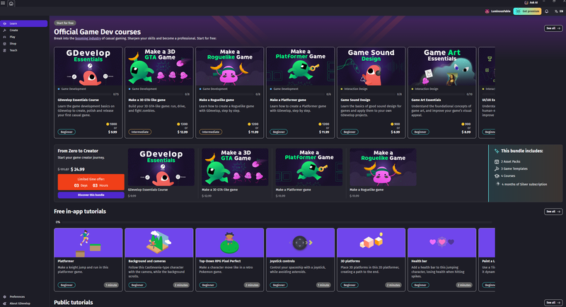
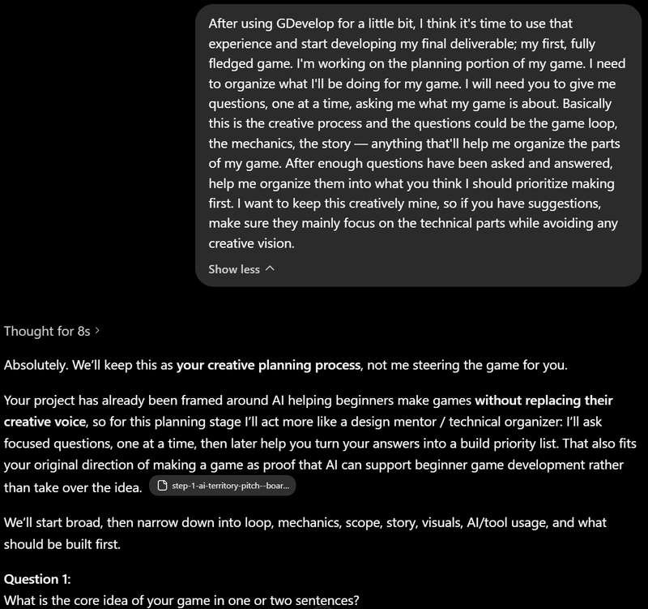
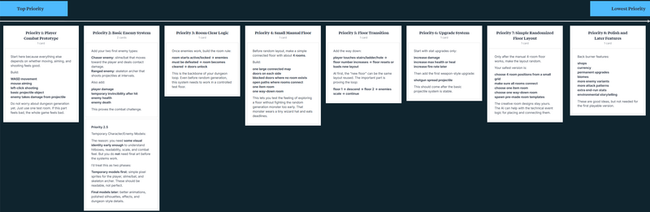
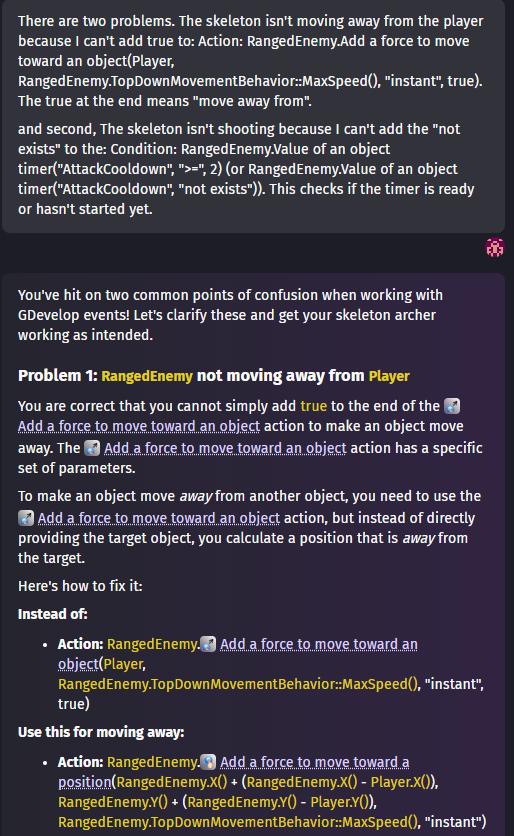
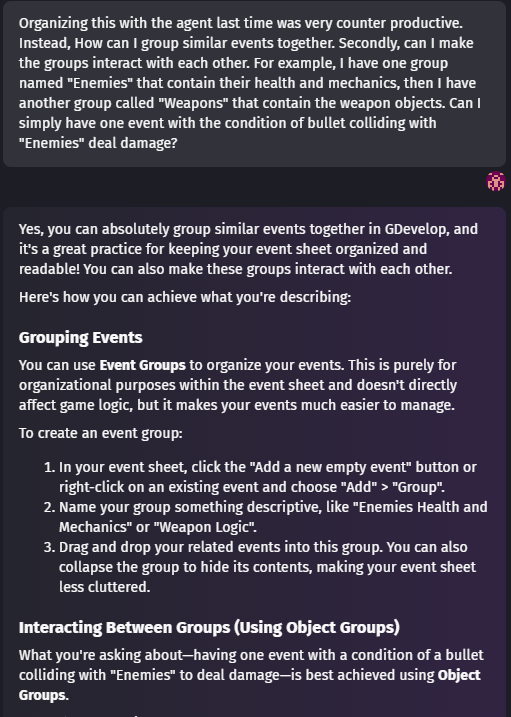
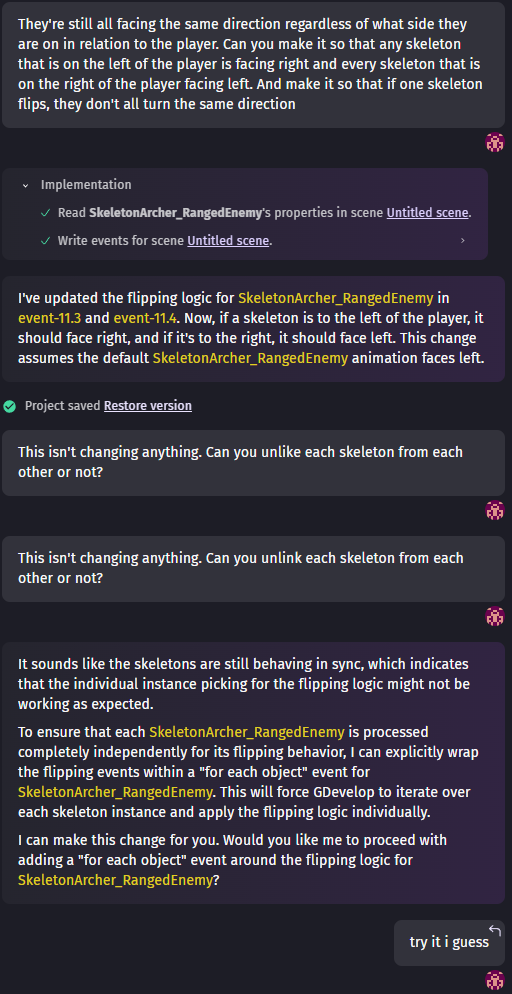
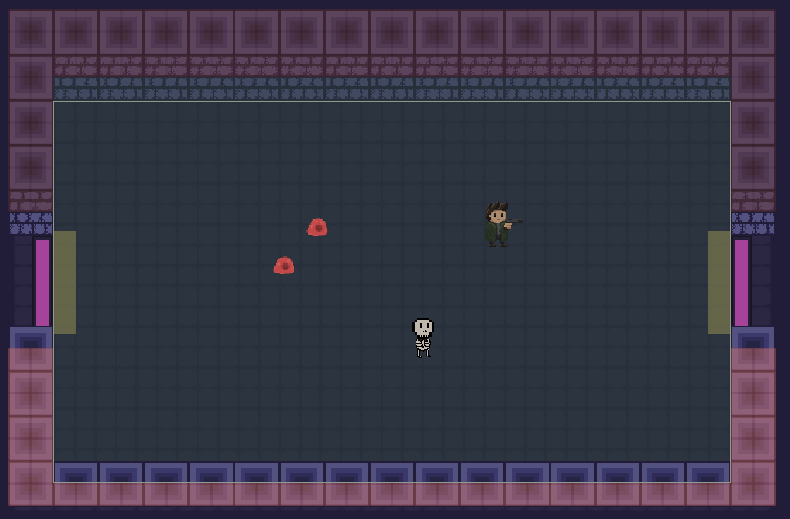
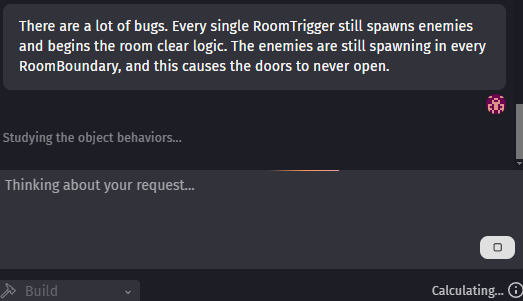
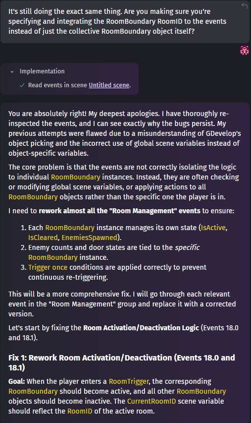

# Process Evidence and Media Notes

Split from the command-center archive. Captions and media references are grouped here for future site sections.

# Process Evidence / Images

## Beginner Learning Evidence

Caption: This screenshot shows the GDevelop tutorial screen I used when first learning the tool.

Evidence item:

- First Character Movement

Artifact:

- Video directly below — Character's First Steps

What it shows:

- A simple character that is capable of moving with the arrow keys

Why it matters:

- This is where a game starts. By placing the player inside and giving them control

[20260507-2206-51.8613629.mp4](../images/112-video-20260507-2206-51.8613629.mp4) (1.6 MB)

Evidence item:

- Coin Collecting

Artifact:

- Video directly below — Collectible Coin Test

What it shows:

- A simple character colliding with coins to collect them

Why it matters:

- This is evidence of my very first gameplay loop; move, collect, object disappears

[20260507-2244-40.6713045.mp4](../images/113-video-20260507-2244-40.6713045.mp4) (367 KB)

Caption: This video shows a score increasing as coins are collected

[20260507-2318-21.1454224.mp4](../images/114-video-20260507-2318-21.1454224.mp4) (288 KB)

Evidence item:

- First Completed Game

Artifact:

- Video directly below — Collect Coins to Win Test

What it shows:

- A simple character winning by collecting all the coins

Why it matters:

- This is my very first completed game. A simple coin collector.

[20260507-2333-46.3155710.mp4](../images/115-video-20260507-2333-46.3155710.mp4) (278 KB)

## AI Planning Evidence

Evidence item:

- AI-assisted game planning prompt

Artifact:

- Screenshot/note directly below — Prompt Experiment 1

What it shows:

- I asked AI to help organize the game-making process while avoiding creative takeover.

Why it matters:

- This shows that I set boundaries for AI and used it as a planning assistant instead of letting it define the game’s identity.

Evidence item:

- Game build priority list

Artifact:

- Screenshot/note directly below — Game Plan / Priority List

What it shows:

- The game was broken into technical priorities like combat, enemies, room clear logic, floor structure, upgrades, and procedural generation.

Why it matters:

- This gave me a beginner-friendly production path while keeping the genre, mechanics, and creative direction mine.

## Core Prototype Evidence

Caption: This video shows the application of the Character Movement from my first game with added mouse aiming

[20260516-0249-37.2856904.mp4](../images/116-video-20260516-0249-37.2856904.mp4) (554 KB)

Evidence item:

- Projectile Test

Artifact:

- Video directly below — Projectile Physics Test

What it shows:

- The player can fire projectiles in the direction they are aiming.

Why it matters:

- This is the start of the main combat system

[20260516-0302-53.6544624.mp4](../images/118-video-20260516-0302-53.6544624.mp4) (1.8 MB)

Caption: This video shows the addition of an enemy that can take damage from the player's projectiles

[20260516-1847-06.9085444.mp4](../images/119-video-20260516-1847-06.9085444.mp4) (2.2 MB)

Evidence item:

- Enemy Attacks and Player Health

Artifact:

- Video directly below — Enemy Damage Test

What it shows:

- Enemies can now chase and deal damage to player

Why it matters:

- This proves the first combat loop: enemies can threaten the player, the player can take damage, and combat has consequences.

[20260522-0006-53.6466006.mp4](../images/120-video-20260522-0006-53.6466006.mp4) (1.1 MB)

Evidence item:

- Skeleton Archer Enemy Behavior

Artifact:

- Video directly below — New Enemy: Skeleton Archer

What it shows:

- An enemy that can now shoot projectiles that deal damage to the player

Why it matters:

- This was one of the first moments where AI helped me solve a technical behavior system. The enemy design still came from my game plan, but AI support helped me make the logic work inside GDevelop.

[20260522-0107-57.6653180.mp4](../images/121-video-20260522-0107-57.6653180.mp4) (3.2 MB)

## AI Failure / Debugging Evidence

Evidence item:

- Skeleton Archer mechanics bug and AI's unclear instructions

Artifact:

- Screenshot/Image directly below — Prompting after AI Chat hallucinates fixes

What it shows:

- The prompt after the AI suggested a fix that was either worded differently in the program, or did not exist.

Why it matters:

- This shows that the AI is not perfect and can be subject to hallucinations as well.

Evidence item:

- AI Agent event organization failure

Artifact:

- Screenshot/Image directly below — Prompting after AI Chat fails to organize the event sequences

What it shows:

- The prompt after the AI failed to organize the events and broke some mechanics.

Why it matters:

- This shows that AI advice can sound correct but still be counterproductive in practice. I had to manually organize the events when the AI agent started breaking systems that already worked

Evidence item:

- Entity turning bug and AI Agent failure

Artifact:

- Screenshot and video directly below — skeletons turning independently

What it shows:

- The AI Agent struggled to fix a bug where all skeletons turned together instead of behaving as individual enemies.

Why it matters:

- This shows that AI was useful, but not automatic. I still had to test, revise prompts, reject broken solutions, and keep working until the mechanic fit my intended combat design.

[20260527-0226-23.4023862.mp4](../images/126-video-20260527-0226-23.4023862.mp4) (14.8 MB)

## Dungeon Loop Evidence

Evidence item:

Doors, Room Boundaries, and Room Triggers

Artifact:

Image directly below — Room Clearing Logic parts

What it shows:

The boxes that define the doors, boundaries, room triggers, and collision.

Why it matters:

This shows the parts that run the room logic. These are essentially the gears to my game.

Evidence item:

Room Clear Logic

Artifact:

Video directly below — Room clearing condition working

What it shows:

Enemies must be defeated before the room is considered clear and doors are unlocked

Why it matters:

This is the backbone of the loop. Enter a room, clear out the enemies, room unlocks, continue exploring.

[20260524-0357-39.2737059.mp4](../images/124-video-20260524-0357-39.2737059.mp4) (9.4 MB)

Evidence item:

Random enemy spawner

Artifact:

Video directly below — random enemy spawning test

What it shows:

Enemies can spawn into the room through a system instead of being placed manually every time.

Why it matters:

This supports the roguelike direction by making combat encounters easier to vary and expand.

[20260524-0435-23.4233100.mp4](../images/125-video-20260524-0435-23.4233100.mp4) (12.6 MB)

Evidence item:

Manual floor structure and room logic debugging

Artifact:

Screenshots and video directly below — 4-room test floor and room boundary debugging

What it shows:

The prototype uses a connected room layout where the player can move between rooms on one scene. It also shows the debugging process for making each room manage its own boundaries and triggers.

Why it matters:

This proves the dungeon structure before adding random generation, keeping the project manageable while still moving toward the final roguelike loop. This also became an important AI limitation moment, where the AI Agent kept treating the Room boundaries too generally, while I was able to identify that each room needed its own Room ID and specific variables. This shows that I wasn't just following AI instructions, but that I was also learning enough to recognize and point the AI towards the issue myself.

[20260528-2317-26.1875862.mp4](../images/127-video-20260528-2317-26.1875862.mp4) (37.1 MB)

