# Prototype Build Journal

Split from the command-center archive. Local image/video links point to ../images when available.

## Project / Prototype Build

# Beginner's Game Development Journal

Starting Gdevelop

Beginning to make a game

Making a Background

Making a Character

Building Walls

## Week 6 Part 1

May 7, 2026 - 11:49 AM:

- I have begun reading through GDevelop's "Getting Started" page to gather a better understanding on how this program works

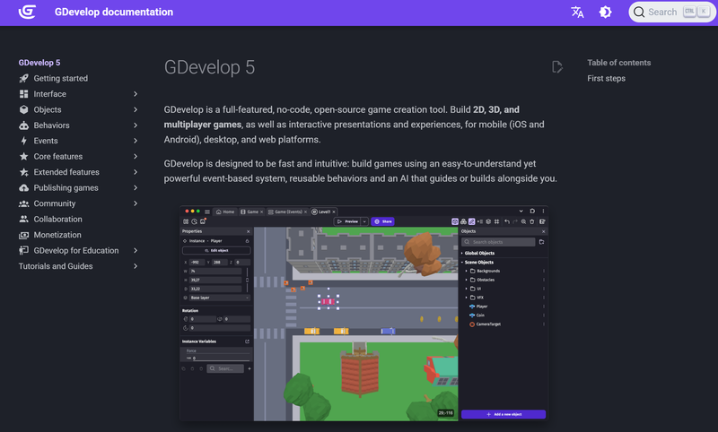

May 7, 2026 - 1:09 PM:

- I have downloaded the GDevelop app and started browsing through the tutorials

May 7, 2026 - 1:20 PM:

- Started the first tutorial

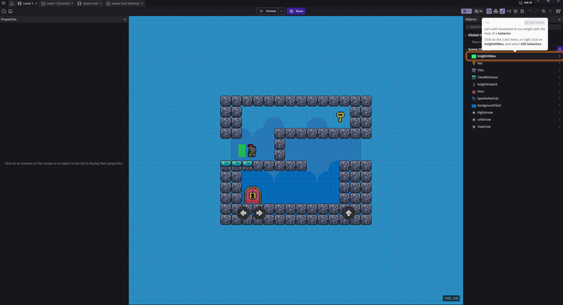

May 7, 2026 - 2:00 PM:

- Finished all the free tutorials

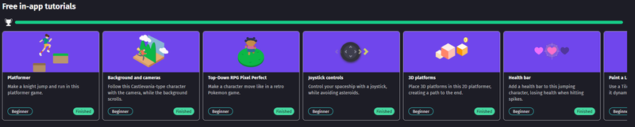

May 7, 2026 - 2:35 PM:

- Started my collaboration with ChatGPT and using Gdevelop to make my first game.

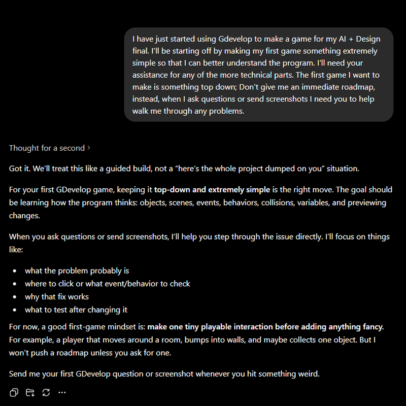

May 7, 2026 - 2:41 PM:

- First step of making my first game; making a background

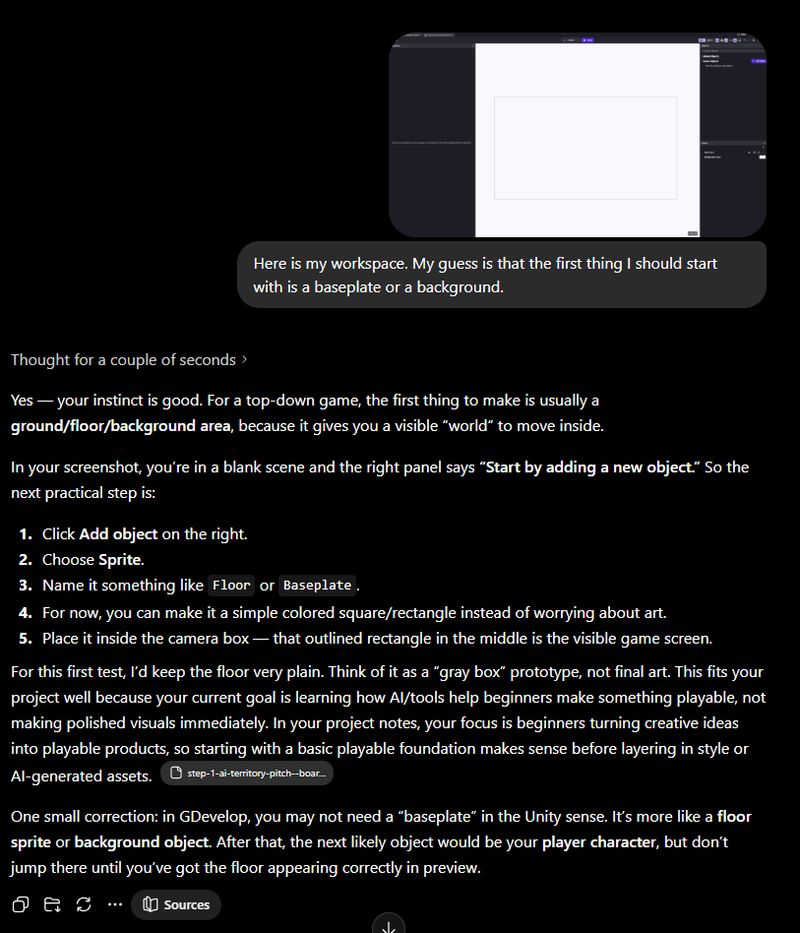

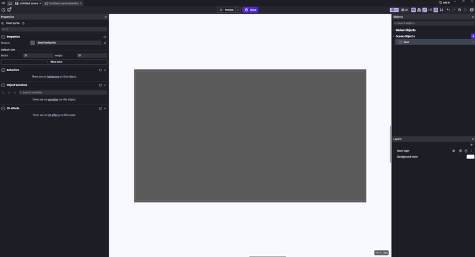

May 7, 2026 - 2:52 PM:

- Second step of making my first game; making a character

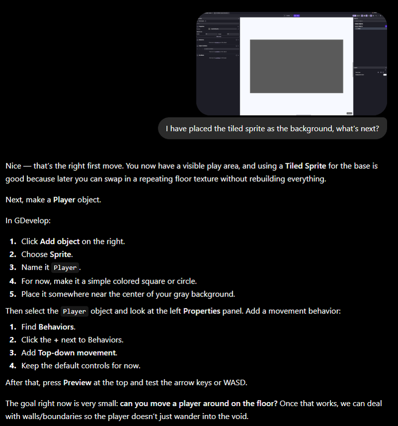

May 7, 2026 - 3:08 PM:

- Made my first character capable of moving with arrow keys

[20260507-2206-51.8613629.mp4](../images/112-video-20260507-2206-51.8613629.mp4) (1.6 MB)

May 7, 2026 - 3:10 PM:

- Surrounding the background with walls to prevent players from leaving the background

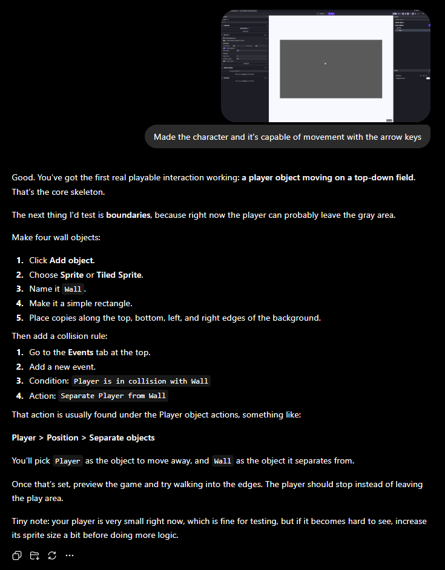

May 7, 2026 - 3:31 PM:

- Wall has been built to prevent player from leaving

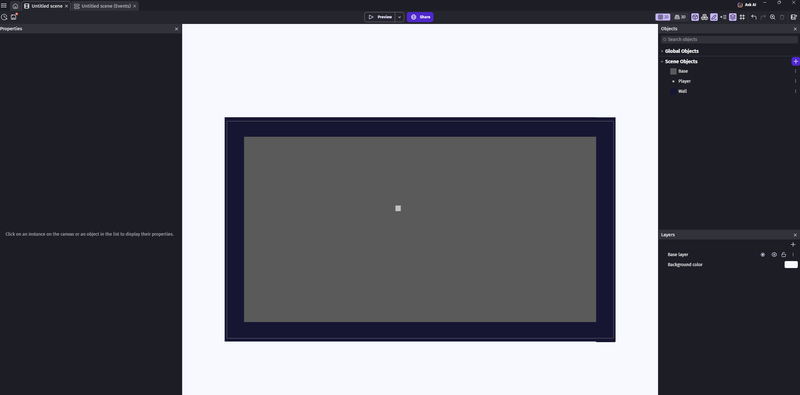

May 7, 2026 - 3:31 PM:

- Adding a collectible

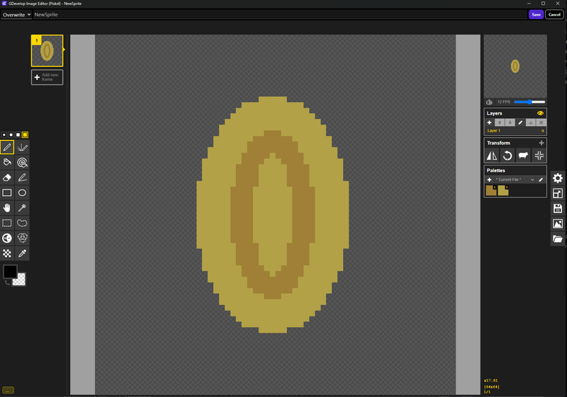

[20260507-2244-40.6713045.mp4](../images/113-video-20260507-2244-40.6713045.mp4) (367 KB)

Adding a score system

## Week 6 Part 2

May 7, 2026 - 3:49 PM:

- Adding a score system for collecting coins

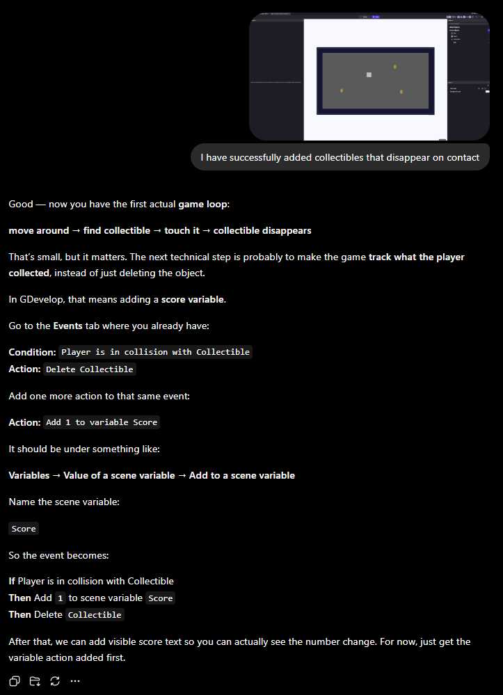

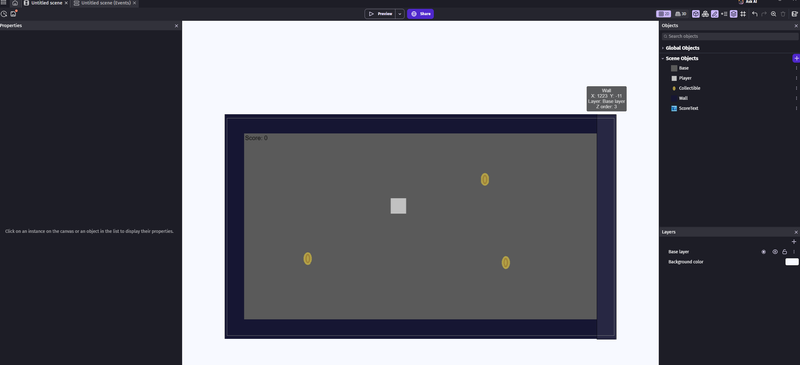

Needed assistance to find the correct action

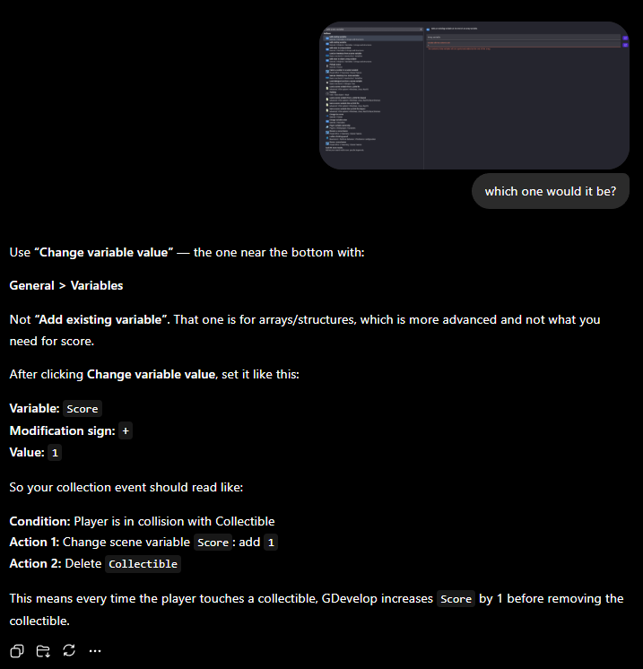

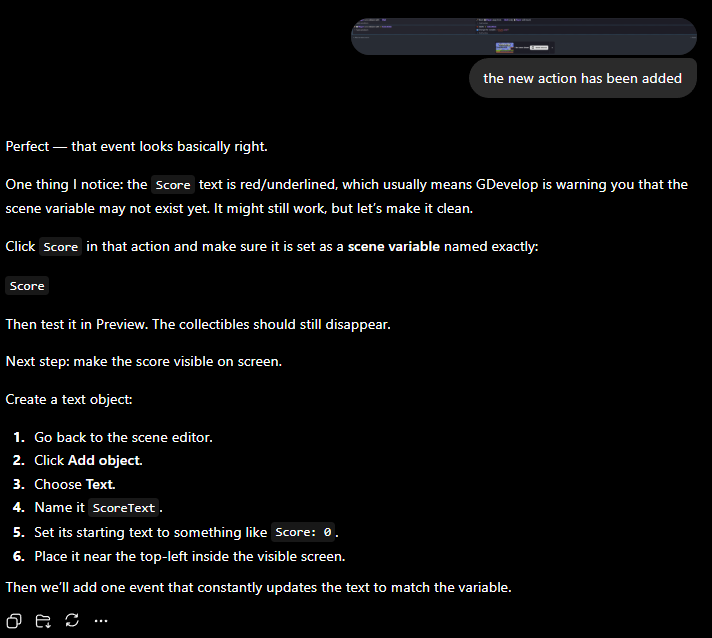

Little mistake

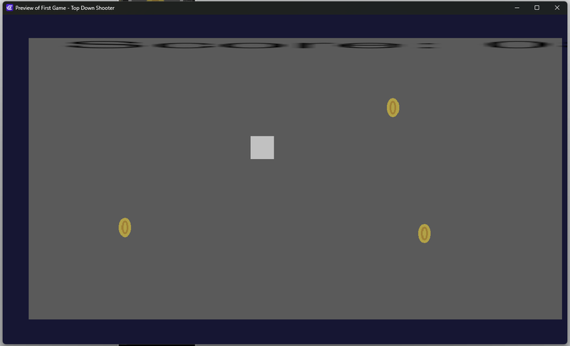

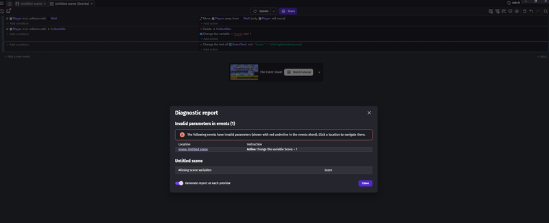

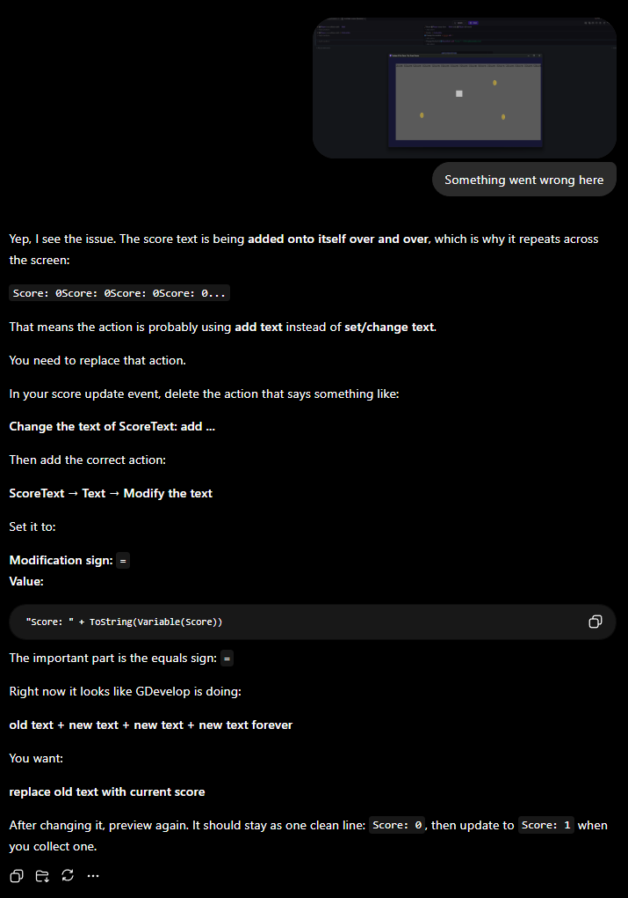

Score can now be successfully counted

[20260507-2318-21.1454224.mp4](../images/114-video-20260507-2318-21.1454224.mp4) (288 KB)

May 7, 2026 - 4:21 PM:

- Adding a win condition and win screen

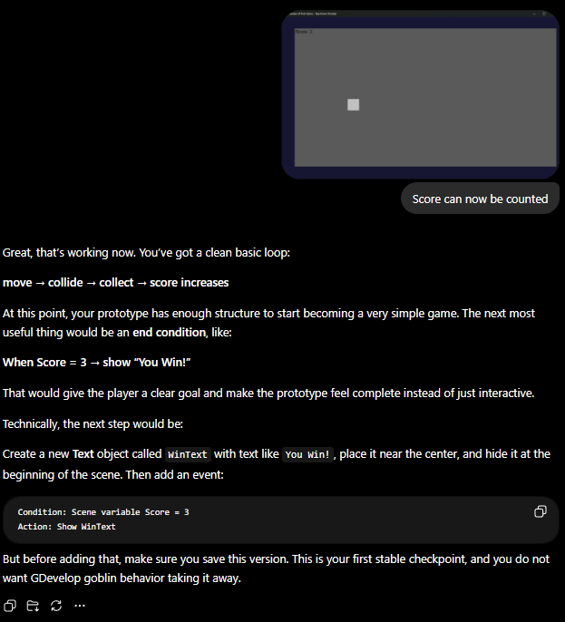

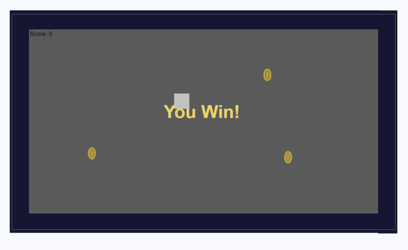

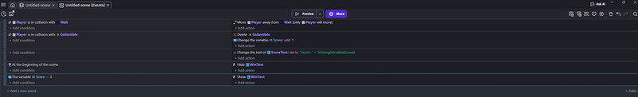

[20260507-2333-46.3155710.mp4](../images/115-video-20260507-2333-46.3155710.mp4) (278 KB)

May 7, 2026 - 4:35 PM:

- Completed my first ever game!

Winning condition and screen

Start of our real game.

Development Begins! Starting with the mechanics.

# Game Plan

## Top Priority

## Priority 1: Player Combat Prototype

Start here because everything else depends on whether moving, aiming, and shooting feels good.

Build:

**WASD movement**\
**mouse aiming**\
**left-click shooting**\
**basic projectile object**\
**enemy takes damage from projectile**

Do not worry about dungeon generation yet. Just use one test room. If this part feels bad, the whole game feels bad.

## Priority 2: Basic Enemy System

Add your two first enemy types:

**Chaser enemy:** slime/bat that moves toward the player and deals contact damage.\
**Ranged enemy:** skeleton archer that shoots projectiles at intervals.

Also add:

**player damage**\
**temporary invincibility after hit**\
**enemy health**\
**enemy death**

This proves the combat challenge.

**Priority 2.5**

Temporary Character/Enemy Models:

The reason: you need **some visual identity early enough** to understand hitboxes, readability, scale, and combat feel. But you do **not** need final art before the systems work.

I’d treat this as two phases:

**Temporary models first:** simple pixel sprites for the player, slime/bat, and skeleton archer. These should be readable, not perfect.

**Final models later:** better animations, polished silhouettes, effects, and dungeon-style details.

## Priority 3: Room Clear Logic

Once enemies work, build the room rule:

**room starts active/locked → enemies must be defeated → room becomes cleared → doors unlock**

This is the backbone of your dungeon loop. Even before random generation, this system needs to work in a controlled test floor.

## Priority 4: Small Manual Floor

Before random layout, make a simple connected floor with about **4 rooms**.

Build:

**one large connected map**\
**doors on each side**\
**blocked doors where no room exists**\
**open paths where rooms connect**\
**one item room**\
**one way-down room**

This lets you test the feeling of exploring a floor without fighting the random generation monster too early. That monster wears a tiny wizard hat and eats deadlines.

## Priority 5: Floor Transition

Add the way down:

**player touches stairs/ladder/hole → floor number increases → floor resets or loads new layout**

At first, the “new floor” can be the same layout reused. The important part is proving the loop:

**floor 1 → descend → floor 2 → enemies scale → continue**

## Priority 6: Upgrade System

Start with stat upgrades only:

**increase damage**\
**increase max health or heal**\
**increase fire rate later**

Then add the first weapon-style upgrade:

**shotgun spread projectile**

This should come after the basic projectile system is stable.

## Priority 7: Simple Randomized Floor Layout

Only after the manual 4-room floor works, make the layout random.

Your safest version is:

**choose 4 room positions from a small grid**\
**make sure all rooms connect**\
**choose one item room**\
**choose one way-down room**\
**spawn pre-made room templates**

The creative room designs stay yours. The AI can help with the technical event logic for placing and connecting them.

## Priority 8: Polish and Later Features

Back burner features:

**shops**\
**currency**\
**permanent upgrades**\
**biomes**\
**more enemy variants**\
**more attack patterns**\
**extra end-run stats**\
**environmental storytelling**

These are good ideas, but not needed for the first playable version.

## Lowest Priority

## AI Assisted Creative Process

Prompt: After using GDevelop for a little bit, I think it's time to use that experience and start developing my final deliverable; my first, fully fledged game. I'm working on the planning portion of my game. I need to organize what I'll be doing for my game. I will need you to give me questions, one at a time, asking me what my game is about. Basically this is the creative process and the questions could be the game loop, the mechanics, the story — anything that'll help me organize the parts of my game. After enough questions have been asked and answered, help me organize them into what you think I should prioritize making first. I want to keep this creatively mine, so if you have suggestions, make sure they mainly focus on the technical parts while avoiding any creative vision.

### Your Game Plan So Far

Your game is a **top-down roguelike dungeon crawler** where the player tries to descend as far as possible through connected dungeon floors.

The core loop is:

**explore floor → enter rooms → fight enemies → clear rooms → unlock paths → find item room or way down → descend → repeat until death**

Your main gameplay identity is:

**WASD movement + mouse aiming + projectile combat + enemy bullet dodging**

The player starts with **10 health**, takes more damage from contact enemies than projectiles, and can rarely heal through a special room. This makes damage feel punishing, which supports your goal of careful movement and avoiding sloppy mistakes.

## AI Involvement with Building Process

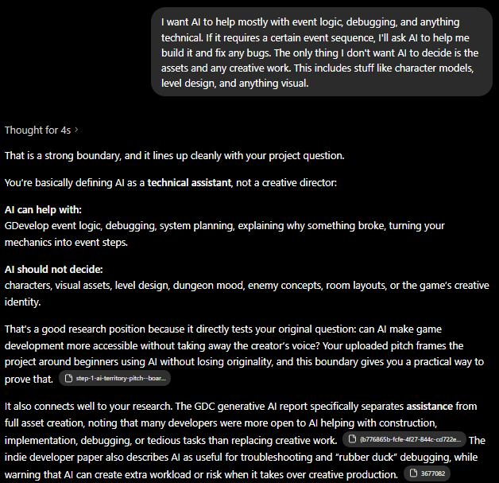

Completed Game Plan

## Week 7 Part 1

**May 15, 2026 - 2:41 PM:**

- We begin making our final deliverable for this project. A roguelite, dungeon-crawling, bullet hell. Where the main goal of the game is to go as deep as possible into the dungeon.

- Making this game, we'll utilize the built-in AI assistant. We'll experiment with both the chat and the agent to see how useful they are with the more technical parts, while the designs will all be made by me.

- Note: With the free version of GDevelop, you only get 40 credits per month. You can use these credits with the "Ask AI" chat feature or the "AI Agent" to help you generate game logic, create events, or write code. Keep in mind that asking questions or doing simpler tasks usually costs 3 to 5 credits, while complex Agent requests can cost between 4 and 20 credits.

- For this project, I'll be using Gdevelop's Gold Premium for more AI credits

**May 15, 2026 - 3:54 PM:**

- Begin by planning my game

- Asking ChatGPT to assist me in organizing my creative process.

**May 15, 2026 - 6:20 PM:**

- ChatGPT and I made a game plan to figure out what to prioritize first when building the game

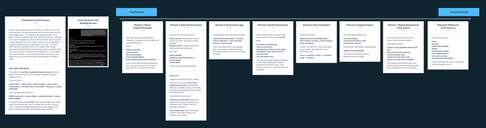

**May 15, 2026 - 6:31 PM:**

- Building begins and I'm utilizing both ChatGPT to help with prompting, and GDevelop AI to help me build within the engine.

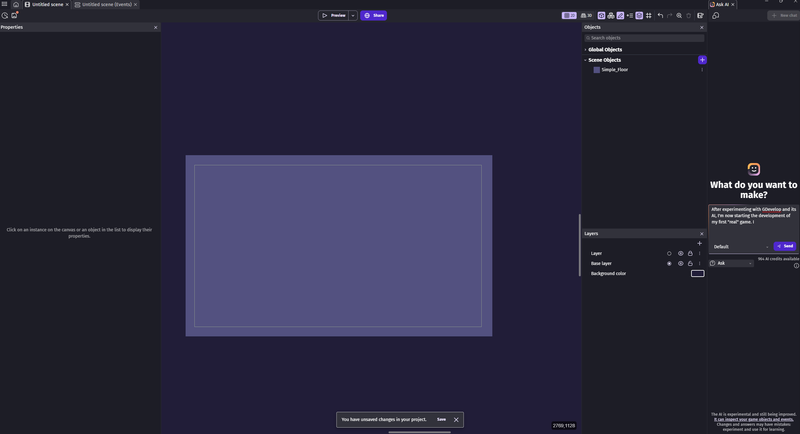

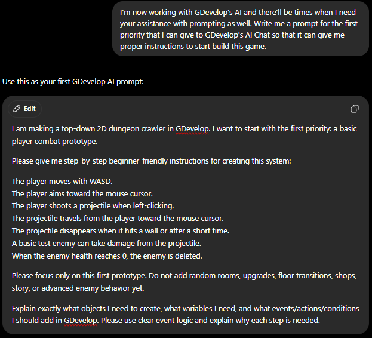

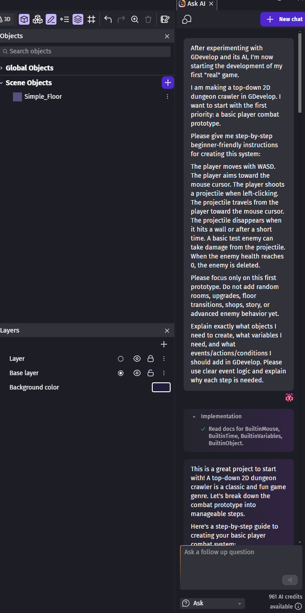

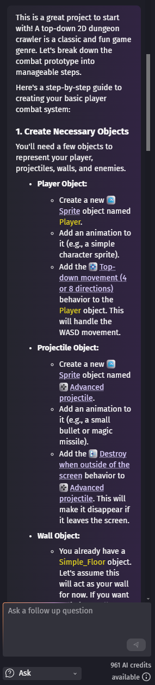

Essential Game Sprites:

- Player

- Projectile

- Wall

- Enemy

Setting Player Movement

Bullet Physics

## Week 7 Part 2

**May 15, 2026 - 7:23 PM**

- Made a player character that can move with Arrow Keys

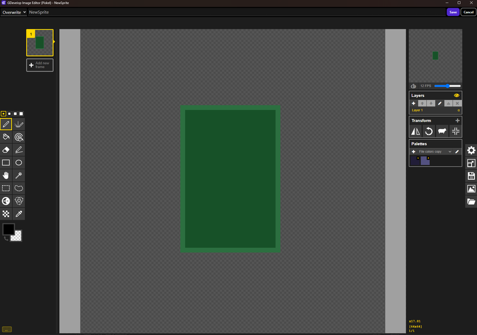

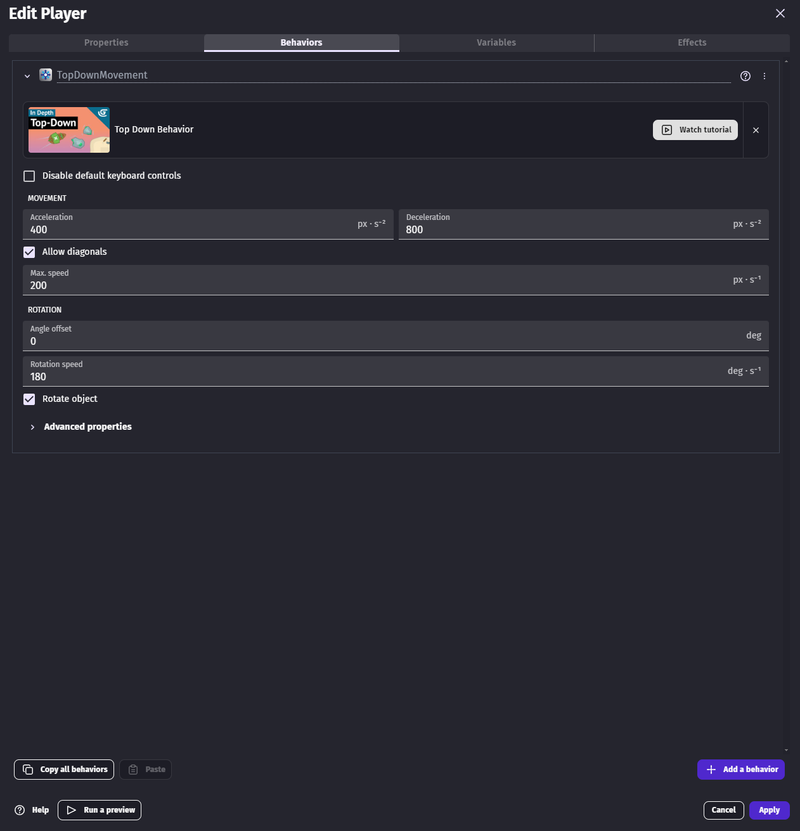

**May 15, 2026 - 7:23 PM**

- Made a projectile

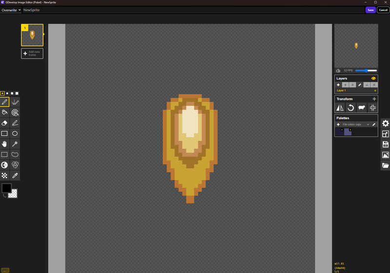

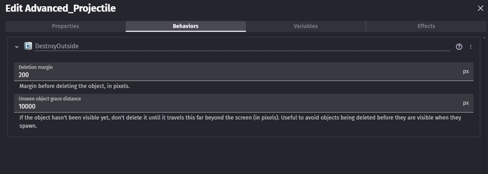

**May 15, 2026 - 7:23 PM**

- Made a basic wall for rooms

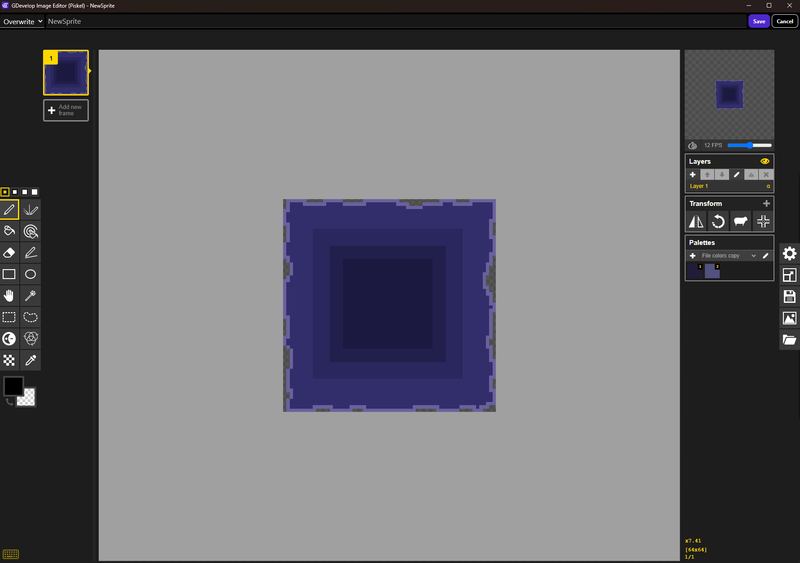

**May 15, 2026 - 7:23 PM**

- Made the most basic enemy. Say hello to Mr. Slime

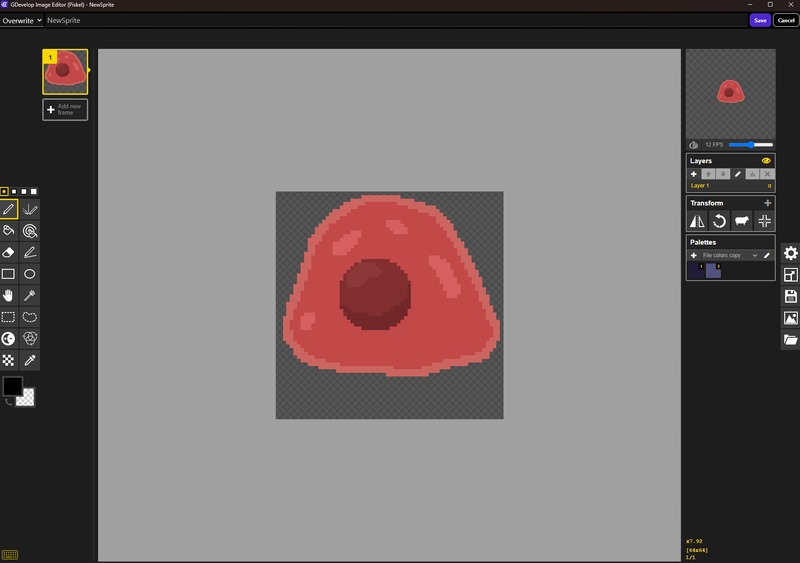

**May 15, 2026 - 7:29 PM**

- Setting up player movement to WASD

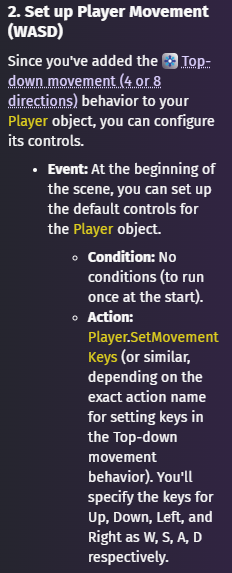

**May 15, 2026 - 7:38 PM**

- Setting up mouse aim

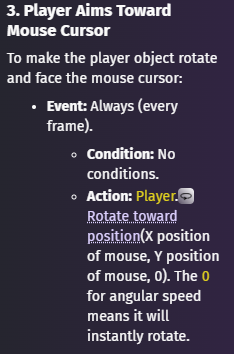

[20260516-0249-37.2856904.mp4](../images/116-video-20260516-0249-37.2856904.mp4) (554 KB)

**May 15, 2026 - 7:43 PM**

- Setting up projectile physics

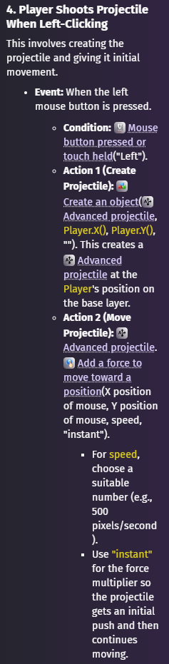

[20260516-0255-03.2917310.mp4](../images/117-video-20260516-0255-03.2917310.mp4) (4.6 MB)

Enemy Health

## Week 7 Part 3

**May 15, 2026 - 7:55 PM**

- Adding Bullet Collision

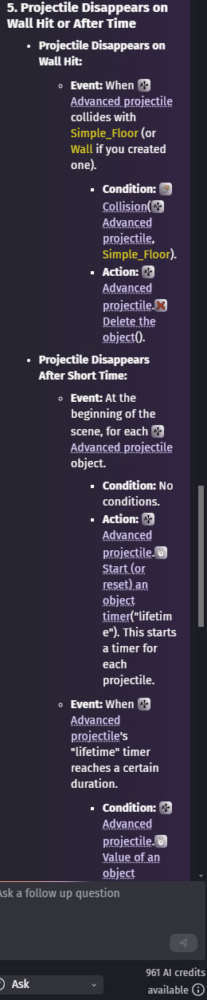

[20260516-0302-53.6544624.mp4](../images/118-video-20260516-0302-53.6544624.mp4) (1.8 MB)

**May 15, 2026 - 7:55 PM**

- Adding Enemy Health

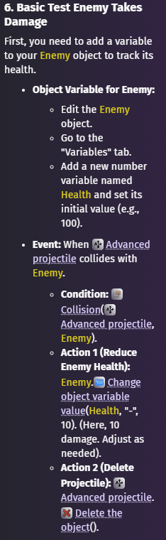

[20260516-1847-06.9085444.mp4](../images/119-video-20260516-1847-06.9085444.mp4) (2.2 MB)

Beginning Step 2 of building our game

Adding a Player Health system

Adding the first Enemy Ai

New Enemy: Skeleton Archer

New issues arise

## Week 8 Part 1

**May 21, 2026 - 4:25 PM**

- Begin working on Priority #2: Enemy types

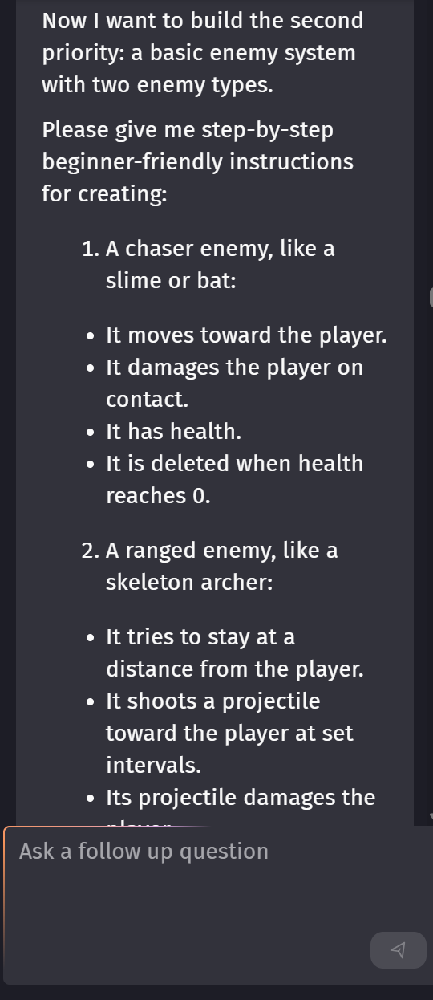

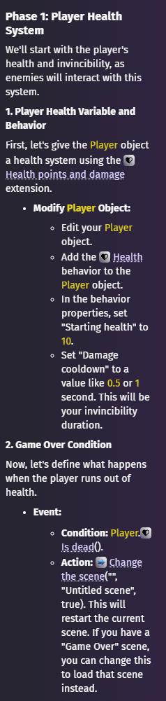

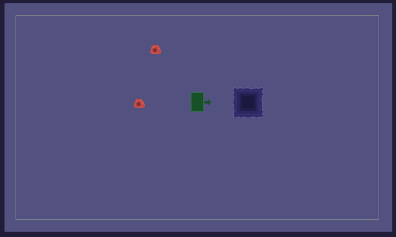

[20260522-0006-53.6466006.mp4](../images/120-video-20260522-0006-53.6466006.mp4) (1.1 MB)

**May 21, 2026: 5:08 PM**

- Adding a new enemy type: Ranged enemies

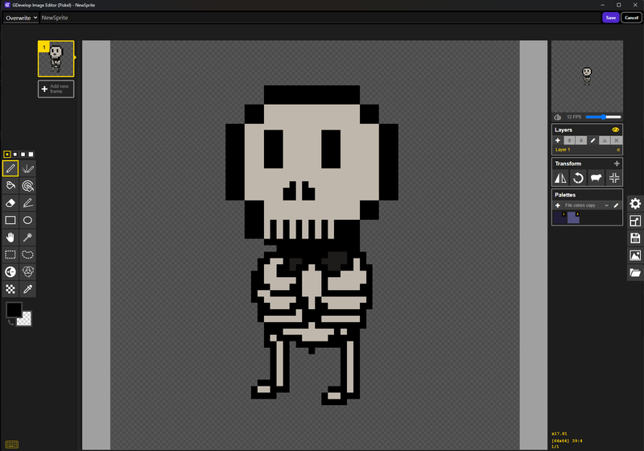

**May 21, 2026: 5:59 PM**

- Ran into some issues. GDevelop is suggesting options that don't exist

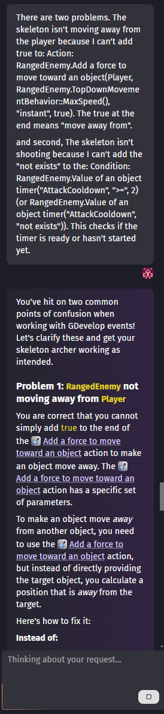

Debugging using the AI Agent

Fixed

## Week 8 Part 2

**May 21, 2026: 6:01 PM**

- These changes are insane. I'll test out the the AI agent by having it  implement the fixes

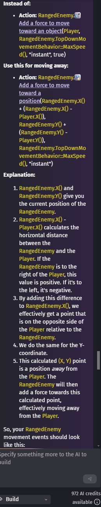

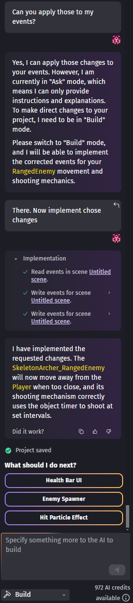

**May 21, 2026: 6:06 PM**

- The Skeleton Archer is fixed and can now fire and set its distance from the player

[20260522-0107-57.6653180.mp4](../images/121-video-20260522-0107-57.6653180.mp4) (3.2 MB)

New player model

New starting weapon

Organization

## Week 8 Part 3

**May 22, 2026: 12:35 PM**

- Adding a character model for the player

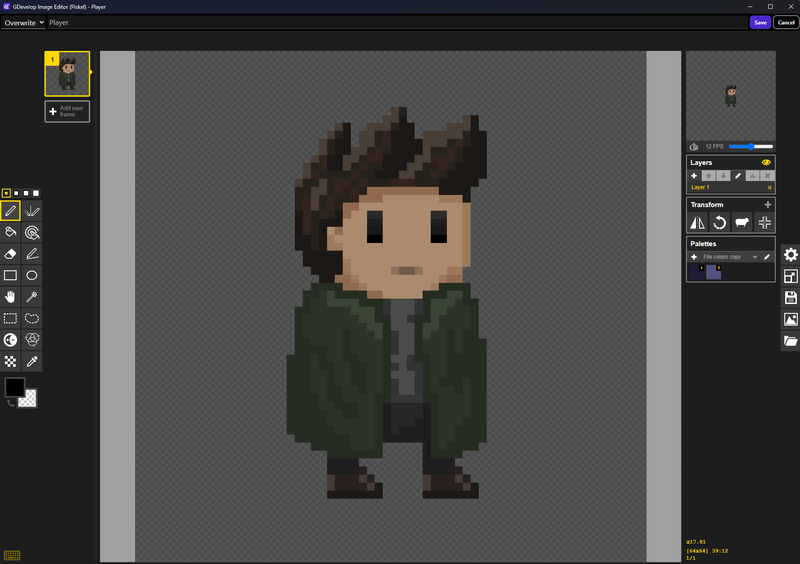

Funny little bug. With the new sprite, it looks like the player is doing somersaults while aiming

[20260522-1941-14.5023291.mp4](../images/122-video-20260522-1941-14.5023291.mp4) (4.2 MB)

**May 22, 2026: 12:57 PM**

- added the starting weapon: a pistol

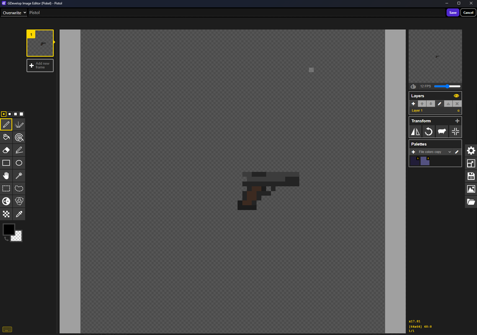

**May 22, 2026: 1:26 PM**

- Implementing the new weapon and doing some debugging. Using the AI agent is a real plus for technical fixes. Looks like I'm beginning to run into an issue with the chat being too long now though.

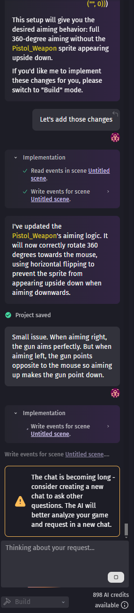

**May 22, 2026: 2:04 PM**

- Working on organizing the events

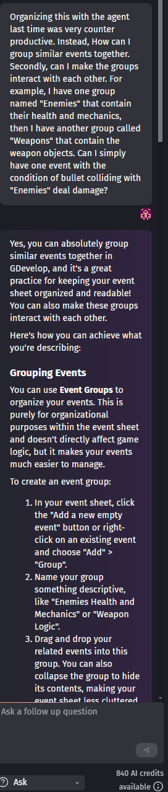

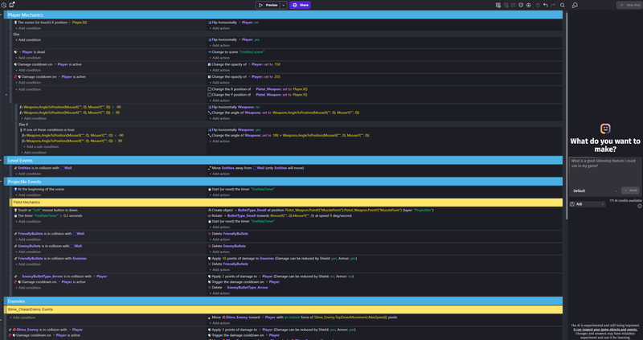

Finished some more debugging and optimizations

Priority #3 Begins (a.k.a. Absolute Insanity)

Room clearing mechanic

## Week 8 Part 4

**May 22, 2026: 3:08 PM**

- Finished more Optimizations

[20260522-2209-31.2466614.mp4](../images/123-video-20260522-2209-31.2466614.mp4) (2.1 MB)

**May 23, 2026: 5:52 PM**

- Made a simple Tilemap and added proper collision mapping

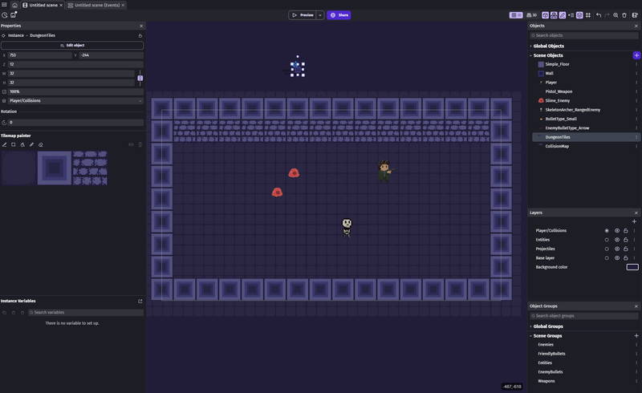

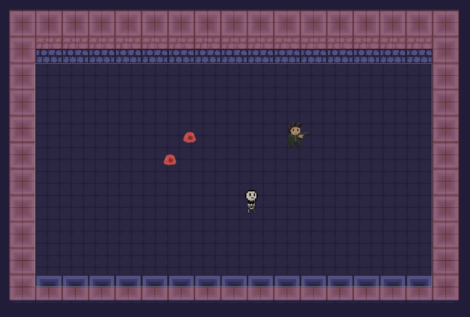

**May 23, 2026: 6:59 PM**

- Begin working on Priority #3: Room Clear Logic

**May 23, 2026: 7:52 PM**

- Made the sprites for the doors, Room boundaries, and room triggers

**May 23, 2026: 8:12 PM**

- This part was extremely technical, messing around with booleans and variables

- Having the AI agent walk me through and build it for me

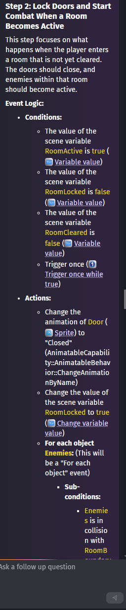

**May 23, 2026: 8:27 PM**

- This was all WAY beyond me. I had no idea what to make of this, even with the AI agent explaining along the way. I'm just glad it was able to build this for me. All that's left is to test it. Fingers crossed.

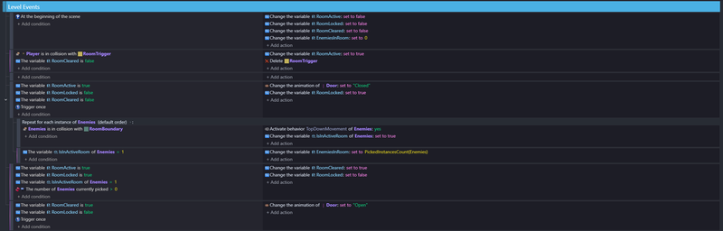

**May 23, 2026: 8:56 PM**

- Took A LOT of optimizing, but we now have a working room clear condition!

[20260524-0357-39.2737059.mp4](../images/124-video-20260524-0357-39.2737059.mp4) (9.4 MB)

**May 23, 2026: 9:34 PM**

- Added a random enemy spawner

[20260524-0435-23.4233100.mp4](../images/125-video-20260524-0435-23.4233100.mp4) (12.6 MB)

More fixing

Beginning Step 4 of building our game

## Week 9 Part 1

**May 26, 2026 - 5:59 PM**

- Fixing some bugs before I start on Priority #4: Floor logic

Quick adjustment: Say hello to Mr.Bones 2.0

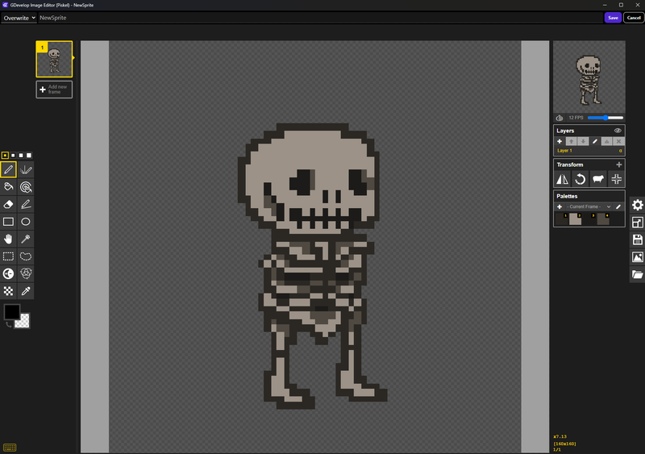

Giving our friend a new weapon

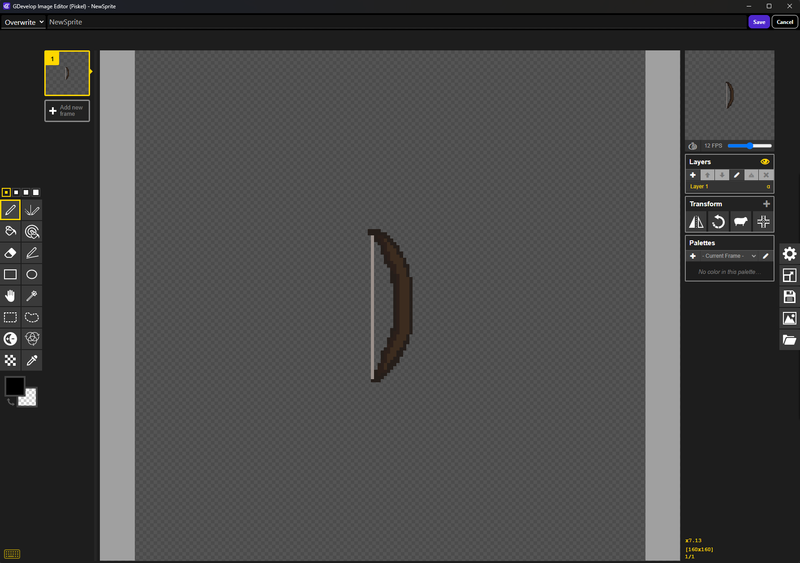

One of the bigger failures the AI Agent has run into.

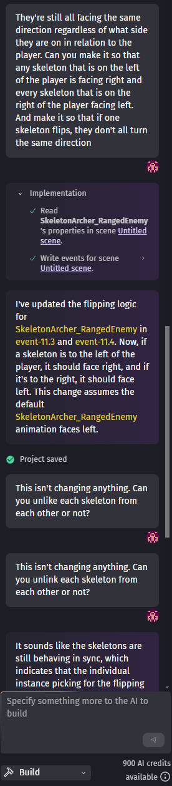

Finally got it working again. Making each entity turn individually was one of the hardest  tasks so far

[20260527-0226-23.4023862.mp4](../images/126-video-20260527-0226-23.4023862.mp4) (14.8 MB)

**May 26, 2026 - 7:36 PM**

- Finally working on step 4

**Step 4 Prompt:**

I finished the first three priorities:

1. The player can move with WASD, aim with the mouse, shoot projectiles, and damage enemies.

2. I have two basic enemy types: a chaser enemy and a ranged enemy. The player has health, takes damage, has brief invincibility after being hit, and can reach Game Over.

3. I have workable room clear logic: enemies must be defeated, then the room is cleared and doors can unlock.

Now I want to build the fourth priority: a small 4-room floor.

Please give me step-by-step beginner-friendly instructions for creating a connected floor with about 4 rooms.

The goal is to make one large connected map where the player moves continuously from room to room, not separate scenes.

Please help me create:

- 4 connected rooms on one scene

- Corridors between connected rooms

- Blocked doors or walls where no room is connected

- Room trigger areas so the game knows which room the player entered

- At least one combat room with enemies

- One empty/safe room for Spawning

- One room that can later become an Upgrade room

- One room that can later become the way-down room

Keep in mind that for the final product there will be random room placement, but for now please do not add random generation yet. I want this to be a manually built test floor first, so I can prove the room-to-room structure works before making it random.

Please explain:

What objects I need to create. How large each room should be or how to keep room sizes consistent. How to place rooms so doors line up. How to set up room IDs or room variables. How to connect the room clear logic to each individual room. How to stop cleared rooms from locking again. How to make sure doors only open when the connected room exists. How to test the floor step by step.

Please organize the instructions in the order I should build them. Use clear GDevelop event logic with conditions and actions, and explain why each step is needed

Proof of concept

First Floor

## Week 9 Part 2

**May 26, 2026 - 7:49 PM**

- Before I begin working on Priority #4, I need to ask GDevelop if this is even a possible endeavor

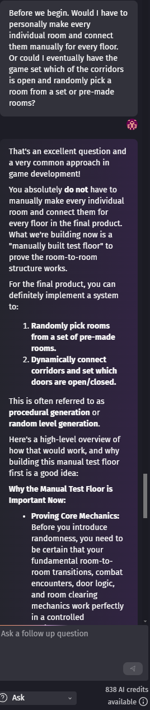

**May 28, 2026 - 3:17 PM**

- Made the first manual floor

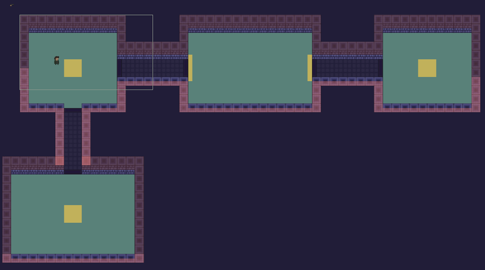

**May 28, 2026 - 3:17 PM**

- Here come the bugs. Enemies spawning when they shouldn't, Different room triggers activating combat and closing doors, doors not opening after defeating enemies. This is probably the most amount of bugs at once so far.

**May 28, 2026 - 3:17 PM**

- We've got the beginnings of a working floor!

- I'm surprised I was able to point the AI to the correct solution after it failed a couple of times

[20260528-2317-26.1875862.mp4](../images/127-video-20260528-2317-26.1875862.mp4) (37.1 MB)

Beginning of Priority 5: Floor Transition

Beginning of Priority 6: Upgrade Room

## Week 9 Part 3

**May 28, 2026 - 5:47 PM**

- Time to work on the implementation of levels.

- A way down has been made

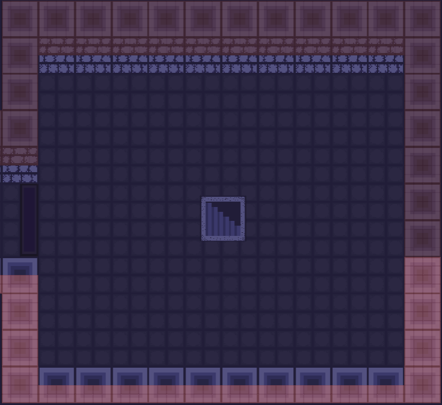

**May 28, 2026 - 6:34 PM**

- Working on making the way down interactable.

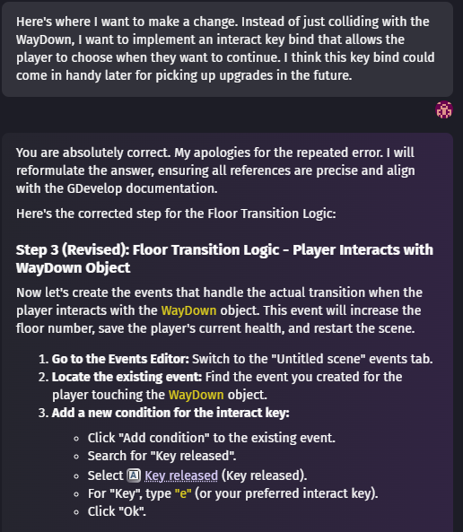

**May 28, 2026 - 8:18 PM**

- The floor transitions are done along with enemy health scaling.

[20260529-0317-30.8748947.mp4](../images/128-video-20260529-0317-30.8748947.mp4) (40.8 MB)

**May 28, 2026 - 8:26 PM**

- Now to work on another essential of a roguelike, Upgrades.

Upgrade statue sprites

Procedural Generation

## Week 9 Part 1

**June 3, 2026 - 1:04 PM**

- Made the sprites for the upgrades: A statue of light and a statue of war

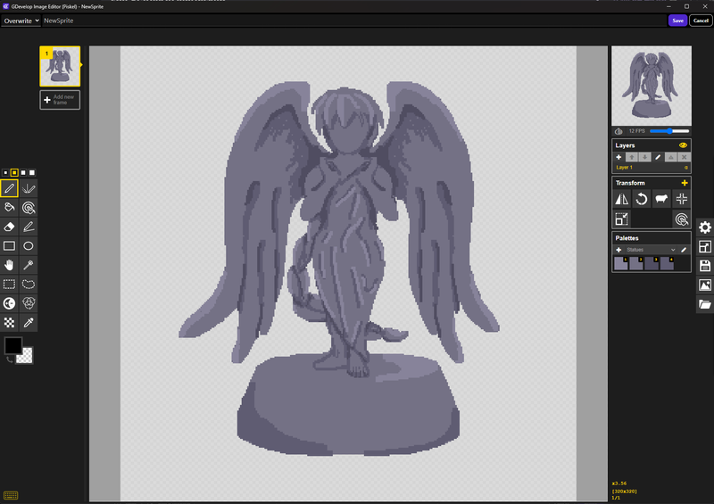

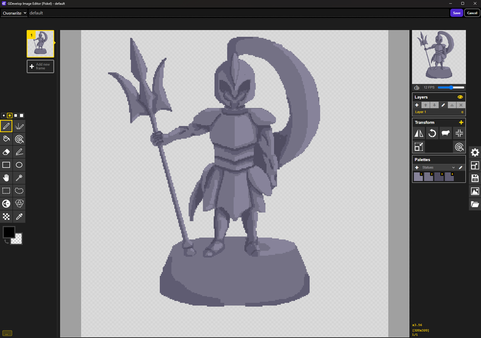

**June 3, 2026 - 2:45 PM**

- Finally made the basic upgrades work. After a bunch of debugging, I was able to make it so that the player can choose an upgrade, delete the other option until next floor, and display a message that shows what the upgrade will do.

    - Reaching a limitation with GDevelop. The more complex a game becomes, the more problems it's going to have. I had to delete an entire event sequence and manually fix it because GDevelop was beginning to hallucinate with the events.

[20260603-2149-09.2502503.mp4](../images/129-video-20260603-2149-09.2502503.mp4) (36.0 MB)

**June 3, 2026 - 4:51 PM**

- Bonus Addon: Gave the Statue of War a few random choices of power to give

**June 4, 2026 - 3:54 PM**

- This is the most ambitious part of my game build and will really push GDevelop: Procedural Generation (a.k.a random floor layouts)

**June 4, 2026 - 6:56 PM**

- This is absolute insanity! I'm mainly having the AI Agent build the event sequence for this part because this is making my head spin.

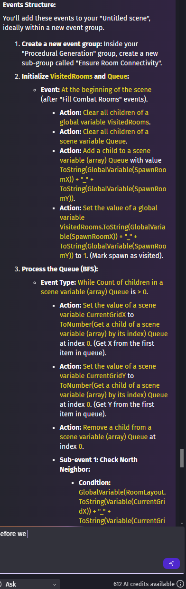

**June 5, 2026 - 5:21 PM**

- This is where GDevelop completely failed. It created a procedural generation roadmap that was absolutely incompatible with the game and it couldn't find any way to fix it. Having to start over from a save I made before attempting the procedural generation. Trying again, but this time, I'm deciding how the procedural generation works.

- My plan: Create a bunch of pre-made room layouts (which is what I wanted in the first place before GDevelop completely forgot about that aspect) and have GDevelop create a sequence that randomizes the room boundary and floor layout.

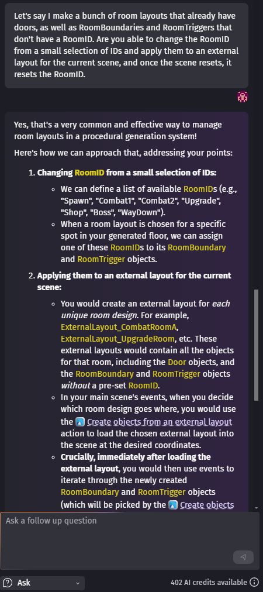

- One of the biggest problems for this step: It seems like GDevelop's Agent likes to follow a specific route for certain mechanics. For procedural generation, the AI keeps going on about creating grids and complex variables, when I specifically ask for simpler approaches, it continues to hallucinate methods that do not apply to my current event sequence.

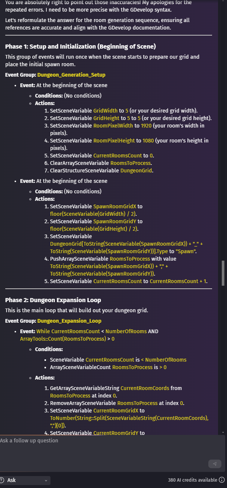

We have procedural generation!

Room Initialization

## Week 9 Part 1

**June 5, 2026 - 9:27 PM**

- LET'S GO! procedural generation completed.

- This is the greatest achievement in building my game.

- Sadly, this was where the AI had completely failed. It was as if the agent had only one option for building a mechanic and unfortunately, it wasn't compatible with for my game was structured. Instead, I had to build the mechanic myself with a bit of help from a YouTube tutorial.

- I also noticed the AI progressively gets worse the more events you have

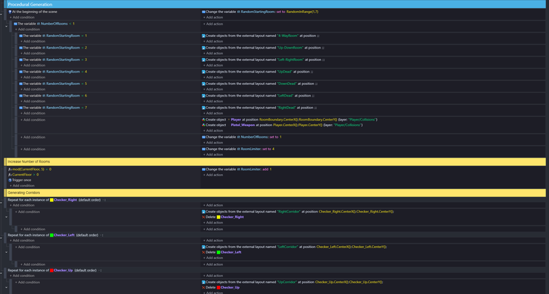

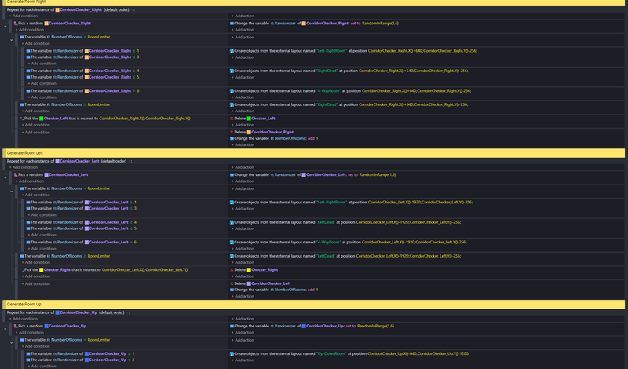

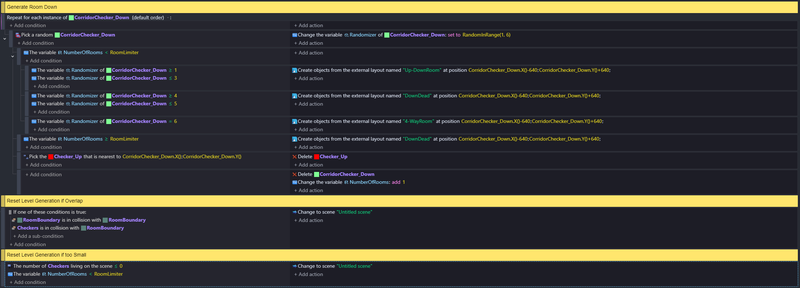

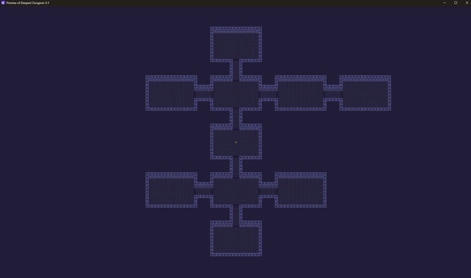

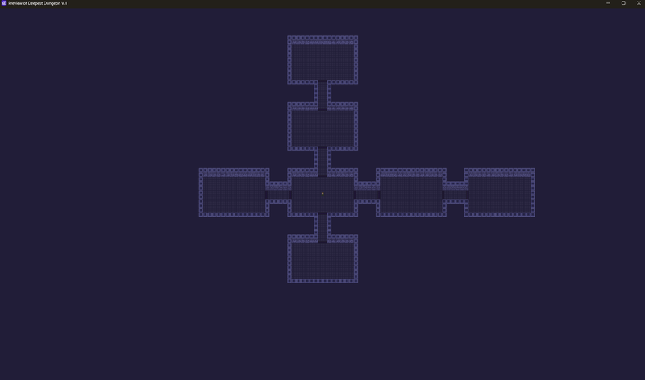

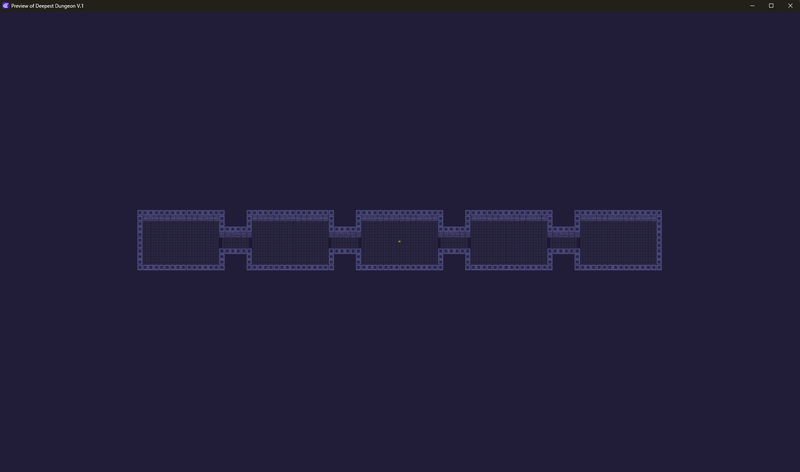

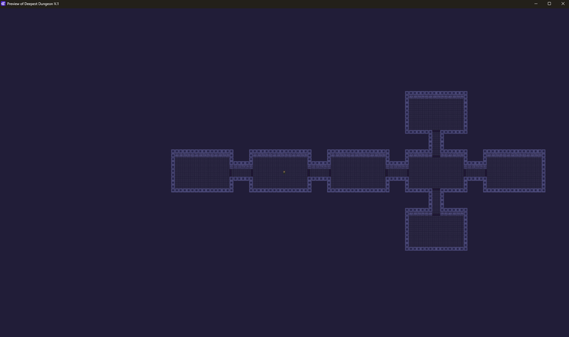

**June 4, 2026 - 9:40 PM**

- The Final Step for our first truly playable Dungeon Crawler. Time to tie everything together.

Adding Collectibles

# Game Plan

## Top Priority

## Priority 1: Player Combat Prototype

Start here because everything else depends on whether moving, aiming, and shooting feels good.

Build:

**WASD movement**\
**mouse aiming**\
**left-click shooting**\
**basic projectile object**\
**enemy takes damage from projectile**

Do not worry about dungeon generation yet. Just use one test room. If this part feels bad, the whole game feels bad.

## Priority 2: Basic Enemy System

Add your two first enemy types:

**Chaser enemy:** slime/bat that moves toward the player and deals contact damage.\
**Ranged enemy:** skeleton archer that shoots projectiles at intervals.

Also add:

**player damage**\
**temporary invincibility after hit**\
**enemy health**\
**enemy death**

This proves the combat challenge.

**Priority 2.5**

Temporary Character/Enemy Models:

The reason: you need **some visual identity early enough** to understand hitboxes, readability, scale, and combat feel. But you do **not** need final art before the systems work.

I’d treat this as two phases:

**Temporary models first:** simple pixel sprites for the player, slime/bat, and skeleton archer. These should be readable, not perfect.

**Final models later:** better animations, polished silhouettes, effects, and dungeon-style details.

## Priority 3: Room Clear Logic

Once enemies work, build the room rule:

**room starts active/locked → enemies must be defeated → room becomes cleared → doors unlock**

This is the backbone of your dungeon loop. Even before random generation, this system needs to work in a controlled test floor.

## Priority 4: Small Manual Floor

Before random layout, make a simple connected floor with about **4 rooms**.

Build:

**one large connected map**\
**doors on each side**\
**blocked doors where no room exists**\
**open paths where rooms connect**\
**one item room**\
**one way-down room**

This lets you test the feeling of exploring a floor without fighting the random generation monster too early. That monster wears a tiny wizard hat and eats deadlines.

## Priority 5: Floor Transition

Add the way down:

**player touches stairs/ladder/hole → floor number increases → floor resets or loads new layout**

At first, the “new floor” can be the same layout reused. The important part is proving the loop:

**floor 1 → descend → floor 2 → enemies scale → continue**

## Priority 6: Upgrade System

Start with stat upgrades only:

**increase damage**\
**increase max health or heal**\
**increase fire rate later**

Then add the first weapon-style upgrade:

**shotgun spread projectile**

This should come after the basic projectile system is stable.

## Priority 7: Simple Randomized Floor Layout

Only after the manual 4-room floor works, make the layout random.

Your safest version is:

**choose 4 room positions from a small grid**\
**make sure all rooms connect**\
**choose one item room**\
**choose one way-down room**\
**spawn pre-made room templates**

The creative room designs stay yours. The AI can help with the technical event logic for placing and connecting them.

## Priority 8: Polish and Later Features

Back burner features:

**shops**\
**currency**\
**permanent upgrades**\
**biomes**\
**more enemy variants**\
**more attack patterns**\
**extra end-run stats**\
**environmental storytelling**

These are good ideas, but not needed for the first playable version.

## Lowest Priority

## AI Assisted Creative Process

Prompt: After using GDevelop for a little bit, I think it's time to use that experience and start developing my final deliverable; my first, fully fledged game. I'm working on the planning portion of my game. I need to organize what I'll be doing for my game. I will need you to give me questions, one at a time, asking me what my game is about. Basically this is the creative process and the questions could be the game loop, the mechanics, the story — anything that'll help me organize the parts of my game. After enough questions have been asked and answered, help me organize them into what you think I should prioritize making first. I want to keep this creatively mine, so if you have suggestions, make sure they mainly focus on the technical parts while avoiding any creative vision.

### Your Game Plan So Far

Your game is a **top-down roguelike dungeon crawler** where the player tries to descend as far as possible through connected dungeon floors.

The core loop is:

**explore floor → enter rooms → fight enemies → clear rooms → unlock paths → find item room or way down → descend → repeat until death**

Your main gameplay identity is:

**WASD movement + mouse aiming + projectile combat + enemy bullet dodging**

The player starts with **10 health**, takes more damage from contact enemies than projectiles, and can rarely heal through a special room. This makes damage feel punishing, which supports your goal of careful movement and avoiding sloppy mistakes.

## AI Involvement with Building Process

[Deepest Dungeon Dashboard | AI + Design Studio](https://emanuelmoua.github.io/Github-Start-up/)

Deepest Dungeon Dashboard: an AI-assisted game development command center for beginner-friendly roguelike design.

**Note:** This dashboard was a practice run for testing the tools and workflow I may use for the final project website. It is not the final site.

