# Weekly Progress Archive

Split from the command-center archive. This keeps the chronological process notes separate from research sources.

## Actual Weekly Progress Archive

## Actual Week 5

**Goal**  

Define the project focus and organize the research foundation.

**Activities**  

\- Finalize project identity, inquiry brief, and source starter list.

\- Read and annotate the GDC generative AI source.

\- Identify the main tension: AI as creative support vs. AI as creative replacement.

\- Create folders/sections in Milanote for research, prompts, experiments, screenshots, and reflections.

**Tools**  

Milanote, ChatGPT, GDC PDF, class notes

**Output**  

A cleaned-up Command Center with project identity, inquiry brief, and starter sources.

**Success indicator**  

Someone can open the board and understand what I am investigating, why it matters, and where my research starts.

**Possible goal next week:**

- Research and experiment with the tools I'll be using for the next couple of weeks.

## Actual Week 6

**Goal:**

Find more sources that I can use to support my project. Find roughly 8 different sources.

# Wk.6 Progress Report

Added a new Sources/Research Board to the Command Center, where all my new sources will be added.

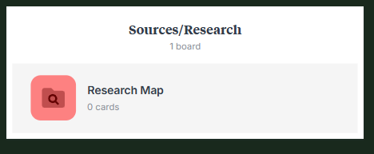

Gave ChatGPT a prompt to find me 10 reliable sources for my project

1. **Prompt Log**

    - **Entry 1:** 

        - Can you find me 10 sources that I can use as research for my Game Development project. Find me sources that are reliable and verifiable. Use my Inquiry Brief that is pasted as context for the sources. Try to avoid any blog posts such as Reddit.

    - **Model / tool:** ChatGPT 5.5

    - **Output summary:**

        - Yes — I found **10 reliable, verifiable sources** that fit your inquiry pretty well. I prioritized **academic papers, official industry reports, and official tool documentation**, not Reddit/blog-style commentary.

            Your project is asking whether AI can help beginners make playable games **without replacing their creative voice**, which matches your earlier framing: AI as “Player Two,” a tool that helps beginners turn ideas into playable work while still questioning originality and ownership.

Table element string placeholder

Table of sources that ChatGPT output

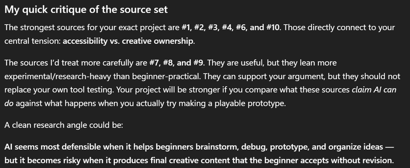

ChatGPT's critique of sources

Building up the Research boards for each source.

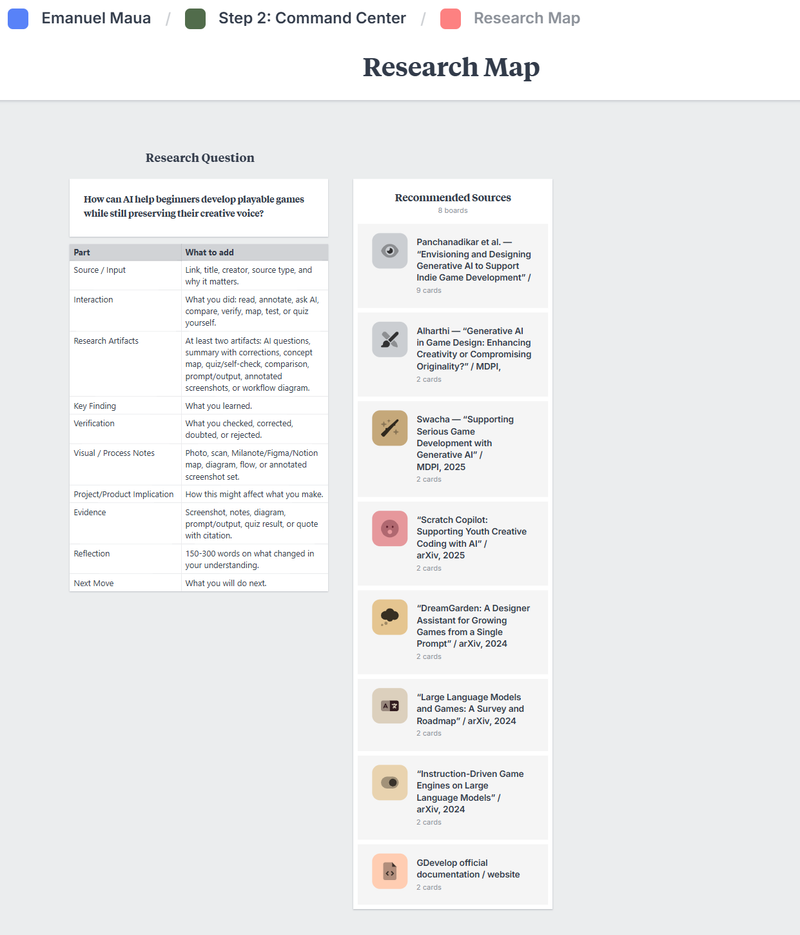

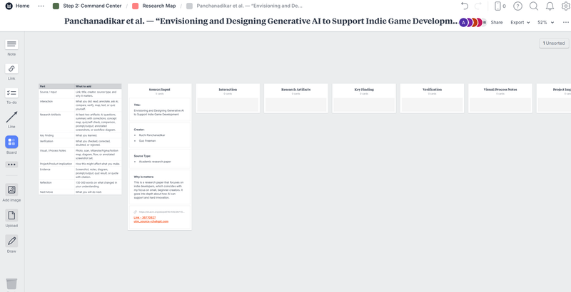

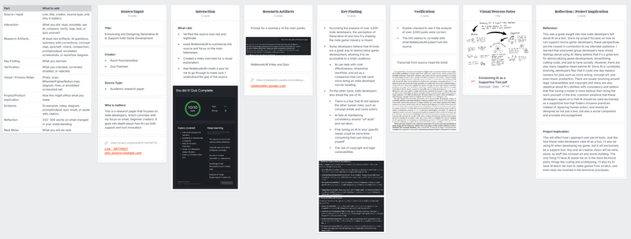

Finished researching my first source: **Envisioning and Designing Generative AI to Support Indie Game Developmen**

**Change of plans:**

I need to research Gdevelop and begin testing so that I have enough time to develop a game while studying.

Created a new board to record my experiences with using AI in game development.

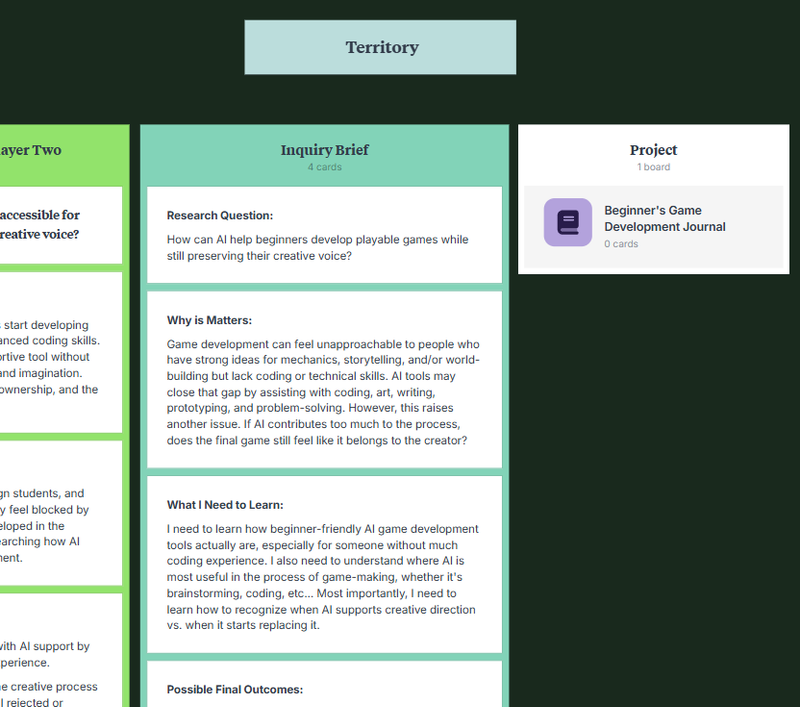

**Beginner's Game Journal** has been updated for this week

# Beginner's Game Development Journal

Starting Gdevelop

Beginning to make a game

Making a Background

Making a Character

Building Walls

## Week 6 Part 1

May 7, 2026 - 11:49 AM:

- I have begun reading through GDevelop's "Getting Started" page to gather a better understanding on how this program works

May 7, 2026 - 1:09 PM:

- I have downloaded the GDevelop app and started browsing through the tutorials

May 7, 2026 - 1:20 PM:

- Started the first tutorial

May 7, 2026 - 2:00 PM:

- Finished all the free tutorials

May 7, 2026 - 2:35 PM:

- Started my collaboration with ChatGPT and using Gdevelop to make my first game.

May 7, 2026 - 2:41 PM:

- First step of making my first game; making a background

May 7, 2026 - 2:52 PM:

- Second step of making my first game; making a character

May 7, 2026 - 3:08 PM:

- Made my first character capable of moving with arrow keys

[20260507-2206-51.8613629.mp4](../images/112-video-20260507-2206-51.8613629.mp4) (1.6 MB)

May 7, 2026 - 3:10 PM:

- Surrounding the background with walls to prevent players from leaving the background

May 7, 2026 - 3:31 PM:

- Wall has been built to prevent player from leaving

May 7, 2026 - 3:31 PM:

- Adding a collectible

[20260507-2244-40.6713045.mp4](../images/113-video-20260507-2244-40.6713045.mp4) (367 KB)

Adding a score system

## Week 6 Part 2

May 7, 2026 - 3:49 PM:

- Adding a score system for collecting coins

Needed assistance to find the correct action

Little mistake

Score can now be successfully counted

[20260507-2318-21.1454224.mp4](../images/114-video-20260507-2318-21.1454224.mp4) (288 KB)

May 7, 2026 - 4:21 PM:

- Adding a win condition and win screen

[20260507-2333-46.3155710.mp4](../images/115-video-20260507-2333-46.3155710.mp4) (278 KB)

May 7, 2026 - 4:35 PM:

- Completed my first ever game!

Winning condition and screen

Start of our real game.

Development Begins! Starting with the mechanics.

# Game Plan

## Top Priority

## Priority 1: Player Combat Prototype

Start here because everything else depends on whether moving, aiming, and shooting feels good.

Build:

**WASD movement**\
**mouse aiming**\
**left-click shooting**\
**basic projectile object**\
**enemy takes damage from projectile**

Do not worry about dungeon generation yet. Just use one test room. If this part feels bad, the whole game feels bad.

## Priority 2: Basic Enemy System

Add your two first enemy types:

**Chaser enemy:** slime/bat that moves toward the player and deals contact damage.\
**Ranged enemy:** skeleton archer that shoots projectiles at intervals.

Also add:

**player damage**\
**temporary invincibility after hit**\
**enemy health**\
**enemy death**

This proves the combat challenge.

**Priority 2.5**

Temporary Character/Enemy Models:

The reason: you need **some visual identity early enough** to understand hitboxes, readability, scale, and combat feel. But you do **not** need final art before the systems work.

I’d treat this as two phases:

**Temporary models first:** simple pixel sprites for the player, slime/bat, and skeleton archer. These should be readable, not perfect.

**Final models later:** better animations, polished silhouettes, effects, and dungeon-style details.

## Priority 3: Room Clear Logic

Once enemies work, build the room rule:

**room starts active/locked → enemies must be defeated → room becomes cleared → doors unlock**

This is the backbone of your dungeon loop. Even before random generation, this system needs to work in a controlled test floor.

## Priority 4: Small Manual Floor

Before random layout, make a simple connected floor with about **4 rooms**.

Build:

**one large connected map**\
**doors on each side**\
**blocked doors where no room exists**\
**open paths where rooms connect**\
**one item room**\
**one way-down room**

This lets you test the feeling of exploring a floor without fighting the random generation monster too early. That monster wears a tiny wizard hat and eats deadlines.

## Priority 5: Floor Transition

Add the way down:

**player touches stairs/ladder/hole → floor number increases → floor resets or loads new layout**

At first, the “new floor” can be the same layout reused. The important part is proving the loop:

**floor 1 → descend → floor 2 → enemies scale → continue**

## Priority 6: Upgrade System

Start with stat upgrades only:

**increase damage**\
**increase max health or heal**\
**increase fire rate later**

Then add the first weapon-style upgrade:

**shotgun spread projectile**

This should come after the basic projectile system is stable.

## Priority 7: Simple Randomized Floor Layout

Only after the manual 4-room floor works, make the layout random.

Your safest version is:

**choose 4 room positions from a small grid**\
**make sure all rooms connect**\
**choose one item room**\
**choose one way-down room**\
**spawn pre-made room templates**

The creative room designs stay yours. The AI can help with the technical event logic for placing and connecting them.

## Priority 8: Polish and Later Features

Back burner features:

**shops**\
**currency**\
**permanent upgrades**\
**biomes**\
**more enemy variants**\
**more attack patterns**\
**extra end-run stats**\
**environmental storytelling**

These are good ideas, but not needed for the first playable version.

## Lowest Priority

## AI Assisted Creative Process

Prompt: After using GDevelop for a little bit, I think it's time to use that experience and start developing my final deliverable; my first, fully fledged game. I'm working on the planning portion of my game. I need to organize what I'll be doing for my game. I will need you to give me questions, one at a time, asking me what my game is about. Basically this is the creative process and the questions could be the game loop, the mechanics, the story — anything that'll help me organize the parts of my game. After enough questions have been asked and answered, help me organize them into what you think I should prioritize making first. I want to keep this creatively mine, so if you have suggestions, make sure they mainly focus on the technical parts while avoiding any creative vision.

### Your Game Plan So Far

Your game is a **top-down roguelike dungeon crawler** where the player tries to descend as far as possible through connected dungeon floors.

The core loop is:

**explore floor → enter rooms → fight enemies → clear rooms → unlock paths → find item room or way down → descend → repeat until death**

Your main gameplay identity is:

**WASD movement + mouse aiming + projectile combat + enemy bullet dodging**

The player starts with **10 health**, takes more damage from contact enemies than projectiles, and can rarely heal through a special room. This makes damage feel punishing, which supports your goal of careful movement and avoiding sloppy mistakes.

## AI Involvement with Building Process

Completed Game Plan

## Week 7 Part 1

**May 15, 2026 - 2:41 PM:**

- We begin making our final deliverable for this project. A roguelite, dungeon-crawling, bullet hell. Where the main goal of the game is to go as deep as possible into the dungeon.

- Making this game, we'll utilize the built-in AI assistant. We'll experiment with both the chat and the agent to see how useful they are with the more technical parts, while the designs will all be made by me.

- Note: With the free version of GDevelop, you only get 40 credits per month. You can use these credits with the "Ask AI" chat feature or the "AI Agent" to help you generate game logic, create events, or write code. Keep in mind that asking questions or doing simpler tasks usually costs 3 to 5 credits, while complex Agent requests can cost between 4 and 20 credits.

- For this project, I'll be using Gdevelop's Gold Premium for more AI credits

**May 15, 2026 - 3:54 PM:**

- Begin by planning my game

- Asking ChatGPT to assist me in organizing my creative process.

**May 15, 2026 - 6:20 PM:**

- ChatGPT and I made a game plan to figure out what to prioritize first when building the game

**May 15, 2026 - 6:31 PM:**

- Building begins and I'm utilizing both ChatGPT to help with prompting, and GDevelop AI to help me build within the engine.

Essential Game Sprites:

- Player

- Projectile

- Wall

- Enemy

Setting Player Movement

Bullet Physics

## Week 7 Part 2

**May 15, 2026 - 7:23 PM**

- Made a player character that can move with Arrow Keys

**May 15, 2026 - 7:23 PM**

- Made a projectile

**May 15, 2026 - 7:23 PM**

- Made a basic wall for rooms

**May 15, 2026 - 7:23 PM**

- Made the most basic enemy. Say hello to Mr. Slime

**May 15, 2026 - 7:29 PM**

- Setting up player movement to WASD

**May 15, 2026 - 7:38 PM**

- Setting up mouse aim

[20260516-0249-37.2856904.mp4](../images/116-video-20260516-0249-37.2856904.mp4) (554 KB)

**May 15, 2026 - 7:43 PM**

- Setting up projectile physics

[20260516-0255-03.2917310.mp4](../images/117-video-20260516-0255-03.2917310.mp4) (4.6 MB)

Enemy Health

## Week 7 Part 3

**May 15, 2026 - 7:55 PM**

- Adding Bullet Collision

[20260516-0302-53.6544624.mp4](../images/118-video-20260516-0302-53.6544624.mp4) (1.8 MB)

**May 15, 2026 - 7:55 PM**

- Adding Enemy Health

[20260516-1847-06.9085444.mp4](../images/119-video-20260516-1847-06.9085444.mp4) (2.2 MB)

Beginning Step 2 of building our game

Adding a Player Health system

Adding the first Enemy Ai

New Enemy: Skeleton Archer

New issues arise

## Week 8 Part 1

**May 21, 2026 - 4:25 PM**

- Begin working on Priority #2: Enemy types

[20260522-0006-53.6466006.mp4](../images/120-video-20260522-0006-53.6466006.mp4) (1.1 MB)

**May 21, 2026: 5:08 PM**

- Adding a new enemy type: Ranged enemies

**May 21, 2026: 5:59 PM**

- Ran into some issues. GDevelop is suggesting options that don't exist

Debugging using the AI Agent

Fixed

## Week 8 Part 2

**May 21, 2026: 6:01 PM**

- These changes are insane. I'll test out the the AI agent by having it  implement the fixes

**May 21, 2026: 6:06 PM**

- The Skeleton Archer is fixed and can now fire and set its distance from the player

[20260522-0107-57.6653180.mp4](../images/121-video-20260522-0107-57.6653180.mp4) (3.2 MB)

New player model

New starting weapon

Organization

## Week 8 Part 3

**May 22, 2026: 12:35 PM**

- Adding a character model for the player

Funny little bug. With the new sprite, it looks like the player is doing somersaults while aiming

[20260522-1941-14.5023291.mp4](../images/122-video-20260522-1941-14.5023291.mp4) (4.2 MB)

**May 22, 2026: 12:57 PM**

- added the starting weapon: a pistol

**May 22, 2026: 1:26 PM**

- Implementing the new weapon and doing some debugging. Using the AI agent is a real plus for technical fixes. Looks like I'm beginning to run into an issue with the chat being too long now though.

**May 22, 2026: 2:04 PM**

- Working on organizing the events

Finished some more debugging and optimizations

Priority #3 Begins (a.k.a. Absolute Insanity)

Room clearing mechanic

## Week 8 Part 4

**May 22, 2026: 3:08 PM**

- Finished more Optimizations

[20260522-2209-31.2466614.mp4](../images/123-video-20260522-2209-31.2466614.mp4) (2.1 MB)

**May 23, 2026: 5:52 PM**

- Made a simple Tilemap and added proper collision mapping

**May 23, 2026: 6:59 PM**

- Begin working on Priority #3: Room Clear Logic

**May 23, 2026: 7:52 PM**

- Made the sprites for the doors, Room boundaries, and room triggers

**May 23, 2026: 8:12 PM**

- This part was extremely technical, messing around with booleans and variables

- Having the AI agent walk me through and build it for me

**May 23, 2026: 8:27 PM**

- This was all WAY beyond me. I had no idea what to make of this, even with the AI agent explaining along the way. I'm just glad it was able to build this for me. All that's left is to test it. Fingers crossed.

**May 23, 2026: 8:56 PM**

- Took A LOT of optimizing, but we now have a working room clear condition!

[20260524-0357-39.2737059.mp4](../images/124-video-20260524-0357-39.2737059.mp4) (9.4 MB)

**May 23, 2026: 9:34 PM**

- Added a random enemy spawner

[20260524-0435-23.4233100.mp4](../images/125-video-20260524-0435-23.4233100.mp4) (12.6 MB)

More fixing

Beginning Step 4 of building our game

## Week 9 Part 1

**May 26, 2026 - 5:59 PM**

- Fixing some bugs before I start on Priority #4: Floor logic

Quick adjustment: Say hello to Mr.Bones 2.0

Giving our friend a new weapon

One of the bigger failures the AI Agent has run into.

Finally got it working again. Making each entity turn individually was one of the hardest  tasks so far

[20260527-0226-23.4023862.mp4](../images/126-video-20260527-0226-23.4023862.mp4) (14.8 MB)

**May 26, 2026 - 7:36 PM**

- Finally working on step 4

**Step 4 Prompt:**

I finished the first three priorities:

1. The player can move with WASD, aim with the mouse, shoot projectiles, and damage enemies.

2. I have two basic enemy types: a chaser enemy and a ranged enemy. The player has health, takes damage, has brief invincibility after being hit, and can reach Game Over.

3. I have workable room clear logic: enemies must be defeated, then the room is cleared and doors can unlock.

Now I want to build the fourth priority: a small 4-room floor.

Please give me step-by-step beginner-friendly instructions for creating a connected floor with about 4 rooms.

The goal is to make one large connected map where the player moves continuously from room to room, not separate scenes.

Please help me create:

- 4 connected rooms on one scene

- Corridors between connected rooms

- Blocked doors or walls where no room is connected

- Room trigger areas so the game knows which room the player entered

- At least one combat room with enemies

- One empty/safe room for Spawning

- One room that can later become an Upgrade room

- One room that can later become the way-down room

Keep in mind that for the final product there will be random room placement, but for now please do not add random generation yet. I want this to be a manually built test floor first, so I can prove the room-to-room structure works before making it random.

Please explain:

What objects I need to create. How large each room should be or how to keep room sizes consistent. How to place rooms so doors line up. How to set up room IDs or room variables. How to connect the room clear logic to each individual room. How to stop cleared rooms from locking again. How to make sure doors only open when the connected room exists. How to test the floor step by step.

Please organize the instructions in the order I should build them. Use clear GDevelop event logic with conditions and actions, and explain why each step is needed

Proof of concept

First Floor

## Week 9 Part 2

**May 26, 2026 - 7:49 PM**

- Before I begin working on Priority #4, I need to ask GDevelop if this is even a possible endeavor

**May 28, 2026 - 3:17 PM**

- Made the first manual floor

**May 28, 2026 - 3:17 PM**

- Here come the bugs. Enemies spawning when they shouldn't, Different room triggers activating combat and closing doors, doors not opening after defeating enemies. This is probably the most amount of bugs at once so far.

**May 28, 2026 - 3:17 PM**

- We've got the beginnings of a working floor!

- I'm surprised I was able to point the AI to the correct solution after it failed a couple of times

[20260528-2317-26.1875862.mp4](../images/127-video-20260528-2317-26.1875862.mp4) (37.1 MB)

Beginning of Priority 5: Floor Transition

Beginning of Priority 6: Upgrade Room

## Week 9 Part 3

**May 28, 2026 - 5:47 PM**

- Time to work on the implementation of levels.

- A way down has been made

**May 28, 2026 - 6:34 PM**

- Working on making the way down interactable.

**May 28, 2026 - 8:18 PM**

- The floor transitions are done along with enemy health scaling.

[20260529-0317-30.8748947.mp4](../images/128-video-20260529-0317-30.8748947.mp4) (40.8 MB)

**May 28, 2026 - 8:26 PM**

- Now to work on another essential of a roguelike, Upgrades.

Upgrade statue sprites

Procedural Generation

## Week 9 Part 1

**June 3, 2026 - 1:04 PM**

- Made the sprites for the upgrades: A statue of light and a statue of war

**June 3, 2026 - 2:45 PM**

- Finally made the basic upgrades work. After a bunch of debugging, I was able to make it so that the player can choose an upgrade, delete the other option until next floor, and display a message that shows what the upgrade will do.

    - Reaching a limitation with GDevelop. The more complex a game becomes, the more problems it's going to have. I had to delete an entire event sequence and manually fix it because GDevelop was beginning to hallucinate with the events.

[20260603-2149-09.2502503.mp4](../images/129-video-20260603-2149-09.2502503.mp4) (36.0 MB)

**June 3, 2026 - 4:51 PM**

- Bonus Addon: Gave the Statue of War a few random choices of power to give

**June 4, 2026 - 3:54 PM**

- This is the most ambitious part of my game build and will really push GDevelop: Procedural Generation (a.k.a random floor layouts)

**June 4, 2026 - 6:56 PM**

- This is absolute insanity! I'm mainly having the AI Agent build the event sequence for this part because this is making my head spin.

**June 5, 2026 - 5:21 PM**

- This is where GDevelop completely failed. It created a procedural generation roadmap that was absolutely incompatible with the game and it couldn't find any way to fix it. Having to start over from a save I made before attempting the procedural generation. Trying again, but this time, I'm deciding how the procedural generation works.

- My plan: Create a bunch of pre-made room layouts (which is what I wanted in the first place before GDevelop completely forgot about that aspect) and have GDevelop create a sequence that randomizes the room boundary and floor layout.

- One of the biggest problems for this step: It seems like GDevelop's Agent likes to follow a specific route for certain mechanics. For procedural generation, the AI keeps going on about creating grids and complex variables, when I specifically ask for simpler approaches, it continues to hallucinate methods that do not apply to my current event sequence.

We have procedural generation!

Room Initialization

## Week 9 Part 1

**June 5, 2026 - 9:27 PM**

- LET'S GO! procedural generation completed.

- This is the greatest achievement in building my game.

- Sadly, this was where the AI had completely failed. It was as if the agent had only one option for building a mechanic and unfortunately, it wasn't compatible with for my game was structured. Instead, I had to build the mechanic myself with a bit of help from a YouTube tutorial.

- I also noticed the AI progressively gets worse the more events you have

**June 4, 2026 - 9:40 PM**

- The Final Step for our first truly playable Dungeon Crawler. Time to tie everything together.

Adding Collectibles

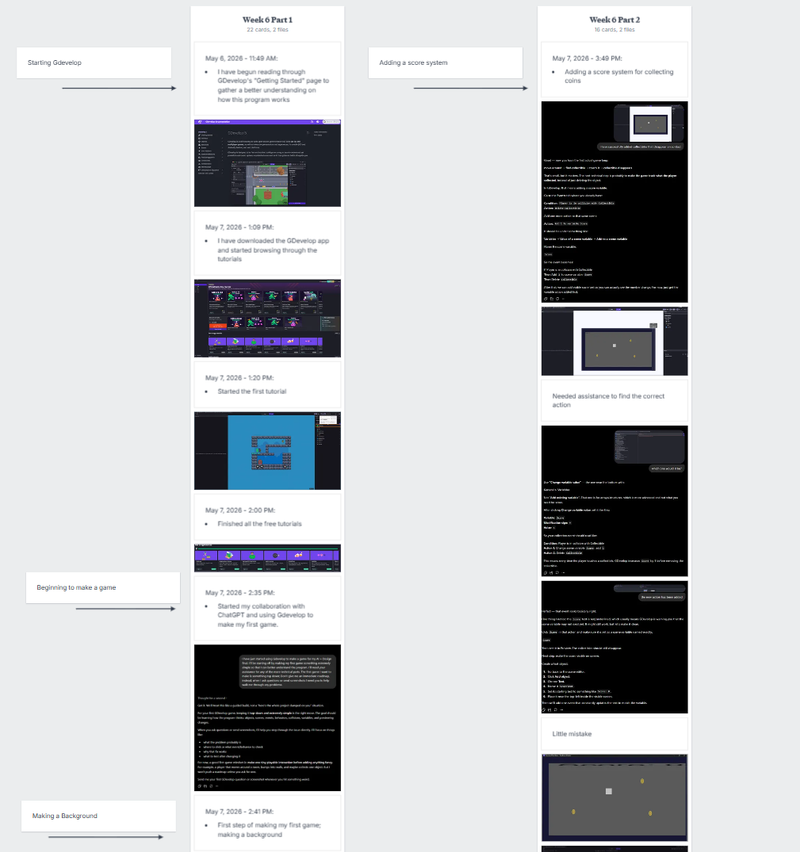

## Artifacts: Read from Left to Right

## Progress Summary

## Requirements

Include the following in your "Week X Update" section:

Progress Summary

- What did you work on this week (in line with your Week 6-11 plan)?

- Include relevant artifacts (screenshots, prototypes, iterations, readings)

On-Track Check-In

Are you on schedule with your study plan?

- **If yes:** Briefly describe what is helping you maintain momentum.

- **If no:** Describe what shifted (scope/timeline/technology), and why.

- **If you deviated from your original plan:** Document the deviation, your rationale, and what you've learned.

Weekly Reflection

- What did you learn this week (about tools, design, AI, process)?

- What's working well and what's problematic?

- What are your biggest questions or obstacles moving into next week?

Next Steps

- What are 1-3 specific, actionable goals for next week (Week 7) aligned with your plan?

Board Organization Note

Confirm your Milanote board remains structured:

- Each week has its own clearly labeled section/column.

- Key components (Progress, On-Track Check, Reflection, Next Steps) are clearly identified.

## Progress Summary

**Summary:**

I researched one of my sources (Envisioning and Designing Generative AI to Support Indie Game Development) and skimmed through a couple of the others.

**Next Steps:**

- Begin testing and getting comfortable with Gdevelop

- Try to research one of my sources using NotebookLM

## Check-In

**On-Track Check-In:**

Currently, I am on track with the AI suggested weekly roadmap and the class assignments. However, I wasn't expecting the deep dive of the first source to take as long as it did. Even though I am on course, I feel like making the actual product is going to take far longer. Instead of researching all of the sources first and only having a week to make an entire game from scratch, I'm going to start experimenting with the tools and begin development while balancing research in-between.

## Weekly Reflection

**What I learned:**

This week, I learned about the perspective that indie developers have on AI usage in the gaming industry, with praise that AI will lower the skill barrier for game development while at the same time, worrying about how AI can effect the creativity and authenticity of games. I also took the time to learn some of the basics of GDevelop, a beginner-friendly game development program that also utilizes AI, and was able to make a very simple game with the guidance of ChatGPT.

**What's working well and what isn't:**

So far, what's working well is that I'm gaining a basic level of knowledge with how Gdevelop works and I was able to research a source with the assistance of NotebookLM. The most issues that I've run into so far was one or two hiccups with the advice ChatGPT provided not really being helpful, but the most problematic being my time management and other classes. I've realized how much time it took for me research a source, and when combined with trying to learn a new program and creating a game from scratch, I may be cutting it close. Especially while working on finals for other classes

**Biggest questions or obstacles for next week:**

My biggest obstacle is going to be allocating enough time next week to work on researching another source, getting more hands-on experience with GDevelop while recording that progress, working on the weekly assignment we'll be given on Monday, all while also working on my final projects for my other classes. My biggest question right now is, am I doing too much?

## Next Steps

1. Do a deep dive into another one of my sources using NotebookLM

2. Begin the creative, initial process of the game I'll be developing for my final deliverable

**Possible goal next week:**

1. Do a deep dive into another one of my sources using NotebookLM

2. Begin the creative, initial process of the game I'll be developing for my final deliverable

## Actual Week 7

**Goal:**

- Do a deep dive into another one of my sources using NotebookLM

- Experiment with GDevelop's AI assistant in making another test game

- Begin the creative, initial process of the game I'll be developing for my final deliverable

# Wk.7 Progress Report

## Requirements

Include the following in your "Week X Update" section:

Progress Summary

- What did you work on this week (in line with your Week 6-11 plan)?

- Include relevant artifacts (screenshots, prototypes, iterations, readings)

On-Track Check-In

Are you on schedule with your study plan?

- **If yes:** Briefly describe what is helping you maintain momentum.

- **If no:** Describe what shifted (scope/timeline/technology), and why.

- **If you deviated from your original plan:** Document the deviation, your rationale, and what you've learned.

Weekly Reflection

- What did you learn this week (about tools, design, AI, process)?

- What's working well and what's problematic?

- What are your biggest questions or obstacles moving into next week?

Next Steps

- What are 1-3 specific, actionable goals for next week (Week 7) aligned with your plan?

Board Organization Note

Confirm your Milanote board remains structured:

- Each week has its own clearly labeled section/column.

- Key components (Progress, On-Track Check, Reflection, Next Steps) are clearly identified.

## Progress Summary

**Summary:**

I was able to research two sources; **Gdevelop Documentation Site** and **GDC — What Game Developers Want From: Generative AI / 2024**. I also started working on the deliverable I'll turn in for this project.

## Check-In

**On-Track Check-In:**

For researching the sources, I am currently, just about, falling behind since I had to shift my priorities to actually making the game. Speaking of, I think I'm doing pretty well for the game development process, thanks to the priority list I made with ChatGPT which helped me organize and streamline that portion (which also applies to my project of "Whether AI can help game developers").

## Weekly Reflection

**What I learned:**

- This week, I learned how to utilize GDevelop's own AI to help kickstart my game

-

**What's working well and what isn't:**

- Currently, what's most problematic is trying to fit researching sources into my schedule

- What is working well is the start of building my game. I have a decently laid out roadmap that ChatGPT can use to create prompts for GDevelop. So far, this has been running the smoothest.

**Biggest questions or obstacles for next week:**

- How can I better fit researching my sources into my busy schedule?

## Next Steps

- Try to get at least one source researched this week

- Continue working on my game

Finished researching the GDevelop Documentation site

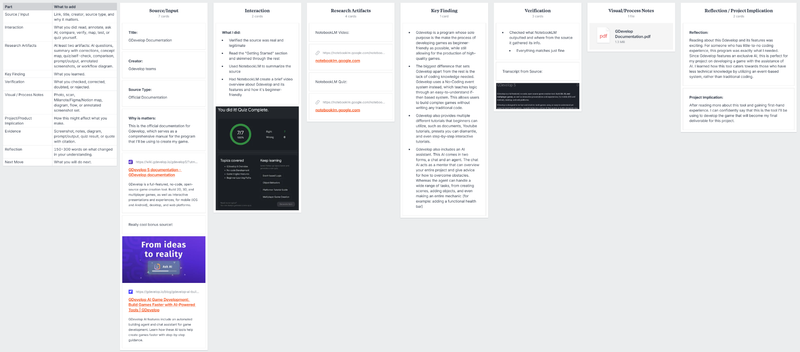

Started and finished researching another source: **GDC — What Game Developers Want From: Generative AI / 2024**

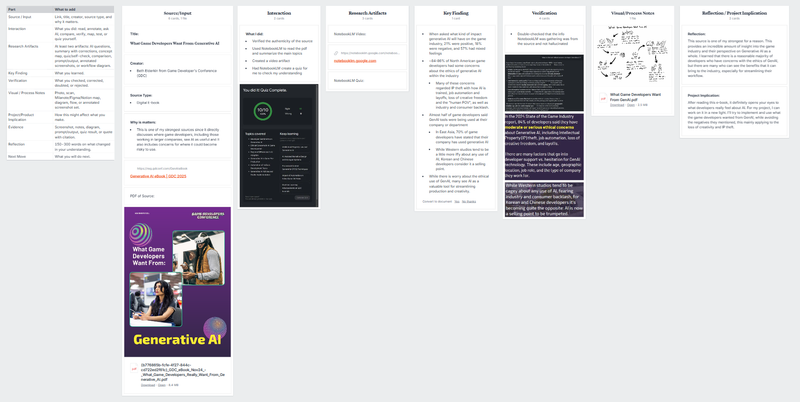

# GDC — What Game Developers Want From: Generative AI / 2024

Table element string placeholder

## Source/Input

**TItle:**

### **What Game Developers Want From: Generative AI**

**Creator:**

- Beth Elderkin from Game Developer's Conference (GDC)

**Source Type:**

- Digital E-book

**Why is matters:**

- This is one of my strongest sources since it directly discusses where game developers, including those working in larger companies, see AI as useful and It also includes concerns for where it could become risky to use.

[Generative AI eBook | GDC 2025](https://reg.gdconf.com/GenAIeBook)

PDF of Source:

[{b776865b-fcfe-4f27-844c-cd722ed2f61c}_GDC_eBook_Nov24_-_What_Game_Developers_Really_Want_From_Generative_AI.pdf](https://media.milanote.com/p/files/1WmWRY1QoT7pcn/od6/%7Bb776865b-fcfe-4f27-844c-cd722ed2f61c%7D_GDC_eBook_Nov24_-_What_Game_Developers_Really_Want_From_Generative_AI.pdf) (8.4 MB)

## Interaction

**What I did:**

- Verified the authenticity of the source

- Used NotebookLM to read the pdf and summarize the main topics

- Created a video artifact

- Had NotebookLM create a quiz for me to check my understanding

## Research Artifacts

NotebookLM Video:

[notebooklm.google.com](https://notebooklm.google.com/notebook/53233194-9e5a-49da-b3e7-883a4a567b7c/artifact/7b211d93-5625-44ab-9cd9-b8bd74d80cc7?utm_source=nlm_web_share&utm_medium=google_oo&utm_campaign=art_share_1&utm_content=&utm_smc=nlm_web_share_google_oo_art_share_1_)

NotebookLM Quiz:

## Key Finding

- When asked what kind of impact generative AI will have on the game industry, 21% were positive, 18% were negative, and 57% had mixed feelings

- \~84-86% of North American game developers had some concerns about the ethics of generative AI within the industry

    - Many of these concerns regarded IP theft with how AI is trained, job automation and layoffs, loss of creative freedom and the "human POV", as well as industry and consumer backlash.

- Almost half of game developers said GenAI tools were being used at their company or department

    - In East Asia, 70% of game developers have stated that their company has used generative AI

    - While Western studios tend to be a little more iffy about any use of AI, Korean and Chinese developers consider it a selling point.

- While there is worry about the ethical use of GenAI, many see AI as a valuable tool for streamlining production and creativity.

## Verification

- Double-checked that the info NotebookLM was gathering was from the source and not hallucinated

## Visual/Process Notes

[What Game Developers Want From GenAI.pdf](https://media.milanote.com/p/files/1WmYAT1QoT7pcy/llo/What%20Game%20Developers%20Want%20From%20GenAI.pdf) (2.5 MB)

## Reflection / Project Implication

**Reflection:**

This source is one of my strongest for a reason. This provides an incredible amount of insight into the game industry and their perspective on Generative AI as a whole. I learned that there is a reasonable majority of developers who have concerns with the ethics of GenAI, but there are many who can see the benefits that it can bring to the industry, especially for streamlining their workflow.

**Project Implication:**

After reading this e-book, it definitely opens your eyes to what developers really feel about AI. For my project, I can work on it in a new light. I'll try to implement and use what the game developers wanted from GenAI, while avoiding the negatives they mentioned, this mainly applying to the loss of creativity and IP theft.

Started developing my main deliverable. A fully fledged game. Asking ChatGPT to help me organize my creative process.

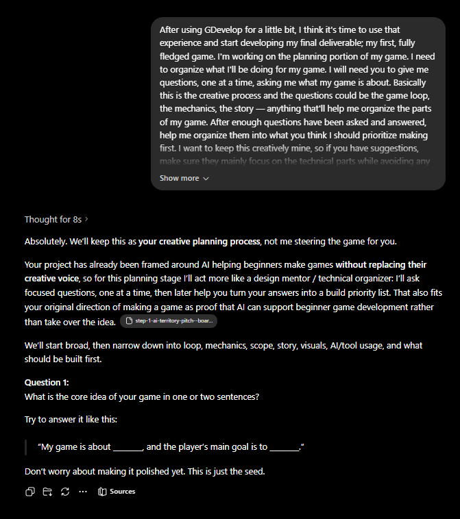

After having ChatGPT ask me a series of questions and answering them. Together we made a fleshed out game plan.

# Game Plan

## Top Priority

## Priority 1: Player Combat Prototype

Start here because everything else depends on whether moving, aiming, and shooting feels good.

Build:

**WASD movement**\
**mouse aiming**\
**left-click shooting**\
**basic projectile object**\
**enemy takes damage from projectile**

Do not worry about dungeon generation yet. Just use one test room. If this part feels bad, the whole game feels bad.

## Priority 2: Basic Enemy System

Add your two first enemy types:

**Chaser enemy:** slime/bat that moves toward the player and deals contact damage.\
**Ranged enemy:** skeleton archer that shoots projectiles at intervals.

Also add:

**player damage**\
**temporary invincibility after hit**\
**enemy health**\
**enemy death**

This proves the combat challenge.

**Priority 2.5**

Temporary Character/Enemy Models:

The reason: you need **some visual identity early enough** to understand hitboxes, readability, scale, and combat feel. But you do **not** need final art before the systems work.

I’d treat this as two phases:

**Temporary models first:** simple pixel sprites for the player, slime/bat, and skeleton archer. These should be readable, not perfect.

**Final models later:** better animations, polished silhouettes, effects, and dungeon-style details.

## Priority 3: Room Clear Logic

Once enemies work, build the room rule:

**room starts active/locked → enemies must be defeated → room becomes cleared → doors unlock**

This is the backbone of your dungeon loop. Even before random generation, this system needs to work in a controlled test floor.

## Priority 4: Small Manual Floor

Before random layout, make a simple connected floor with about **4 rooms**.

Build:

**one large connected map**\
**doors on each side**\
**blocked doors where no room exists**\
**open paths where rooms connect**\
**one item room**\
**one way-down room**

This lets you test the feeling of exploring a floor without fighting the random generation monster too early. That monster wears a tiny wizard hat and eats deadlines.

## Priority 5: Floor Transition

Add the way down:

**player touches stairs/ladder/hole → floor number increases → floor resets or loads new layout**

At first, the “new floor” can be the same layout reused. The important part is proving the loop:

**floor 1 → descend → floor 2 → enemies scale → continue**

## Priority 6: Upgrade System

Start with stat upgrades only:

**increase damage**\
**increase max health or heal**\
**increase fire rate later**

Then add the first weapon-style upgrade:

**shotgun spread projectile**

This should come after the basic projectile system is stable.

## Priority 7: Simple Randomized Floor Layout

Only after the manual 4-room floor works, make the layout random.

Your safest version is:

**choose 4 room positions from a small grid**\
**make sure all rooms connect**\
**choose one item room**\
**choose one way-down room**\
**spawn pre-made room templates**

The creative room designs stay yours. The AI can help with the technical event logic for placing and connecting them.

## Priority 8: Polish and Later Features

Back burner features:

**shops**\
**currency**\
**permanent upgrades**\
**biomes**\
**more enemy variants**\
**more attack patterns**\
**extra end-run stats**\
**environmental storytelling**

These are good ideas, but not needed for the first playable version.

## Lowest Priority

## AI Assisted Creative Process

Prompt: After using GDevelop for a little bit, I think it's time to use that experience and start developing my final deliverable; my first, fully fledged game. I'm working on the planning portion of my game. I need to organize what I'll be doing for my game. I will need you to give me questions, one at a time, asking me what my game is about. Basically this is the creative process and the questions could be the game loop, the mechanics, the story — anything that'll help me organize the parts of my game. After enough questions have been asked and answered, help me organize them into what you think I should prioritize making first. I want to keep this creatively mine, so if you have suggestions, make sure they mainly focus on the technical parts while avoiding any creative vision.

### Your Game Plan So Far

Your game is a **top-down roguelike dungeon crawler** where the player tries to descend as far as possible through connected dungeon floors.

The core loop is:

**explore floor → enter rooms → fight enemies → clear rooms → unlock paths → find item room or way down → descend → repeat until death**

Your main gameplay identity is:

**WASD movement + mouse aiming + projectile combat + enemy bullet dodging**

The player starts with **10 health**, takes more damage from contact enemies than projectiles, and can rarely heal through a special room. This makes damage feel punishing, which supports your goal of careful movement and avoiding sloppy mistakes.

## AI Involvement with Building Process

Updated the **Beginner's Game Development Journal**

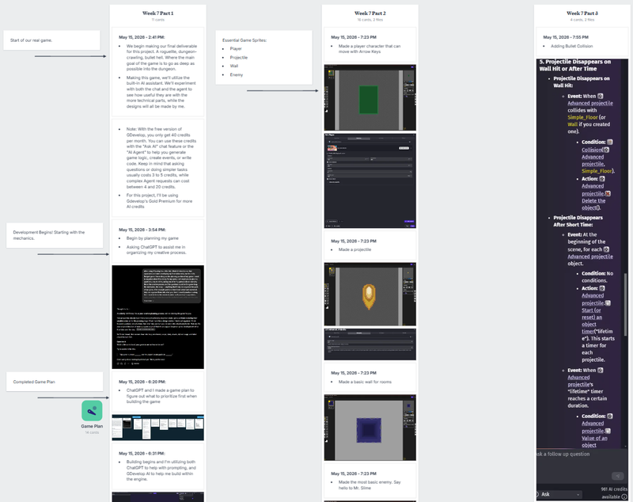

# Beginner's Game Development Journal

Starting Gdevelop

Beginning to make a game

Making a Background

Making a Character

Building Walls

## Week 6 Part 1

May 7, 2026 - 11:49 AM:

- I have begun reading through GDevelop's "Getting Started" page to gather a better understanding on how this program works

May 7, 2026 - 1:09 PM:

- I have downloaded the GDevelop app and started browsing through the tutorials

May 7, 2026 - 1:20 PM:

- Started the first tutorial

May 7, 2026 - 2:00 PM:

- Finished all the free tutorials

May 7, 2026 - 2:35 PM:

- Started my collaboration with ChatGPT and using Gdevelop to make my first game.

May 7, 2026 - 2:41 PM:

- First step of making my first game; making a background

May 7, 2026 - 2:52 PM:

- Second step of making my first game; making a character

May 7, 2026 - 3:08 PM:

- Made my first character capable of moving with arrow keys

[20260507-2206-51.8613629.mp4](../images/112-video-20260507-2206-51.8613629.mp4) (1.6 MB)

May 7, 2026 - 3:10 PM:

- Surrounding the background with walls to prevent players from leaving the background

May 7, 2026 - 3:31 PM:

- Wall has been built to prevent player from leaving

May 7, 2026 - 3:31 PM:

- Adding a collectible

[20260507-2244-40.6713045.mp4](../images/113-video-20260507-2244-40.6713045.mp4) (367 KB)

Adding a score system

## Week 6 Part 2

May 7, 2026 - 3:49 PM:

- Adding a score system for collecting coins

Needed assistance to find the correct action

Little mistake

Score can now be successfully counted

[20260507-2318-21.1454224.mp4](../images/114-video-20260507-2318-21.1454224.mp4) (288 KB)

May 7, 2026 - 4:21 PM:

- Adding a win condition and win screen

[20260507-2333-46.3155710.mp4](../images/115-video-20260507-2333-46.3155710.mp4) (278 KB)

May 7, 2026 - 4:35 PM:

- Completed my first ever game!

Winning condition and screen

Start of our real game.

Development Begins! Starting with the mechanics.

# Game Plan

## Top Priority

## Priority 1: Player Combat Prototype

Start here because everything else depends on whether moving, aiming, and shooting feels good.

Build:

**WASD movement**\
**mouse aiming**\
**left-click shooting**\
**basic projectile object**\
**enemy takes damage from projectile**

Do not worry about dungeon generation yet. Just use one test room. If this part feels bad, the whole game feels bad.

## Priority 2: Basic Enemy System

Add your two first enemy types:

**Chaser enemy:** slime/bat that moves toward the player and deals contact damage.\
**Ranged enemy:** skeleton archer that shoots projectiles at intervals.

Also add:

**player damage**\
**temporary invincibility after hit**\
**enemy health**\
**enemy death**

This proves the combat challenge.

**Priority 2.5**

Temporary Character/Enemy Models:

The reason: you need **some visual identity early enough** to understand hitboxes, readability, scale, and combat feel. But you do **not** need final art before the systems work.

I’d treat this as two phases:

**Temporary models first:** simple pixel sprites for the player, slime/bat, and skeleton archer. These should be readable, not perfect.

**Final models later:** better animations, polished silhouettes, effects, and dungeon-style details.

## Priority 3: Room Clear Logic

Once enemies work, build the room rule:

**room starts active/locked → enemies must be defeated → room becomes cleared → doors unlock**

This is the backbone of your dungeon loop. Even before random generation, this system needs to work in a controlled test floor.

## Priority 4: Small Manual Floor

Before random layout, make a simple connected floor with about **4 rooms**.

Build:

**one large connected map**\
**doors on each side**\
**blocked doors where no room exists**\
**open paths where rooms connect**\
**one item room**\
**one way-down room**

This lets you test the feeling of exploring a floor without fighting the random generation monster too early. That monster wears a tiny wizard hat and eats deadlines.

## Priority 5: Floor Transition

Add the way down:

**player touches stairs/ladder/hole → floor number increases → floor resets or loads new layout**

At first, the “new floor” can be the same layout reused. The important part is proving the loop:

**floor 1 → descend → floor 2 → enemies scale → continue**

## Priority 6: Upgrade System

Start with stat upgrades only:

**increase damage**\
**increase max health or heal**\
**increase fire rate later**

Then add the first weapon-style upgrade:

**shotgun spread projectile**

This should come after the basic projectile system is stable.

## Priority 7: Simple Randomized Floor Layout

Only after the manual 4-room floor works, make the layout random.

Your safest version is:

**choose 4 room positions from a small grid**\
**make sure all rooms connect**\
**choose one item room**\
**choose one way-down room**\
**spawn pre-made room templates**

The creative room designs stay yours. The AI can help with the technical event logic for placing and connecting them.

## Priority 8: Polish and Later Features

Back burner features:

**shops**\
**currency**\
**permanent upgrades**\
**biomes**\
**more enemy variants**\
**more attack patterns**\
**extra end-run stats**\
**environmental storytelling**

These are good ideas, but not needed for the first playable version.

## Lowest Priority

## AI Assisted Creative Process

Prompt: After using GDevelop for a little bit, I think it's time to use that experience and start developing my final deliverable; my first, fully fledged game. I'm working on the planning portion of my game. I need to organize what I'll be doing for my game. I will need you to give me questions, one at a time, asking me what my game is about. Basically this is the creative process and the questions could be the game loop, the mechanics, the story — anything that'll help me organize the parts of my game. After enough questions have been asked and answered, help me organize them into what you think I should prioritize making first. I want to keep this creatively mine, so if you have suggestions, make sure they mainly focus on the technical parts while avoiding any creative vision.

### Your Game Plan So Far

Your game is a **top-down roguelike dungeon crawler** where the player tries to descend as far as possible through connected dungeon floors.

The core loop is:

**explore floor → enter rooms → fight enemies → clear rooms → unlock paths → find item room or way down → descend → repeat until death**

Your main gameplay identity is:

**WASD movement + mouse aiming + projectile combat + enemy bullet dodging**

The player starts with **10 health**, takes more damage from contact enemies than projectiles, and can rarely heal through a special room. This makes damage feel punishing, which supports your goal of careful movement and avoiding sloppy mistakes.

## AI Involvement with Building Process

Completed Game Plan

## Week 7 Part 1

**May 15, 2026 - 2:41 PM:**

- We begin making our final deliverable for this project. A roguelite, dungeon-crawling, bullet hell. Where the main goal of the game is to go as deep as possible into the dungeon.

- Making this game, we'll utilize the built-in AI assistant. We'll experiment with both the chat and the agent to see how useful they are with the more technical parts, while the designs will all be made by me.

- Note: With the free version of GDevelop, you only get 40 credits per month. You can use these credits with the "Ask AI" chat feature or the "AI Agent" to help you generate game logic, create events, or write code. Keep in mind that asking questions or doing simpler tasks usually costs 3 to 5 credits, while complex Agent requests can cost between 4 and 20 credits.

- For this project, I'll be using Gdevelop's Gold Premium for more AI credits

**May 15, 2026 - 3:54 PM:**

- Begin by planning my game

- Asking ChatGPT to assist me in organizing my creative process.

**May 15, 2026 - 6:20 PM:**

- ChatGPT and I made a game plan to figure out what to prioritize first when building the game

**May 15, 2026 - 6:31 PM:**

- Building begins and I'm utilizing both ChatGPT to help with prompting, and GDevelop AI to help me build within the engine.

Essential Game Sprites:

- Player

- Projectile

- Wall

- Enemy

Setting Player Movement

Bullet Physics

## Week 7 Part 2

**May 15, 2026 - 7:23 PM**

- Made a player character that can move with Arrow Keys

**May 15, 2026 - 7:23 PM**

- Made a projectile

**May 15, 2026 - 7:23 PM**

- Made a basic wall for rooms

**May 15, 2026 - 7:23 PM**

- Made the most basic enemy. Say hello to Mr. Slime

**May 15, 2026 - 7:29 PM**

- Setting up player movement to WASD

**May 15, 2026 - 7:38 PM**

- Setting up mouse aim

[20260516-0249-37.2856904.mp4](../images/116-video-20260516-0249-37.2856904.mp4) (554 KB)

**May 15, 2026 - 7:43 PM**

- Setting up projectile physics

[20260516-0255-03.2917310.mp4](../images/117-video-20260516-0255-03.2917310.mp4) (4.6 MB)

Enemy Health

## Week 7 Part 3

**May 15, 2026 - 7:55 PM**

- Adding Bullet Collision

[20260516-0302-53.6544624.mp4](../images/118-video-20260516-0302-53.6544624.mp4) (1.8 MB)

**May 15, 2026 - 7:55 PM**

- Adding Enemy Health

[20260516-1847-06.9085444.mp4](../images/119-video-20260516-1847-06.9085444.mp4) (2.2 MB)

Beginning Step 2 of building our game

Adding a Player Health system

Adding the first Enemy Ai

New Enemy: Skeleton Archer

New issues arise

## Week 8 Part 1

**May 21, 2026 - 4:25 PM**

- Begin working on Priority #2: Enemy types

[20260522-0006-53.6466006.mp4](../images/120-video-20260522-0006-53.6466006.mp4) (1.1 MB)

**May 21, 2026: 5:08 PM**

- Adding a new enemy type: Ranged enemies

**May 21, 2026: 5:59 PM**

- Ran into some issues. GDevelop is suggesting options that don't exist

Debugging using the AI Agent

Fixed

## Week 8 Part 2

**May 21, 2026: 6:01 PM**

- These changes are insane. I'll test out the the AI agent by having it  implement the fixes

**May 21, 2026: 6:06 PM**

- The Skeleton Archer is fixed and can now fire and set its distance from the player

[20260522-0107-57.6653180.mp4](../images/121-video-20260522-0107-57.6653180.mp4) (3.2 MB)

New player model

New starting weapon

Organization

## Week 8 Part 3

**May 22, 2026: 12:35 PM**

- Adding a character model for the player

Funny little bug. With the new sprite, it looks like the player is doing somersaults while aiming

[20260522-1941-14.5023291.mp4](../images/122-video-20260522-1941-14.5023291.mp4) (4.2 MB)

**May 22, 2026: 12:57 PM**

- added the starting weapon: a pistol

**May 22, 2026: 1:26 PM**

- Implementing the new weapon and doing some debugging. Using the AI agent is a real plus for technical fixes. Looks like I'm beginning to run into an issue with the chat being too long now though.

**May 22, 2026: 2:04 PM**

- Working on organizing the events

Finished some more debugging and optimizations

Priority #3 Begins (a.k.a. Absolute Insanity)

Room clearing mechanic

## Week 8 Part 4

**May 22, 2026: 3:08 PM**

- Finished more Optimizations

[20260522-2209-31.2466614.mp4](../images/123-video-20260522-2209-31.2466614.mp4) (2.1 MB)

**May 23, 2026: 5:52 PM**

- Made a simple Tilemap and added proper collision mapping

**May 23, 2026: 6:59 PM**

- Begin working on Priority #3: Room Clear Logic

**May 23, 2026: 7:52 PM**

- Made the sprites for the doors, Room boundaries, and room triggers

**May 23, 2026: 8:12 PM**

- This part was extremely technical, messing around with booleans and variables

- Having the AI agent walk me through and build it for me

**May 23, 2026: 8:27 PM**

- This was all WAY beyond me. I had no idea what to make of this, even with the AI agent explaining along the way. I'm just glad it was able to build this for me. All that's left is to test it. Fingers crossed.

**May 23, 2026: 8:56 PM**

- Took A LOT of optimizing, but we now have a working room clear condition!

[20260524-0357-39.2737059.mp4](../images/124-video-20260524-0357-39.2737059.mp4) (9.4 MB)

**May 23, 2026: 9:34 PM**

- Added a random enemy spawner

[20260524-0435-23.4233100.mp4](../images/125-video-20260524-0435-23.4233100.mp4) (12.6 MB)

More fixing

Beginning Step 4 of building our game

## Week 9 Part 1

**May 26, 2026 - 5:59 PM**

- Fixing some bugs before I start on Priority #4: Floor logic

Quick adjustment: Say hello to Mr.Bones 2.0

Giving our friend a new weapon

One of the bigger failures the AI Agent has run into.

Finally got it working again. Making each entity turn individually was one of the hardest  tasks so far

[20260527-0226-23.4023862.mp4](../images/126-video-20260527-0226-23.4023862.mp4) (14.8 MB)

**May 26, 2026 - 7:36 PM**

- Finally working on step 4

**Step 4 Prompt:**

I finished the first three priorities:

1. The player can move with WASD, aim with the mouse, shoot projectiles, and damage enemies.

2. I have two basic enemy types: a chaser enemy and a ranged enemy. The player has health, takes damage, has brief invincibility after being hit, and can reach Game Over.

3. I have workable room clear logic: enemies must be defeated, then the room is cleared and doors can unlock.

Now I want to build the fourth priority: a small 4-room floor.

Please give me step-by-step beginner-friendly instructions for creating a connected floor with about 4 rooms.

The goal is to make one large connected map where the player moves continuously from room to room, not separate scenes.

Please help me create:

- 4 connected rooms on one scene

- Corridors between connected rooms

- Blocked doors or walls where no room is connected

- Room trigger areas so the game knows which room the player entered

- At least one combat room with enemies

- One empty/safe room for Spawning

- One room that can later become an Upgrade room

- One room that can later become the way-down room

Keep in mind that for the final product there will be random room placement, but for now please do not add random generation yet. I want this to be a manually built test floor first, so I can prove the room-to-room structure works before making it random.

Please explain:

What objects I need to create. How large each room should be or how to keep room sizes consistent. How to place rooms so doors line up. How to set up room IDs or room variables. How to connect the room clear logic to each individual room. How to stop cleared rooms from locking again. How to make sure doors only open when the connected room exists. How to test the floor step by step.

Please organize the instructions in the order I should build them. Use clear GDevelop event logic with conditions and actions, and explain why each step is needed

Proof of concept

First Floor

## Week 9 Part 2

**May 26, 2026 - 7:49 PM**

- Before I begin working on Priority #4, I need to ask GDevelop if this is even a possible endeavor

**May 28, 2026 - 3:17 PM**

- Made the first manual floor

**May 28, 2026 - 3:17 PM**

- Here come the bugs. Enemies spawning when they shouldn't, Different room triggers activating combat and closing doors, doors not opening after defeating enemies. This is probably the most amount of bugs at once so far.

**May 28, 2026 - 3:17 PM**

- We've got the beginnings of a working floor!

- I'm surprised I was able to point the AI to the correct solution after it failed a couple of times

[20260528-2317-26.1875862.mp4](../images/127-video-20260528-2317-26.1875862.mp4) (37.1 MB)

Beginning of Priority 5: Floor Transition

Beginning of Priority 6: Upgrade Room

## Week 9 Part 3

**May 28, 2026 - 5:47 PM**

- Time to work on the implementation of levels.

- A way down has been made

**May 28, 2026 - 6:34 PM**

- Working on making the way down interactable.

**May 28, 2026 - 8:18 PM**

- The floor transitions are done along with enemy health scaling.

[20260529-0317-30.8748947.mp4](../images/128-video-20260529-0317-30.8748947.mp4) (40.8 MB)

**May 28, 2026 - 8:26 PM**

- Now to work on another essential of a roguelike, Upgrades.

Upgrade statue sprites

Procedural Generation

## Week 9 Part 1

**June 3, 2026 - 1:04 PM**

- Made the sprites for the upgrades: A statue of light and a statue of war

**June 3, 2026 - 2:45 PM**

- Finally made the basic upgrades work. After a bunch of debugging, I was able to make it so that the player can choose an upgrade, delete the other option until next floor, and display a message that shows what the upgrade will do.

    - Reaching a limitation with GDevelop. The more complex a game becomes, the more problems it's going to have. I had to delete an entire event sequence and manually fix it because GDevelop was beginning to hallucinate with the events.

[20260603-2149-09.2502503.mp4](../images/129-video-20260603-2149-09.2502503.mp4) (36.0 MB)

**June 3, 2026 - 4:51 PM**

- Bonus Addon: Gave the Statue of War a few random choices of power to give

**June 4, 2026 - 3:54 PM**

- This is the most ambitious part of my game build and will really push GDevelop: Procedural Generation (a.k.a random floor layouts)

**June 4, 2026 - 6:56 PM**

- This is absolute insanity! I'm mainly having the AI Agent build the event sequence for this part because this is making my head spin.

**June 5, 2026 - 5:21 PM**

- This is where GDevelop completely failed. It created a procedural generation roadmap that was absolutely incompatible with the game and it couldn't find any way to fix it. Having to start over from a save I made before attempting the procedural generation. Trying again, but this time, I'm deciding how the procedural generation works.

- My plan: Create a bunch of pre-made room layouts (which is what I wanted in the first place before GDevelop completely forgot about that aspect) and have GDevelop create a sequence that randomizes the room boundary and floor layout.

- One of the biggest problems for this step: It seems like GDevelop's Agent likes to follow a specific route for certain mechanics. For procedural generation, the AI keeps going on about creating grids and complex variables, when I specifically ask for simpler approaches, it continues to hallucinate methods that do not apply to my current event sequence.

We have procedural generation!

Room Initialization

## Week 9 Part 1

**June 5, 2026 - 9:27 PM**

- LET'S GO! procedural generation completed.

- This is the greatest achievement in building my game.

- Sadly, this was where the AI had completely failed. It was as if the agent had only one option for building a mechanic and unfortunately, it wasn't compatible with for my game was structured. Instead, I had to build the mechanic myself with a bit of help from a YouTube tutorial.

- I also noticed the AI progressively gets worse the more events you have

**June 4, 2026 - 9:40 PM**

- The Final Step for our first truly playable Dungeon Crawler. Time to tie everything together.

Adding Collectibles

## Artifacts: Read from Left to Right

# GDevelop official documentation / website

Table element string placeholder

## Source/Input

**TItle:**

GDevelop Documentation

**Creator:**

Gdevelop teams

**Source Type:**

Official Documentation

**Why is matters:**

This is the official documentation for Gdevelop, which serves as a comprehensive manual for the program that I'll be using to create my game.

[GDevelop 5 documentation - GDevelop documentation](https://wiki.gdevelop.io/gdevelop5/?utm_source=chatgpt.com)

GDevelop is a full-featured, no-code, open-source game creation tool. Build 2D, 3D, and multiplayer games, as well as interactive presentations and experiences, for mobile (iOS and Android), desktop, and web platforms.

Really cool bonus source!:

[GDevelop AI Game Development: Build Games Faster with AI-Powered Tools | GDevelop](https://gdevelop.io/blog/gdevelop-ai-build-games-faster-ai-powered-tools)

GDevelop AI features include an automated building agent and chat assistant for game development. Learn how these AI tools help create games faster with step-by-step guidance.

## Interaction

**What I did:**

- Verified the source was real and legitimate

- Read the "Getting Started" section and skimmed through the rest

- Used NotebookLM to summarize the source

- Had NotebookLM create a brief video overview about Gdevelop and its features and how it's beginner-friendly

## Research Artifacts

NotebookLM Video:

[notebooklm.google.com](https://notebooklm.google.com/notebook/b6bf6fd5-05f4-4cb9-9fce-9ab11ea4579c/artifact/b1b3751a-5af7-4673-bc62-b1530388614b?utm_source=nlm_web_share&utm_medium=google_oo&utm_campaign=art_share_1&utm_content=&utm_smc=nlm_web_share_google_oo_art_share_1_)

NotebookLM Quiz:

[notebooklm.google.com](https://notebooklm.google.com/notebook/b6bf6fd5-05f4-4cb9-9fce-9ab11ea4579c/artifact/0463ac69-7d63-4290-9706-3e21c3e2121b?utm_source=nlm_web_share&utm_medium=google_oo&utm_campaign=art_share_1&utm_content=&utm_smc=nlm_web_share_google_oo_art_share_1_)

## Key Finding

- Gdevelop is a program whose sole purpose is the make the process of developing games as beginner-friendly as possible, while still allowing for the production of high-quality games.

- The biggest difference that sets Gdevelop apart from the rest is the lack of coding knowledge needed. Gdevelop uses a No-Coding event system instead, which teaches logic through an easy-to-understand if-then based system. This allows users to build complex games without writing any traditional code.

- Gdevelop also provides multiple different tutorials that beginners can utilize, such as documents, Youtube tutorials, presets you can dismantle, and even step-by-step interactive tutorials.

- Gdevelop also includes an AI assistant. This AI comes in two forms, a chat and an agent. The chat Ai acts as a mentor that can overview your entire project and give advice for how to overcome obstacles. Whereas the agent can handle a wide range of tasks, from creating scenes, adding objects, and even making an entire mechanic (for example: adding a functional health bar)

## Verification

- Checked what NotebookLM outputted and where from the source it gathered its info.

    - Everything matches just fine

Transcript from Source:

## Visual/Process Notes

[GDevelop Documentation.pdf](https://media.milanote.com/p/files/1WmE7B1Sl2A3as/6Rq/GDevelop%20Documentation.pdf) (1.3 MB)

## Reflection / Project Implication

**Reflection:**

Reading about this Gdevelop and its features was exciting. For someone who has little-to-no coding experience, this program was exactly what I needed. Since Gdevelop features an exclusive AI, this is perfect for my project on developing a game with the assistance of AI. I learned how this tool caters towards those who have less technical knowledge by utilizing an event-based system, rather than traditional coding.

**Project Implication:**

After reading more about this tool and gaining first-hand experience. I can confidently say that this is the tool I'll be using to develop the game that will become my final deliverable for this project.

## Progress Summary

**Possible goal next week:**

- Try to get at least one source researched next week

- Continue working on my game

    - Ideally, finish priority #2 of my game plan

## Actual Week 8

**Goal:**

- Try to get at least one source researched

- Continue working on my game

    - Ideally, finish priority #2 of my game plan

# Wk.8 Progress Report

## Requirements

Include the following in your "Week X Update" section:

Progress Summary

- What did you work on this week (in line with your Week 6-11 plan)?

- Include relevant artifacts (screenshots, prototypes, iterations, readings)

On-Track Check-In

Are you on schedule with your study plan?

- **If yes:** Briefly describe what is helping you maintain momentum.

- **If no:** Describe what shifted (scope/timeline/technology), and why.

- **If you deviated from your original plan:** Document the deviation, your rationale, and what you've learned.

Weekly Reflection

- What did you learn this week (about tools, design, AI, process)?

- What's working well and what's problematic?

- What are your biggest questions or obstacles moving into next week?

Next Steps

- What are 1-3 specific, actionable goals for next week (Week 7) aligned with your plan?

Board Organization Note

Confirm your Milanote board remains structured:

- Each week has its own clearly labeled section/column.

- Key components (Progress, On-Track Check, Reflection, Next Steps) are clearly identified.

## Progress Summary

**Summary:**

Was only able to finish researching two additional sources; **“DreamGarden: A Designer Assistant for Growing Games from a Single Prompt” / arXiv, 2024** and **Scratch Copilot: Supporting Youth Creative Coding with AI.** Was also able to make major progress into building my game for the final delieverable.

## Check-In

**On-Track Check-In:**

Although I still think I'm slightly behind schedule for the research, by pushing that to the side and prioritizing building my game, I was able to make a giant leap towards finishing my game. Once I began utilizing GDevelop's AI Agent to help with the debugging and event-writing, the process became much faster. I was able to finish two whole priorities / steps to my game within two day!

## Weekly Reflection

**What I learned:**

- This week I learned from the sources how AI can be used in a professional setting for game development, as well as an effective teaching tool for younger audiences.

- I also learned how to utilize GDevelop's AI Agent to further streamline my game building process, while preserving my creative vision.

**What's working well and what isn't:**

- I'm still falling a little behind on researching my sources as I try to juggle what projects and homework I should be prioritizing.

- What is working well is the building process of my game. After using the integrated AI agent, I was able to finish a whole step in only 3 hours! If I continue to use this Agent to help me write the code while I work on the creative concepts like visuals, I might even finish the whole game within a couple days.

**Biggest questions or obstacles for next week:**

- Does the final deliverable require us to also build a website? Or can we just bring one thing to show, for example, just my game alone?

## Next Steps

- Main priority: Get as much of the game finished as possible. Ideally, I should have every step finished, but a playable prototype should also suffice.

- Try to research at least one more source

## May 21, 2026

- Completed researching **“DreamGarden: A Designer Assistant for Growing Games from a Single Prompt” / arXiv, 2024**

# “DreamGarden: A Designer Assistant for Growing Games from a Single Prompt” / arXiv, 2024

Table element string placeholder

## Source/Input

**TItle:**

**DreamGarden: A Designer Assistant for Growing Games from a Single Prompt**

**Creator:**

- **Sam Earle** from New York University.

- **Samyak Parajuili** from the University of Texas at Austin.

- **Andrzej Banburski-Fahey** from Microsoft Research

**Source Type:**

Academic Research Paper

**Why is matters:**

DreamGarden, an AI system capable of assisting with the development of diverse game environments in Unreal Engine. This research paper explains how AI can be used in a professional setting.

[DreamGarden: A Designer Assistant for Growing Games from a Single Prompt](https://arxiv.org/html/2410.01791v1?utm_source=chatgpt.com)

Coding assistants are increasingly leveraged in game design, both generating code and making high-level plans. To what degree can these tools align with developer workflows, and what new modes of human-computer interaction can emerge from their use?\
We present DreamGarden, an AI system capable of assisting with the development of diverse game environments in Unreal Engine. At the core of our method is an LLM-driven planner, capable of breaking down a single, high-level prompt—a dream, memory, or imagined scenario provided by a human user—into a hierarchical action plan, which is then distributed across specialized submodules facilitating concrete implementation. This system is presented to the user as a garden of plans and actions, both growing independently and responding to user intervention via seed prompts, pruning, and feedback. Through a user study, we explore design implications of this system, charting courses for future work in semi-autonomous assistants and open-ended simulation design.

## Interaction

**What I did:**

- Verified that the source was real

- Used NotebookLM to read the pdf and summarize

- Created a video artifact to explain what DreamGarden is

- Had NotebookLM create a quiz for me

## Research Artifacts

Video:

[notebooklm.google.com](https://notebooklm.google.com/notebook/0d90ee06-6376-4ef6-8767-1bc5a673610d/artifact/e7b754bd-7592-4c40-86ab-111d16340ef6?utm_source=nlm_web_share&utm_medium=google_oo&utm_campaign=art_share_1&utm_content=&utm_smc=nlm_web_share_google_oo_art_share_1_)

Quiz:

[notebooklm.google.com](https://notebooklm.google.com/notebook/0d90ee06-6376-4ef6-8767-1bc5a673610d/artifact/8086b633-178f-462a-8b40-fd4042f6e9d6?utm_source=nlm_web_share&utm_medium=google_oo&utm_campaign=art_share_1&utm_content=&utm_smc=nlm_web_share_google_oo_art_share_1_)

## Key Finding

- DreamGarden is an AI-powered design assistant that was created to turn prompts into 3d game environments in Unreal Engine.

- The process is visualized through a node-based graphical user interface. This allows creators to intervene and adjust the development whenever they want.

- Although DreamGarden is great for quick prototyping and early-stage ideation. It still has its limitations, such as technical constraints, user interface and transparency issues, and, engineering challenges, and creative limitations.

## Verification

- Double-checked that the info NotebookLM was gathering was from the source and not hallucinated

## Visual/Process Notes

## Reflection / Project Implication

**Reflection:**

Although not the strongest source for what my project is specializing in, it still provides some insight into how AI is being utilized in different game engines along with how it can be used in a more professional setting.

**Project Implication:**

Although it doesn't really affect the project I am currently working on. It just further solidifies the fact that AI can be used multiple ways in other game engines in a more professional setting.

- Continuing Step: 2 in Game Development

    - Finished Step 2

# Beginner's Game Development Journal

Starting Gdevelop

Beginning to make a game

Making a Background

Making a Character

Building Walls

## Week 6 Part 1

May 7, 2026 - 11:49 AM:

- I have begun reading through GDevelop's "Getting Started" page to gather a better understanding on how this program works

May 7, 2026 - 1:09 PM:

- I have downloaded the GDevelop app and started browsing through the tutorials

May 7, 2026 - 1:20 PM:

- Started the first tutorial

May 7, 2026 - 2:00 PM:

- Finished all the free tutorials

May 7, 2026 - 2:35 PM:

- Started my collaboration with ChatGPT and using Gdevelop to make my first game.

May 7, 2026 - 2:41 PM:

- First step of making my first game; making a background

May 7, 2026 - 2:52 PM:

- Second step of making my first game; making a character

May 7, 2026 - 3:08 PM:

- Made my first character capable of moving with arrow keys

[20260507-2206-51.8613629.mp4](../images/112-video-20260507-2206-51.8613629.mp4) (1.6 MB)

May 7, 2026 - 3:10 PM:

- Surrounding the background with walls to prevent players from leaving the background

May 7, 2026 - 3:31 PM:

- Wall has been built to prevent player from leaving

May 7, 2026 - 3:31 PM:

- Adding a collectible

[20260507-2244-40.6713045.mp4](../images/113-video-20260507-2244-40.6713045.mp4) (367 KB)

Adding a score system

## Week 6 Part 2

May 7, 2026 - 3:49 PM:

- Adding a score system for collecting coins

Needed assistance to find the correct action

Little mistake

Score can now be successfully counted

[20260507-2318-21.1454224.mp4](../images/114-video-20260507-2318-21.1454224.mp4) (288 KB)

May 7, 2026 - 4:21 PM:

- Adding a win condition and win screen

[20260507-2333-46.3155710.mp4](../images/115-video-20260507-2333-46.3155710.mp4) (278 KB)

May 7, 2026 - 4:35 PM:

- Completed my first ever game!

Winning condition and screen

Start of our real game.

Development Begins! Starting with the mechanics.

# Game Plan

## Top Priority

## Priority 1: Player Combat Prototype

Start here because everything else depends on whether moving, aiming, and shooting feels good.

Build:

**WASD movement**\
**mouse aiming**\
**left-click shooting**\
**basic projectile object**\
**enemy takes damage from projectile**

Do not worry about dungeon generation yet. Just use one test room. If this part feels bad, the whole game feels bad.

## Priority 2: Basic Enemy System

Add your two first enemy types:

**Chaser enemy:** slime/bat that moves toward the player and deals contact damage.\
**Ranged enemy:** skeleton archer that shoots projectiles at intervals.

Also add:

**player damage**\
**temporary invincibility after hit**\
**enemy health**\
**enemy death**

This proves the combat challenge.

**Priority 2.5**

Temporary Character/Enemy Models:

The reason: you need **some visual identity early enough** to understand hitboxes, readability, scale, and combat feel. But you do **not** need final art before the systems work.

I’d treat this as two phases:

**Temporary models first:** simple pixel sprites for the player, slime/bat, and skeleton archer. These should be readable, not perfect.

**Final models later:** better animations, polished silhouettes, effects, and dungeon-style details.

## Priority 3: Room Clear Logic

Once enemies work, build the room rule:

**room starts active/locked → enemies must be defeated → room becomes cleared → doors unlock**

This is the backbone of your dungeon loop. Even before random generation, this system needs to work in a controlled test floor.

## Priority 4: Small Manual Floor

Before random layout, make a simple connected floor with about **4 rooms**.

Build:

**one large connected map**\
**doors on each side**\
**blocked doors where no room exists**\
**open paths where rooms connect**\
**one item room**\
**one way-down room**

This lets you test the feeling of exploring a floor without fighting the random generation monster too early. That monster wears a tiny wizard hat and eats deadlines.

## Priority 5: Floor Transition

Add the way down:

**player touches stairs/ladder/hole → floor number increases → floor resets or loads new layout**

At first, the “new floor” can be the same layout reused. The important part is proving the loop:

**floor 1 → descend → floor 2 → enemies scale → continue**

## Priority 6: Upgrade System

Start with stat upgrades only:

**increase damage**\
**increase max health or heal**\
**increase fire rate later**

Then add the first weapon-style upgrade:

**shotgun spread projectile**

This should come after the basic projectile system is stable.

## Priority 7: Simple Randomized Floor Layout

Only after the manual 4-room floor works, make the layout random.

Your safest version is:

**choose 4 room positions from a small grid**\
**make sure all rooms connect**\
**choose one item room**\
**choose one way-down room**\
**spawn pre-made room templates**

The creative room designs stay yours. The AI can help with the technical event logic for placing and connecting them.

## Priority 8: Polish and Later Features

Back burner features:

**shops**\
**currency**\
**permanent upgrades**\
**biomes**\
**more enemy variants**\
**more attack patterns**\
**extra end-run stats**\
**environmental storytelling**

These are good ideas, but not needed for the first playable version.

## Lowest Priority

## AI Assisted Creative Process

Prompt: After using GDevelop for a little bit, I think it's time to use that experience and start developing my final deliverable; my first, fully fledged game. I'm working on the planning portion of my game. I need to organize what I'll be doing for my game. I will need you to give me questions, one at a time, asking me what my game is about. Basically this is the creative process and the questions could be the game loop, the mechanics, the story — anything that'll help me organize the parts of my game. After enough questions have been asked and answered, help me organize them into what you think I should prioritize making first. I want to keep this creatively mine, so if you have suggestions, make sure they mainly focus on the technical parts while avoiding any creative vision.

### Your Game Plan So Far

Your game is a **top-down roguelike dungeon crawler** where the player tries to descend as far as possible through connected dungeon floors.

The core loop is:

**explore floor → enter rooms → fight enemies → clear rooms → unlock paths → find item room or way down → descend → repeat until death**

Your main gameplay identity is:

**WASD movement + mouse aiming + projectile combat + enemy bullet dodging**

The player starts with **10 health**, takes more damage from contact enemies than projectiles, and can rarely heal through a special room. This makes damage feel punishing, which supports your goal of careful movement and avoiding sloppy mistakes.

## AI Involvement with Building Process

Completed Game Plan

## Week 7 Part 1

**May 15, 2026 - 2:41 PM:**

- We begin making our final deliverable for this project. A roguelite, dungeon-crawling, bullet hell. Where the main goal of the game is to go as deep as possible into the dungeon.

- Making this game, we'll utilize the built-in AI assistant. We'll experiment with both the chat and the agent to see how useful they are with the more technical parts, while the designs will all be made by me.

- Note: With the free version of GDevelop, you only get 40 credits per month. You can use these credits with the "Ask AI" chat feature or the "AI Agent" to help you generate game logic, create events, or write code. Keep in mind that asking questions or doing simpler tasks usually costs 3 to 5 credits, while complex Agent requests can cost between 4 and 20 credits.

- For this project, I'll be using Gdevelop's Gold Premium for more AI credits

**May 15, 2026 - 3:54 PM:**

- Begin by planning my game

- Asking ChatGPT to assist me in organizing my creative process.

**May 15, 2026 - 6:20 PM:**

- ChatGPT and I made a game plan to figure out what to prioritize first when building the game

**May 15, 2026 - 6:31 PM:**

- Building begins and I'm utilizing both ChatGPT to help with prompting, and GDevelop AI to help me build within the engine.

Essential Game Sprites:

- Player

- Projectile

- Wall

- Enemy

Setting Player Movement

Bullet Physics

## Week 7 Part 2

**May 15, 2026 - 7:23 PM**

- Made a player character that can move with Arrow Keys

**May 15, 2026 - 7:23 PM**

- Made a projectile

**May 15, 2026 - 7:23 PM**

- Made a basic wall for rooms

**May 15, 2026 - 7:23 PM**

- Made the most basic enemy. Say hello to Mr. Slime

**May 15, 2026 - 7:29 PM**

- Setting up player movement to WASD

**May 15, 2026 - 7:38 PM**

- Setting up mouse aim

[20260516-0249-37.2856904.mp4](../images/116-video-20260516-0249-37.2856904.mp4) (554 KB)

**May 15, 2026 - 7:43 PM**

- Setting up projectile physics

[20260516-0255-03.2917310.mp4](../images/117-video-20260516-0255-03.2917310.mp4) (4.6 MB)

Enemy Health

## Week 7 Part 3

**May 15, 2026 - 7:55 PM**

- Adding Bullet Collision

[20260516-0302-53.6544624.mp4](../images/118-video-20260516-0302-53.6544624.mp4) (1.8 MB)

**May 15, 2026 - 7:55 PM**

- Adding Enemy Health

[20260516-1847-06.9085444.mp4](../images/119-video-20260516-1847-06.9085444.mp4) (2.2 MB)

Beginning Step 2 of building our game

Adding a Player Health system

Adding the first Enemy Ai

New Enemy: Skeleton Archer

New issues arise

## Week 8 Part 1

**May 21, 2026 - 4:25 PM**

- Begin working on Priority #2: Enemy types

[20260522-0006-53.6466006.mp4](../images/120-video-20260522-0006-53.6466006.mp4) (1.1 MB)

**May 21, 2026: 5:08 PM**

- Adding a new enemy type: Ranged enemies

**May 21, 2026: 5:59 PM**

- Ran into some issues. GDevelop is suggesting options that don't exist

Debugging using the AI Agent

Fixed

## Week 8 Part 2

**May 21, 2026: 6:01 PM**

- These changes are insane. I'll test out the the AI agent by having it  implement the fixes

**May 21, 2026: 6:06 PM**

- The Skeleton Archer is fixed and can now fire and set its distance from the player

[20260522-0107-57.6653180.mp4](../images/121-video-20260522-0107-57.6653180.mp4) (3.2 MB)

New player model

New starting weapon

Organization

## Week 8 Part 3

**May 22, 2026: 12:35 PM**

- Adding a character model for the player

Funny little bug. With the new sprite, it looks like the player is doing somersaults while aiming

[20260522-1941-14.5023291.mp4](../images/122-video-20260522-1941-14.5023291.mp4) (4.2 MB)

**May 22, 2026: 12:57 PM**

- added the starting weapon: a pistol

**May 22, 2026: 1:26 PM**

- Implementing the new weapon and doing some debugging. Using the AI agent is a real plus for technical fixes. Looks like I'm beginning to run into an issue with the chat being too long now though.

**May 22, 2026: 2:04 PM**

- Working on organizing the events

Finished some more debugging and optimizations

Priority #3 Begins (a.k.a. Absolute Insanity)

Room clearing mechanic

## Week 8 Part 4

**May 22, 2026: 3:08 PM**

- Finished more Optimizations

[20260522-2209-31.2466614.mp4](../images/123-video-20260522-2209-31.2466614.mp4) (2.1 MB)

**May 23, 2026: 5:52 PM**

- Made a simple Tilemap and added proper collision mapping

**May 23, 2026: 6:59 PM**

- Begin working on Priority #3: Room Clear Logic

**May 23, 2026: 7:52 PM**

- Made the sprites for the doors, Room boundaries, and room triggers

**May 23, 2026: 8:12 PM**

- This part was extremely technical, messing around with booleans and variables

- Having the AI agent walk me through and build it for me

**May 23, 2026: 8:27 PM**

- This was all WAY beyond me. I had no idea what to make of this, even with the AI agent explaining along the way. I'm just glad it was able to build this for me. All that's left is to test it. Fingers crossed.

**May 23, 2026: 8:56 PM**

- Took A LOT of optimizing, but we now have a working room clear condition!

[20260524-0357-39.2737059.mp4](../images/124-video-20260524-0357-39.2737059.mp4) (9.4 MB)

**May 23, 2026: 9:34 PM**

- Added a random enemy spawner

[20260524-0435-23.4233100.mp4](../images/125-video-20260524-0435-23.4233100.mp4) (12.6 MB)

More fixing

Beginning Step 4 of building our game

## Week 9 Part 1

**May 26, 2026 - 5:59 PM**

- Fixing some bugs before I start on Priority #4: Floor logic

Quick adjustment: Say hello to Mr.Bones 2.0

Giving our friend a new weapon

One of the bigger failures the AI Agent has run into.

Finally got it working again. Making each entity turn individually was one of the hardest  tasks so far

[20260527-0226-23.4023862.mp4](../images/126-video-20260527-0226-23.4023862.mp4) (14.8 MB)

**May 26, 2026 - 7:36 PM**

- Finally working on step 4

**Step 4 Prompt:**

I finished the first three priorities:

1. The player can move with WASD, aim with the mouse, shoot projectiles, and damage enemies.

2. I have two basic enemy types: a chaser enemy and a ranged enemy. The player has health, takes damage, has brief invincibility after being hit, and can reach Game Over.

3. I have workable room clear logic: enemies must be defeated, then the room is cleared and doors can unlock.

Now I want to build the fourth priority: a small 4-room floor.

Please give me step-by-step beginner-friendly instructions for creating a connected floor with about 4 rooms.

The goal is to make one large connected map where the player moves continuously from room to room, not separate scenes.

Please help me create:

- 4 connected rooms on one scene

- Corridors between connected rooms

- Blocked doors or walls where no room is connected

- Room trigger areas so the game knows which room the player entered

- At least one combat room with enemies

- One empty/safe room for Spawning

- One room that can later become an Upgrade room

- One room that can later become the way-down room

Keep in mind that for the final product there will be random room placement, but for now please do not add random generation yet. I want this to be a manually built test floor first, so I can prove the room-to-room structure works before making it random.

Please explain:

What objects I need to create. How large each room should be or how to keep room sizes consistent. How to place rooms so doors line up. How to set up room IDs or room variables. How to connect the room clear logic to each individual room. How to stop cleared rooms from locking again. How to make sure doors only open when the connected room exists. How to test the floor step by step.

Please organize the instructions in the order I should build them. Use clear GDevelop event logic with conditions and actions, and explain why each step is needed

Proof of concept

First Floor

## Week 9 Part 2

**May 26, 2026 - 7:49 PM**

- Before I begin working on Priority #4, I need to ask GDevelop if this is even a possible endeavor

**May 28, 2026 - 3:17 PM**

- Made the first manual floor

**May 28, 2026 - 3:17 PM**

- Here come the bugs. Enemies spawning when they shouldn't, Different room triggers activating combat and closing doors, doors not opening after defeating enemies. This is probably the most amount of bugs at once so far.

**May 28, 2026 - 3:17 PM**

- We've got the beginnings of a working floor!

- I'm surprised I was able to point the AI to the correct solution after it failed a couple of times

[20260528-2317-26.1875862.mp4](../images/127-video-20260528-2317-26.1875862.mp4) (37.1 MB)

Beginning of Priority 5: Floor Transition

Beginning of Priority 6: Upgrade Room

## Week 9 Part 3

**May 28, 2026 - 5:47 PM**

- Time to work on the implementation of levels.

- A way down has been made

**May 28, 2026 - 6:34 PM**

- Working on making the way down interactable.

**May 28, 2026 - 8:18 PM**

- The floor transitions are done along with enemy health scaling.

[20260529-0317-30.8748947.mp4](../images/128-video-20260529-0317-30.8748947.mp4) (40.8 MB)

**May 28, 2026 - 8:26 PM**

- Now to work on another essential of a roguelike, Upgrades.

Upgrade statue sprites

Procedural Generation

## Week 9 Part 1

**June 3, 2026 - 1:04 PM**

- Made the sprites for the upgrades: A statue of light and a statue of war

**June 3, 2026 - 2:45 PM**

- Finally made the basic upgrades work. After a bunch of debugging, I was able to make it so that the player can choose an upgrade, delete the other option until next floor, and display a message that shows what the upgrade will do.

    - Reaching a limitation with GDevelop. The more complex a game becomes, the more problems it's going to have. I had to delete an entire event sequence and manually fix it because GDevelop was beginning to hallucinate with the events.

[20260603-2149-09.2502503.mp4](../images/129-video-20260603-2149-09.2502503.mp4) (36.0 MB)

**June 3, 2026 - 4:51 PM**

- Bonus Addon: Gave the Statue of War a few random choices of power to give

**June 4, 2026 - 3:54 PM**

- This is the most ambitious part of my game build and will really push GDevelop: Procedural Generation (a.k.a random floor layouts)

**June 4, 2026 - 6:56 PM**

- This is absolute insanity! I'm mainly having the AI Agent build the event sequence for this part because this is making my head spin.

**June 5, 2026 - 5:21 PM**

- This is where GDevelop completely failed. It created a procedural generation roadmap that was absolutely incompatible with the game and it couldn't find any way to fix it. Having to start over from a save I made before attempting the procedural generation. Trying again, but this time, I'm deciding how the procedural generation works.

- My plan: Create a bunch of pre-made room layouts (which is what I wanted in the first place before GDevelop completely forgot about that aspect) and have GDevelop create a sequence that randomizes the room boundary and floor layout.

- One of the biggest problems for this step: It seems like GDevelop's Agent likes to follow a specific route for certain mechanics. For procedural generation, the AI keeps going on about creating grids and complex variables, when I specifically ask for simpler approaches, it continues to hallucinate methods that do not apply to my current event sequence.

We have procedural generation!

Room Initialization

## Week 9 Part 1

**June 5, 2026 - 9:27 PM**

- LET'S GO! procedural generation completed.

- This is the greatest achievement in building my game.

- Sadly, this was where the AI had completely failed. It was as if the agent had only one option for building a mechanic and unfortunately, it wasn't compatible with for my game was structured. Instead, I had to build the mechanic myself with a bit of help from a YouTube tutorial.

- I also noticed the AI progressively gets worse the more events you have

**June 4, 2026 - 9:40 PM**

- The Final Step for our first truly playable Dungeon Crawler. Time to tie everything together.

Adding Collectibles

## May 23, 2026

- Begin working on a few visual changes. Primarily an actual player character.

- Completed Priority #2. Now onto Priority #3

- Finished Priority #3

# Beginner's Game Development Journal

Starting Gdevelop

Beginning to make a game

Making a Background

Making a Character

Building Walls

## Week 6 Part 1

May 7, 2026 - 11:49 AM:

- I have begun reading through GDevelop's "Getting Started" page to gather a better understanding on how this program works

May 7, 2026 - 1:09 PM:

- I have downloaded the GDevelop app and started browsing through the tutorials

May 7, 2026 - 1:20 PM:

- Started the first tutorial

May 7, 2026 - 2:00 PM:

- Finished all the free tutorials

May 7, 2026 - 2:35 PM:

- Started my collaboration with ChatGPT and using Gdevelop to make my first game.

May 7, 2026 - 2:41 PM:

- First step of making my first game; making a background

May 7, 2026 - 2:52 PM:

- Second step of making my first game; making a character

May 7, 2026 - 3:08 PM:

- Made my first character capable of moving with arrow keys

[20260507-2206-51.8613629.mp4](../images/112-video-20260507-2206-51.8613629.mp4) (1.6 MB)

May 7, 2026 - 3:10 PM:

- Surrounding the background with walls to prevent players from leaving the background

May 7, 2026 - 3:31 PM:

- Wall has been built to prevent player from leaving

May 7, 2026 - 3:31 PM:

- Adding a collectible

[20260507-2244-40.6713045.mp4](../images/113-video-20260507-2244-40.6713045.mp4) (367 KB)

Adding a score system

## Week 6 Part 2

May 7, 2026 - 3:49 PM:

- Adding a score system for collecting coins

Needed assistance to find the correct action

Little mistake

Score can now be successfully counted

[20260507-2318-21.1454224.mp4](../images/114-video-20260507-2318-21.1454224.mp4) (288 KB)

May 7, 2026 - 4:21 PM:

- Adding a win condition and win screen

[20260507-2333-46.3155710.mp4](../images/115-video-20260507-2333-46.3155710.mp4) (278 KB)

May 7, 2026 - 4:35 PM:

- Completed my first ever game!

Winning condition and screen

Start of our real game.

Development Begins! Starting with the mechanics.

# Game Plan

## Top Priority

## Priority 1: Player Combat Prototype

Start here because everything else depends on whether moving, aiming, and shooting feels good.

Build:

**WASD movement**\
**mouse aiming**\
**left-click shooting**\
**basic projectile object**\
**enemy takes damage from projectile**

Do not worry about dungeon generation yet. Just use one test room. If this part feels bad, the whole game feels bad.

## Priority 2: Basic Enemy System

Add your two first enemy types:

**Chaser enemy:** slime/bat that moves toward the player and deals contact damage.\
**Ranged enemy:** skeleton archer that shoots projectiles at intervals.

Also add:

**player damage**\
**temporary invincibility after hit**\
**enemy health**\
**enemy death**

This proves the combat challenge.

**Priority 2.5**

Temporary Character/Enemy Models:

The reason: you need **some visual identity early enough** to understand hitboxes, readability, scale, and combat feel. But you do **not** need final art before the systems work.

I’d treat this as two phases:

**Temporary models first:** simple pixel sprites for the player, slime/bat, and skeleton archer. These should be readable, not perfect.

**Final models later:** better animations, polished silhouettes, effects, and dungeon-style details.

## Priority 3: Room Clear Logic

Once enemies work, build the room rule:

**room starts active/locked → enemies must be defeated → room becomes cleared → doors unlock**

This is the backbone of your dungeon loop. Even before random generation, this system needs to work in a controlled test floor.

## Priority 4: Small Manual Floor

Before random layout, make a simple connected floor with about **4 rooms**.

Build:

**one large connected map**\
**doors on each side**\
**blocked doors where no room exists**\
**open paths where rooms connect**\
**one item room**\
**one way-down room**

This lets you test the feeling of exploring a floor without fighting the random generation monster too early. That monster wears a tiny wizard hat and eats deadlines.

## Priority 5: Floor Transition

Add the way down:

**player touches stairs/ladder/hole → floor number increases → floor resets or loads new layout**

At first, the “new floor” can be the same layout reused. The important part is proving the loop:

**floor 1 → descend → floor 2 → enemies scale → continue**

## Priority 6: Upgrade System

Start with stat upgrades only:

**increase damage**\
**increase max health or heal**\
**increase fire rate later**

Then add the first weapon-style upgrade:

**shotgun spread projectile**

This should come after the basic projectile system is stable.

## Priority 7: Simple Randomized Floor Layout

Only after the manual 4-room floor works, make the layout random.

Your safest version is:

**choose 4 room positions from a small grid**\
**make sure all rooms connect**\
**choose one item room**\
**choose one way-down room**\
**spawn pre-made room templates**

The creative room designs stay yours. The AI can help with the technical event logic for placing and connecting them.

## Priority 8: Polish and Later Features

Back burner features:

**shops**\
**currency**\
**permanent upgrades**\
**biomes**\
**more enemy variants**\
**more attack patterns**\
**extra end-run stats**\
**environmental storytelling**

These are good ideas, but not needed for the first playable version.

## Lowest Priority

## AI Assisted Creative Process

Prompt: After using GDevelop for a little bit, I think it's time to use that experience and start developing my final deliverable; my first, fully fledged game. I'm working on the planning portion of my game. I need to organize what I'll be doing for my game. I will need you to give me questions, one at a time, asking me what my game is about. Basically this is the creative process and the questions could be the game loop, the mechanics, the story — anything that'll help me organize the parts of my game. After enough questions have been asked and answered, help me organize them into what you think I should prioritize making first. I want to keep this creatively mine, so if you have suggestions, make sure they mainly focus on the technical parts while avoiding any creative vision.

### Your Game Plan So Far

Your game is a **top-down roguelike dungeon crawler** where the player tries to descend as far as possible through connected dungeon floors.

The core loop is:

**explore floor → enter rooms → fight enemies → clear rooms → unlock paths → find item room or way down → descend → repeat until death**

Your main gameplay identity is:

**WASD movement + mouse aiming + projectile combat + enemy bullet dodging**

The player starts with **10 health**, takes more damage from contact enemies than projectiles, and can rarely heal through a special room. This makes damage feel punishing, which supports your goal of careful movement and avoiding sloppy mistakes.

## AI Involvement with Building Process

Completed Game Plan

## Week 7 Part 1

**May 15, 2026 - 2:41 PM:**

- We begin making our final deliverable for this project. A roguelite, dungeon-crawling, bullet hell. Where the main goal of the game is to go as deep as possible into the dungeon.

- Making this game, we'll utilize the built-in AI assistant. We'll experiment with both the chat and the agent to see how useful they are with the more technical parts, while the designs will all be made by me.

- Note: With the free version of GDevelop, you only get 40 credits per month. You can use these credits with the "Ask AI" chat feature or the "AI Agent" to help you generate game logic, create events, or write code. Keep in mind that asking questions or doing simpler tasks usually costs 3 to 5 credits, while complex Agent requests can cost between 4 and 20 credits.

- For this project, I'll be using Gdevelop's Gold Premium for more AI credits

**May 15, 2026 - 3:54 PM:**

- Begin by planning my game

- Asking ChatGPT to assist me in organizing my creative process.

**May 15, 2026 - 6:20 PM:**

- ChatGPT and I made a game plan to figure out what to prioritize first when building the game

**May 15, 2026 - 6:31 PM:**

- Building begins and I'm utilizing both ChatGPT to help with prompting, and GDevelop AI to help me build within the engine.

Essential Game Sprites:

- Player

- Projectile

- Wall

- Enemy

Setting Player Movement

Bullet Physics

## Week 7 Part 2

**May 15, 2026 - 7:23 PM**

- Made a player character that can move with Arrow Keys

**May 15, 2026 - 7:23 PM**

- Made a projectile

**May 15, 2026 - 7:23 PM**

- Made a basic wall for rooms

**May 15, 2026 - 7:23 PM**

- Made the most basic enemy. Say hello to Mr. Slime

**May 15, 2026 - 7:29 PM**

- Setting up player movement to WASD

**May 15, 2026 - 7:38 PM**

- Setting up mouse aim

[20260516-0249-37.2856904.mp4](../images/116-video-20260516-0249-37.2856904.mp4) (554 KB)

**May 15, 2026 - 7:43 PM**

- Setting up projectile physics

[20260516-0255-03.2917310.mp4](../images/117-video-20260516-0255-03.2917310.mp4) (4.6 MB)

Enemy Health

## Week 7 Part 3

**May 15, 2026 - 7:55 PM**

- Adding Bullet Collision

[20260516-0302-53.6544624.mp4](../images/118-video-20260516-0302-53.6544624.mp4) (1.8 MB)

**May 15, 2026 - 7:55 PM**

- Adding Enemy Health

[20260516-1847-06.9085444.mp4](../images/119-video-20260516-1847-06.9085444.mp4) (2.2 MB)

Beginning Step 2 of building our game

Adding a Player Health system

Adding the first Enemy Ai

New Enemy: Skeleton Archer

New issues arise

## Week 8 Part 1

**May 21, 2026 - 4:25 PM**

- Begin working on Priority #2: Enemy types

[20260522-0006-53.6466006.mp4](../images/120-video-20260522-0006-53.6466006.mp4) (1.1 MB)

**May 21, 2026: 5:08 PM**

- Adding a new enemy type: Ranged enemies

**May 21, 2026: 5:59 PM**

- Ran into some issues. GDevelop is suggesting options that don't exist

Debugging using the AI Agent

Fixed

## Week 8 Part 2

**May 21, 2026: 6:01 PM**

- These changes are insane. I'll test out the the AI agent by having it  implement the fixes

**May 21, 2026: 6:06 PM**

- The Skeleton Archer is fixed and can now fire and set its distance from the player

[20260522-0107-57.6653180.mp4](../images/121-video-20260522-0107-57.6653180.mp4) (3.2 MB)

New player model

New starting weapon

Organization

## Week 8 Part 3

**May 22, 2026: 12:35 PM**

- Adding a character model for the player

Funny little bug. With the new sprite, it looks like the player is doing somersaults while aiming

[20260522-1941-14.5023291.mp4](../images/122-video-20260522-1941-14.5023291.mp4) (4.2 MB)

**May 22, 2026: 12:57 PM**

- added the starting weapon: a pistol

**May 22, 2026: 1:26 PM**

- Implementing the new weapon and doing some debugging. Using the AI agent is a real plus for technical fixes. Looks like I'm beginning to run into an issue with the chat being too long now though.

**May 22, 2026: 2:04 PM**

- Working on organizing the events

Finished some more debugging and optimizations

Priority #3 Begins (a.k.a. Absolute Insanity)

Room clearing mechanic

## Week 8 Part 4

**May 22, 2026: 3:08 PM**

- Finished more Optimizations

[20260522-2209-31.2466614.mp4](../images/123-video-20260522-2209-31.2466614.mp4) (2.1 MB)

**May 23, 2026: 5:52 PM**

- Made a simple Tilemap and added proper collision mapping

**May 23, 2026: 6:59 PM**

- Begin working on Priority #3: Room Clear Logic

**May 23, 2026: 7:52 PM**

- Made the sprites for the doors, Room boundaries, and room triggers

**May 23, 2026: 8:12 PM**

- This part was extremely technical, messing around with booleans and variables

- Having the AI agent walk me through and build it for me

**May 23, 2026: 8:27 PM**

- This was all WAY beyond me. I had no idea what to make of this, even with the AI agent explaining along the way. I'm just glad it was able to build this for me. All that's left is to test it. Fingers crossed.

**May 23, 2026: 8:56 PM**

- Took A LOT of optimizing, but we now have a working room clear condition!

[20260524-0357-39.2737059.mp4](../images/124-video-20260524-0357-39.2737059.mp4) (9.4 MB)

**May 23, 2026: 9:34 PM**

- Added a random enemy spawner

[20260524-0435-23.4233100.mp4](../images/125-video-20260524-0435-23.4233100.mp4) (12.6 MB)

More fixing

Beginning Step 4 of building our game

## Week 9 Part 1

**May 26, 2026 - 5:59 PM**

- Fixing some bugs before I start on Priority #4: Floor logic

Quick adjustment: Say hello to Mr.Bones 2.0

Giving our friend a new weapon

One of the bigger failures the AI Agent has run into.

Finally got it working again. Making each entity turn individually was one of the hardest  tasks so far

[20260527-0226-23.4023862.mp4](../images/126-video-20260527-0226-23.4023862.mp4) (14.8 MB)

**May 26, 2026 - 7:36 PM**

- Finally working on step 4

**Step 4 Prompt:**

I finished the first three priorities:

1. The player can move with WASD, aim with the mouse, shoot projectiles, and damage enemies.

2. I have two basic enemy types: a chaser enemy and a ranged enemy. The player has health, takes damage, has brief invincibility after being hit, and can reach Game Over.

3. I have workable room clear logic: enemies must be defeated, then the room is cleared and doors can unlock.

Now I want to build the fourth priority: a small 4-room floor.

Please give me step-by-step beginner-friendly instructions for creating a connected floor with about 4 rooms.

The goal is to make one large connected map where the player moves continuously from room to room, not separate scenes.

Please help me create:

- 4 connected rooms on one scene

- Corridors between connected rooms

- Blocked doors or walls where no room is connected

- Room trigger areas so the game knows which room the player entered

- At least one combat room with enemies

- One empty/safe room for Spawning

- One room that can later become an Upgrade room

- One room that can later become the way-down room

Keep in mind that for the final product there will be random room placement, but for now please do not add random generation yet. I want this to be a manually built test floor first, so I can prove the room-to-room structure works before making it random.

Please explain:

What objects I need to create. How large each room should be or how to keep room sizes consistent. How to place rooms so doors line up. How to set up room IDs or room variables. How to connect the room clear logic to each individual room. How to stop cleared rooms from locking again. How to make sure doors only open when the connected room exists. How to test the floor step by step.

Please organize the instructions in the order I should build them. Use clear GDevelop event logic with conditions and actions, and explain why each step is needed

Proof of concept

First Floor

## Week 9 Part 2

**May 26, 2026 - 7:49 PM**

- Before I begin working on Priority #4, I need to ask GDevelop if this is even a possible endeavor

**May 28, 2026 - 3:17 PM**

- Made the first manual floor

**May 28, 2026 - 3:17 PM**

- Here come the bugs. Enemies spawning when they shouldn't, Different room triggers activating combat and closing doors, doors not opening after defeating enemies. This is probably the most amount of bugs at once so far.

**May 28, 2026 - 3:17 PM**

- We've got the beginnings of a working floor!

- I'm surprised I was able to point the AI to the correct solution after it failed a couple of times

[20260528-2317-26.1875862.mp4](../images/127-video-20260528-2317-26.1875862.mp4) (37.1 MB)

Beginning of Priority 5: Floor Transition

Beginning of Priority 6: Upgrade Room

## Week 9 Part 3

**May 28, 2026 - 5:47 PM**

- Time to work on the implementation of levels.

- A way down has been made

**May 28, 2026 - 6:34 PM**

- Working on making the way down interactable.

**May 28, 2026 - 8:18 PM**

- The floor transitions are done along with enemy health scaling.

[20260529-0317-30.8748947.mp4](../images/128-video-20260529-0317-30.8748947.mp4) (40.8 MB)

**May 28, 2026 - 8:26 PM**

- Now to work on another essential of a roguelike, Upgrades.

Upgrade statue sprites

Procedural Generation

## Week 9 Part 1

**June 3, 2026 - 1:04 PM**

- Made the sprites for the upgrades: A statue of light and a statue of war

**June 3, 2026 - 2:45 PM**

- Finally made the basic upgrades work. After a bunch of debugging, I was able to make it so that the player can choose an upgrade, delete the other option until next floor, and display a message that shows what the upgrade will do.

    - Reaching a limitation with GDevelop. The more complex a game becomes, the more problems it's going to have. I had to delete an entire event sequence and manually fix it because GDevelop was beginning to hallucinate with the events.

[20260603-2149-09.2502503.mp4](../images/129-video-20260603-2149-09.2502503.mp4) (36.0 MB)

**June 3, 2026 - 4:51 PM**

- Bonus Addon: Gave the Statue of War a few random choices of power to give

**June 4, 2026 - 3:54 PM**

- This is the most ambitious part of my game build and will really push GDevelop: Procedural Generation (a.k.a random floor layouts)

**June 4, 2026 - 6:56 PM**

- This is absolute insanity! I'm mainly having the AI Agent build the event sequence for this part because this is making my head spin.

**June 5, 2026 - 5:21 PM**

- This is where GDevelop completely failed. It created a procedural generation roadmap that was absolutely incompatible with the game and it couldn't find any way to fix it. Having to start over from a save I made before attempting the procedural generation. Trying again, but this time, I'm deciding how the procedural generation works.

- My plan: Create a bunch of pre-made room layouts (which is what I wanted in the first place before GDevelop completely forgot about that aspect) and have GDevelop create a sequence that randomizes the room boundary and floor layout.

- One of the biggest problems for this step: It seems like GDevelop's Agent likes to follow a specific route for certain mechanics. For procedural generation, the AI keeps going on about creating grids and complex variables, when I specifically ask for simpler approaches, it continues to hallucinate methods that do not apply to my current event sequence.

We have procedural generation!

Room Initialization

## Week 9 Part 1

**June 5, 2026 - 9:27 PM**

- LET'S GO! procedural generation completed.

- This is the greatest achievement in building my game.

- Sadly, this was where the AI had completely failed. It was as if the agent had only one option for building a mechanic and unfortunately, it wasn't compatible with for my game was structured. Instead, I had to build the mechanic myself with a bit of help from a YouTube tutorial.

- I also noticed the AI progressively gets worse the more events you have

**June 4, 2026 - 9:40 PM**

- The Final Step for our first truly playable Dungeon Crawler. Time to tie everything together.

Adding Collectibles

## May 24, 2026

- Completed researching **Scratch Copilot: Supporting Youth Creative Coding with AI**

# “Scratch Copilot: Supporting Youth Creative Coding with AI” / arXiv, 2025

Table element string placeholder

## Source/Input

**TItle:**

**Scratch Copilot: Supporting Youth Creative Coding with AI**

**Creator:**

- Stefania Druga from Google DeepMind. Seattle, Washington

- Amy J. Ko from University of Washington. Seattle, Washington

**Source Type:**

Academic Research Paper

**Why is matters:**

It moves the conversation of AI in education beyond just technical efficiency. It also targets a younger demographic who would usually have a harder time working with a more professional coding AI model, like GitHub Copilot and Cursor.

[Scratch Copilot: Supporting Youth Creative Coding with AI](https://arxiv.org/html/2505.03867v1?utm_source=chatgpt.com)

Creative coding platforms, such as Scratch (Maloney et al., 2010), have become instrumental in democratizing computer programming, empowering millions of young learners to express themselves creatively through code. Scratch, with its block-based visual interface, significantly lowers the entry barrier to coding, making it accessible to children as young as 7 years old. However, despite the platform’s accessible visual programming interface, novice middle school learners often encounter difficulties in translating their imaginative ideas into functional code and require scaffolding and guidance (Jimenez et al., 2018; Zhang and Nouri, 2019). These challenges range from grappling with programming logic to debugging errors and effectively utilizing the platform’s features. Consequently, young coders require robust support mechanisms to navigate these hurdles, fully realize their creative potential, and develop crucial computational thinking skills (Papert, 1980; Wing, 2006).

## Interaction

**What I did:**

- Verified the authenticity of the source

- Used NotebookLM to summarize and simplify the article

- Had NotebookLM create a video artifact for me for easier learning and retention

- Also had it make a quiz for me to test my knowledge.

## Research Artifacts

NotebookLM Video:

[notebooklm.google.com](https://notebooklm.google.com/notebook/948c6ac5-670e-48d4-a89e-c3d62ef213fa/artifact/47a4e541-a99b-4563-8742-8162388620d9?utm_source=nlm_web_share&utm_medium=google_oo&utm_campaign=art_share_1&utm_content=&utm_smc=nlm_web_share_google_oo_art_share_1_)

NotebookLM Quiz:

[notebooklm.google.com](https://notebooklm.google.com/notebook/948c6ac5-670e-48d4-a89e-c3d62ef213fa/artifact/5af3c1ee-9e27-4729-a5b0-d440a8cb788b?utm_source=nlm_web_share&utm_medium=google_oo&utm_campaign=art_share_1&utm_content=&utm_smc=nlm_web_share_google_oo_art_share_1_)

## Key Finding

- Cognimates is one of the first AI assistants specifically designed for middle schoolers using visual block-based programming.

- The AI helps students get past "blank page syndrome" by suggesting creative ideas such as game mechanics, character concepts, and project ideas. It also includes real-time visual asset (image) generation using DALL-E

- It prioritizes child agency by preventing over-reliance. The tool uses question-driven teaching method; asking guiding questions to lead them to their own solutions instead of immediately providing direct answers.

## Verification

## Visual/Process Notes

[Cognimates.pdf](https://media.milanote.com/p/files/1WrhyM1Y471a5E/wzm/Cognimates.pdf) (3.0 MB)

## Reflection / Project Implication

**Reflection:**

Although it doesn't specifically go into the game development side of my project. This source offers a great insight into how AI can be used as an effective teaching tool for a younger demographic. It goes into great detail over how the AI teaches by giving questions that help lead students to their own solutions instead of immediately handing out fixes without elaborating.

**Project Implication:**

It doesn't really affect the end product of my project. However, this article still gave me a great view of how AI can be used to teach children complicated processes such as coding and programming, while also keeping it ethical and allowing children to steer the wheel.

## Artifacts: Read from Left to Right

## Progress Summary

**Possible goal next week:**

- Main priority: Get as much of the game finished as possible. Ideally, I should have every step finished, but a playable prototype should also suffice.

- Try to research at least one more source

## Actual Week 9

**Goal:**

- Main priority: Get as much of the game finished as possible. Ideally, I should have every step finished, but a playable prototype should also suffice.

# Wk.9 Progress Report

## Requirements

Include the following in your "Week X Update" section:

Progress Summary

- What did you work on this week (in line with your Week 6-11 plan)?

- Include relevant artifacts (screenshots, prototypes, iterations, readings)

On-Track Check-In

Are you on schedule with your study plan?

- **If yes:** Briefly describe what is helping you maintain momentum.

- **If no:** Describe what shifted (scope/timeline/technology), and why.

- **If you deviated from your original plan:** Document the deviation, your rationale, and what you've learned.

Weekly Reflection

- What did you learn this week (about tools, design, AI, process)?

- What's working well and what's problematic?

- What are your biggest questions or obstacles moving into next week?

Next Steps

- What are 1-3 specific, actionable goals for next week (Week 7) aligned with your plan?

Board Organization Note

Confirm your Milanote board remains structured:

- Each week has its own clearly labeled section/column.

- Key components (Progress, On-Track Check, Reflection, Next Steps) are clearly identified.

## Progress Summary

**Summary:**

Made some major progress on the building the game. It now has a working playable loop, and all that's left are a bit of polishing and additional mechanics. I also did some major reorganization on the Milanote Command Center to make it easier for an AI to read the markdown file. Finally, I finished the project interview, design direction, and placed the resulting md files in a folder that Codex can access.

## Check-In

**On-Track Check-In:**

I think I'm in a pretty good spot. Even though I'm going to work on it some more, I've got enough of my game done to showcase it. I'm also right where I need to be for the final website, I just need to go through the conference with Travis and make some finishing touches on my game before I start making the website.

## Weekly Reflection

**What I learned:**

This week, I learned quite a bit from Gdevelop. I've been slowly understanding how to use the game engine and was even capable of pointing out a problem and suggesting a solution for GDevelop that I would have never known anything about before.

**What's working well and what isn't:**

Everything seems to be working quite well. If anything, I can start working on my website, but I want to polish my game up even more before I make it.

**Biggest questions or obstacles for next week:**

None for this week.

## Next Steps

- Make the finishing touches on my game

- Start the creation process of my final Game Journal / Ai Research website

## May 26, 2026

- We begin working on step 4 of our build plan: a manually-built floor concept

# Beginner's Game Development Journal

Starting Gdevelop

Beginning to make a game

Making a Background

Making a Character

Building Walls

## Week 6 Part 1

May 7, 2026 - 11:49 AM:

- I have begun reading through GDevelop's "Getting Started" page to gather a better understanding on how this program works

May 7, 2026 - 1:09 PM:

- I have downloaded the GDevelop app and started browsing through the tutorials

May 7, 2026 - 1:20 PM:

- Started the first tutorial

May 7, 2026 - 2:00 PM:

- Finished all the free tutorials

May 7, 2026 - 2:35 PM:

- Started my collaboration with ChatGPT and using Gdevelop to make my first game.

May 7, 2026 - 2:41 PM:

- First step of making my first game; making a background

May 7, 2026 - 2:52 PM:

- Second step of making my first game; making a character

May 7, 2026 - 3:08 PM:

- Made my first character capable of moving with arrow keys

[20260507-2206-51.8613629.mp4](../images/112-video-20260507-2206-51.8613629.mp4) (1.6 MB)

May 7, 2026 - 3:10 PM:

- Surrounding the background with walls to prevent players from leaving the background

May 7, 2026 - 3:31 PM:

- Wall has been built to prevent player from leaving

May 7, 2026 - 3:31 PM:

- Adding a collectible

[20260507-2244-40.6713045.mp4](../images/113-video-20260507-2244-40.6713045.mp4) (367 KB)

Adding a score system

## Week 6 Part 2

May 7, 2026 - 3:49 PM:

- Adding a score system for collecting coins

Needed assistance to find the correct action

Little mistake

Score can now be successfully counted

[20260507-2318-21.1454224.mp4](../images/114-video-20260507-2318-21.1454224.mp4) (288 KB)

May 7, 2026 - 4:21 PM:

- Adding a win condition and win screen

[20260507-2333-46.3155710.mp4](../images/115-video-20260507-2333-46.3155710.mp4) (278 KB)

May 7, 2026 - 4:35 PM:

- Completed my first ever game!

Winning condition and screen

Start of our real game.

Development Begins! Starting with the mechanics.

# Game Plan

## Top Priority

## Priority 1: Player Combat Prototype

Start here because everything else depends on whether moving, aiming, and shooting feels good.

Build:

**WASD movement**\
**mouse aiming**\
**left-click shooting**\
**basic projectile object**\
**enemy takes damage from projectile**

Do not worry about dungeon generation yet. Just use one test room. If this part feels bad, the whole game feels bad.

## Priority 2: Basic Enemy System

Add your two first enemy types:

**Chaser enemy:** slime/bat that moves toward the player and deals contact damage.\
**Ranged enemy:** skeleton archer that shoots projectiles at intervals.

Also add:

**player damage**\
**temporary invincibility after hit**\
**enemy health**\
**enemy death**

This proves the combat challenge.

**Priority 2.5**

Temporary Character/Enemy Models:

The reason: you need **some visual identity early enough** to understand hitboxes, readability, scale, and combat feel. But you do **not** need final art before the systems work.

I’d treat this as two phases:

**Temporary models first:** simple pixel sprites for the player, slime/bat, and skeleton archer. These should be readable, not perfect.

**Final models later:** better animations, polished silhouettes, effects, and dungeon-style details.

## Priority 3: Room Clear Logic

Once enemies work, build the room rule:

**room starts active/locked → enemies must be defeated → room becomes cleared → doors unlock**

This is the backbone of your dungeon loop. Even before random generation, this system needs to work in a controlled test floor.

## Priority 4: Small Manual Floor

Before random layout, make a simple connected floor with about **4 rooms**.

Build:

**one large connected map**\
**doors on each side**\
**blocked doors where no room exists**\
**open paths where rooms connect**\
**one item room**\
**one way-down room**

This lets you test the feeling of exploring a floor without fighting the random generation monster too early. That monster wears a tiny wizard hat and eats deadlines.

## Priority 5: Floor Transition

Add the way down:

**player touches stairs/ladder/hole → floor number increases → floor resets or loads new layout**

At first, the “new floor” can be the same layout reused. The important part is proving the loop:

**floor 1 → descend → floor 2 → enemies scale → continue**

## Priority 6: Upgrade System

Start with stat upgrades only:

**increase damage**\
**increase max health or heal**\
**increase fire rate later**

Then add the first weapon-style upgrade:

**shotgun spread projectile**

This should come after the basic projectile system is stable.

## Priority 7: Simple Randomized Floor Layout

Only after the manual 4-room floor works, make the layout random.

Your safest version is:

**choose 4 room positions from a small grid**\
**make sure all rooms connect**\
**choose one item room**\
**choose one way-down room**\
**spawn pre-made room templates**

The creative room designs stay yours. The AI can help with the technical event logic for placing and connecting them.

## Priority 8: Polish and Later Features

Back burner features:

**shops**\
**currency**\
**permanent upgrades**\
**biomes**\
**more enemy variants**\
**more attack patterns**\
**extra end-run stats**\
**environmental storytelling**

These are good ideas, but not needed for the first playable version.

## Lowest Priority

## AI Assisted Creative Process

Prompt: After using GDevelop for a little bit, I think it's time to use that experience and start developing my final deliverable; my first, fully fledged game. I'm working on the planning portion of my game. I need to organize what I'll be doing for my game. I will need you to give me questions, one at a time, asking me what my game is about. Basically this is the creative process and the questions could be the game loop, the mechanics, the story — anything that'll help me organize the parts of my game. After enough questions have been asked and answered, help me organize them into what you think I should prioritize making first. I want to keep this creatively mine, so if you have suggestions, make sure they mainly focus on the technical parts while avoiding any creative vision.

### Your Game Plan So Far

Your game is a **top-down roguelike dungeon crawler** where the player tries to descend as far as possible through connected dungeon floors.

The core loop is:

**explore floor → enter rooms → fight enemies → clear rooms → unlock paths → find item room or way down → descend → repeat until death**

Your main gameplay identity is:

**WASD movement + mouse aiming + projectile combat + enemy bullet dodging**

The player starts with **10 health**, takes more damage from contact enemies than projectiles, and can rarely heal through a special room. This makes damage feel punishing, which supports your goal of careful movement and avoiding sloppy mistakes.

## AI Involvement with Building Process

Completed Game Plan

## Week 7 Part 1

**May 15, 2026 - 2:41 PM:**

- We begin making our final deliverable for this project. A roguelite, dungeon-crawling, bullet hell. Where the main goal of the game is to go as deep as possible into the dungeon.

- Making this game, we'll utilize the built-in AI assistant. We'll experiment with both the chat and the agent to see how useful they are with the more technical parts, while the designs will all be made by me.

- Note: With the free version of GDevelop, you only get 40 credits per month. You can use these credits with the "Ask AI" chat feature or the "AI Agent" to help you generate game logic, create events, or write code. Keep in mind that asking questions or doing simpler tasks usually costs 3 to 5 credits, while complex Agent requests can cost between 4 and 20 credits.

- For this project, I'll be using Gdevelop's Gold Premium for more AI credits

**May 15, 2026 - 3:54 PM:**

- Begin by planning my game

- Asking ChatGPT to assist me in organizing my creative process.

**May 15, 2026 - 6:20 PM:**

- ChatGPT and I made a game plan to figure out what to prioritize first when building the game

**May 15, 2026 - 6:31 PM:**

- Building begins and I'm utilizing both ChatGPT to help with prompting, and GDevelop AI to help me build within the engine.

Essential Game Sprites:

- Player

- Projectile

- Wall

- Enemy

Setting Player Movement

Bullet Physics

## Week 7 Part 2

**May 15, 2026 - 7:23 PM**

- Made a player character that can move with Arrow Keys

**May 15, 2026 - 7:23 PM**

- Made a projectile

**May 15, 2026 - 7:23 PM**

- Made a basic wall for rooms

**May 15, 2026 - 7:23 PM**

- Made the most basic enemy. Say hello to Mr. Slime

**May 15, 2026 - 7:29 PM**

- Setting up player movement to WASD

**May 15, 2026 - 7:38 PM**

- Setting up mouse aim

[20260516-0249-37.2856904.mp4](../images/116-video-20260516-0249-37.2856904.mp4) (554 KB)

**May 15, 2026 - 7:43 PM**

- Setting up projectile physics

[20260516-0255-03.2917310.mp4](../images/117-video-20260516-0255-03.2917310.mp4) (4.6 MB)

Enemy Health

## Week 7 Part 3

**May 15, 2026 - 7:55 PM**

- Adding Bullet Collision

[20260516-0302-53.6544624.mp4](../images/118-video-20260516-0302-53.6544624.mp4) (1.8 MB)

**May 15, 2026 - 7:55 PM**

- Adding Enemy Health

[20260516-1847-06.9085444.mp4](../images/119-video-20260516-1847-06.9085444.mp4) (2.2 MB)

Beginning Step 2 of building our game

Adding a Player Health system

Adding the first Enemy Ai

New Enemy: Skeleton Archer

New issues arise

## Week 8 Part 1

**May 21, 2026 - 4:25 PM**

- Begin working on Priority #2: Enemy types

[20260522-0006-53.6466006.mp4](../images/120-video-20260522-0006-53.6466006.mp4) (1.1 MB)

**May 21, 2026: 5:08 PM**

- Adding a new enemy type: Ranged enemies

**May 21, 2026: 5:59 PM**

- Ran into some issues. GDevelop is suggesting options that don't exist

Debugging using the AI Agent

Fixed

## Week 8 Part 2

**May 21, 2026: 6:01 PM**

- These changes are insane. I'll test out the the AI agent by having it  implement the fixes

**May 21, 2026: 6:06 PM**

- The Skeleton Archer is fixed and can now fire and set its distance from the player

[20260522-0107-57.6653180.mp4](../images/121-video-20260522-0107-57.6653180.mp4) (3.2 MB)

New player model

New starting weapon

Organization

## Week 8 Part 3

**May 22, 2026: 12:35 PM**

- Adding a character model for the player

Funny little bug. With the new sprite, it looks like the player is doing somersaults while aiming

[20260522-1941-14.5023291.mp4](../images/122-video-20260522-1941-14.5023291.mp4) (4.2 MB)

**May 22, 2026: 12:57 PM**

- added the starting weapon: a pistol

**May 22, 2026: 1:26 PM**

- Implementing the new weapon and doing some debugging. Using the AI agent is a real plus for technical fixes. Looks like I'm beginning to run into an issue with the chat being too long now though.

**May 22, 2026: 2:04 PM**

- Working on organizing the events

Finished some more debugging and optimizations

Priority #3 Begins (a.k.a. Absolute Insanity)

Room clearing mechanic

## Week 8 Part 4

**May 22, 2026: 3:08 PM**

- Finished more Optimizations

[20260522-2209-31.2466614.mp4](../images/123-video-20260522-2209-31.2466614.mp4) (2.1 MB)

**May 23, 2026: 5:52 PM**

- Made a simple Tilemap and added proper collision mapping

**May 23, 2026: 6:59 PM**

- Begin working on Priority #3: Room Clear Logic

**May 23, 2026: 7:52 PM**

- Made the sprites for the doors, Room boundaries, and room triggers

**May 23, 2026: 8:12 PM**

- This part was extremely technical, messing around with booleans and variables

- Having the AI agent walk me through and build it for me

**May 23, 2026: 8:27 PM**

- This was all WAY beyond me. I had no idea what to make of this, even with the AI agent explaining along the way. I'm just glad it was able to build this for me. All that's left is to test it. Fingers crossed.

**May 23, 2026: 8:56 PM**

- Took A LOT of optimizing, but we now have a working room clear condition!

[20260524-0357-39.2737059.mp4](../images/124-video-20260524-0357-39.2737059.mp4) (9.4 MB)

**May 23, 2026: 9:34 PM**

- Added a random enemy spawner

[20260524-0435-23.4233100.mp4](../images/125-video-20260524-0435-23.4233100.mp4) (12.6 MB)

More fixing

Beginning Step 4 of building our game

## Week 9 Part 1

**May 26, 2026 - 5:59 PM**

- Fixing some bugs before I start on Priority #4: Floor logic

Quick adjustment: Say hello to Mr.Bones 2.0

Giving our friend a new weapon

One of the bigger failures the AI Agent has run into.

Finally got it working again. Making each entity turn individually was one of the hardest  tasks so far

[20260527-0226-23.4023862.mp4](../images/126-video-20260527-0226-23.4023862.mp4) (14.8 MB)

**May 26, 2026 - 7:36 PM**

- Finally working on step 4

**Step 4 Prompt:**

I finished the first three priorities:

1. The player can move with WASD, aim with the mouse, shoot projectiles, and damage enemies.

2. I have two basic enemy types: a chaser enemy and a ranged enemy. The player has health, takes damage, has brief invincibility after being hit, and can reach Game Over.

3. I have workable room clear logic: enemies must be defeated, then the room is cleared and doors can unlock.

Now I want to build the fourth priority: a small 4-room floor.

Please give me step-by-step beginner-friendly instructions for creating a connected floor with about 4 rooms.

The goal is to make one large connected map where the player moves continuously from room to room, not separate scenes.

Please help me create:

- 4 connected rooms on one scene

- Corridors between connected rooms

- Blocked doors or walls where no room is connected

- Room trigger areas so the game knows which room the player entered

- At least one combat room with enemies

- One empty/safe room for Spawning

- One room that can later become an Upgrade room

- One room that can later become the way-down room

Keep in mind that for the final product there will be random room placement, but for now please do not add random generation yet. I want this to be a manually built test floor first, so I can prove the room-to-room structure works before making it random.

Please explain:

What objects I need to create. How large each room should be or how to keep room sizes consistent. How to place rooms so doors line up. How to set up room IDs or room variables. How to connect the room clear logic to each individual room. How to stop cleared rooms from locking again. How to make sure doors only open when the connected room exists. How to test the floor step by step.

Please organize the instructions in the order I should build them. Use clear GDevelop event logic with conditions and actions, and explain why each step is needed

Proof of concept

First Floor

## Week 9 Part 2

**May 26, 2026 - 7:49 PM**

- Before I begin working on Priority #4, I need to ask GDevelop if this is even a possible endeavor

**May 28, 2026 - 3:17 PM**

- Made the first manual floor

**May 28, 2026 - 3:17 PM**

- Here come the bugs. Enemies spawning when they shouldn't, Different room triggers activating combat and closing doors, doors not opening after defeating enemies. This is probably the most amount of bugs at once so far.

**May 28, 2026 - 3:17 PM**

- We've got the beginnings of a working floor!

- I'm surprised I was able to point the AI to the correct solution after it failed a couple of times

[20260528-2317-26.1875862.mp4](../images/127-video-20260528-2317-26.1875862.mp4) (37.1 MB)

Beginning of Priority 5: Floor Transition

Beginning of Priority 6: Upgrade Room

## Week 9 Part 3

**May 28, 2026 - 5:47 PM**

- Time to work on the implementation of levels.

- A way down has been made

**May 28, 2026 - 6:34 PM**

- Working on making the way down interactable.

**May 28, 2026 - 8:18 PM**

- The floor transitions are done along with enemy health scaling.

[20260529-0317-30.8748947.mp4](../images/128-video-20260529-0317-30.8748947.mp4) (40.8 MB)

**May 28, 2026 - 8:26 PM**

- Now to work on another essential of a roguelike, Upgrades.

Upgrade statue sprites

Procedural Generation

## Week 9 Part 1

**June 3, 2026 - 1:04 PM**

- Made the sprites for the upgrades: A statue of light and a statue of war

**June 3, 2026 - 2:45 PM**

- Finally made the basic upgrades work. After a bunch of debugging, I was able to make it so that the player can choose an upgrade, delete the other option until next floor, and display a message that shows what the upgrade will do.

    - Reaching a limitation with GDevelop. The more complex a game becomes, the more problems it's going to have. I had to delete an entire event sequence and manually fix it because GDevelop was beginning to hallucinate with the events.

[20260603-2149-09.2502503.mp4](../images/129-video-20260603-2149-09.2502503.mp4) (36.0 MB)

**June 3, 2026 - 4:51 PM**

- Bonus Addon: Gave the Statue of War a few random choices of power to give

**June 4, 2026 - 3:54 PM**

- This is the most ambitious part of my game build and will really push GDevelop: Procedural Generation (a.k.a random floor layouts)

**June 4, 2026 - 6:56 PM**

- This is absolute insanity! I'm mainly having the AI Agent build the event sequence for this part because this is making my head spin.

**June 5, 2026 - 5:21 PM**

- This is where GDevelop completely failed. It created a procedural generation roadmap that was absolutely incompatible with the game and it couldn't find any way to fix it. Having to start over from a save I made before attempting the procedural generation. Trying again, but this time, I'm deciding how the procedural generation works.

- My plan: Create a bunch of pre-made room layouts (which is what I wanted in the first place before GDevelop completely forgot about that aspect) and have GDevelop create a sequence that randomizes the room boundary and floor layout.

- One of the biggest problems for this step: It seems like GDevelop's Agent likes to follow a specific route for certain mechanics. For procedural generation, the AI keeps going on about creating grids and complex variables, when I specifically ask for simpler approaches, it continues to hallucinate methods that do not apply to my current event sequence.

We have procedural generation!

Room Initialization

## Week 9 Part 1

**June 5, 2026 - 9:27 PM**

- LET'S GO! procedural generation completed.

- This is the greatest achievement in building my game.

- Sadly, this was where the AI had completely failed. It was as if the agent had only one option for building a mechanic and unfortunately, it wasn't compatible with for my game was structured. Instead, I had to build the mechanic myself with a bit of help from a YouTube tutorial.

- I also noticed the AI progressively gets worse the more events you have

**June 4, 2026 - 9:40 PM**

- The Final Step for our first truly playable Dungeon Crawler. Time to tie everything together.

Adding Collectibles

## May 27, 2026

- Started working on the Ai + Design Studio Final

- Checked off the Overview

- Reorganized the Milanote Command Center with the help of ChatGPT 5.5 so that the markdown file was easier for AI assistants to read.

    - Added a "Start Here" to make the Command Center easier to follow

    - Added a "defined deliverables" column to the Command Center

    - Added a "Final Delieverables / Website Materials" column to the Command Center

        - Inside this column, added a Process Evidence / Images board to hold artifacts that'll be used in my website

    - Moved timelines into their own sections

    - Added a Prompt Experiment Section

    - Organize Milanote step has been fully checked off.

# Step 2: Command Center

# Process Evidence / Images

## Beginner Learning Evidence

Caption: This screenshot shows the GDevelop tutorial screen I used when first learning the tool.

Evidence item:

- First Character Movement

Artifact:

- Video directly below — Character's First Steps

What it shows:

- A simple character that is capable of moving with the arrow keys

Why it matters:

- This is where a game starts. By placing the player inside and giving them control

[20260507-2206-51.8613629.mp4](../images/112-video-20260507-2206-51.8613629.mp4) (1.6 MB)

Evidence item:

- Coin Collecting

Artifact:

- Video directly below — Collectible Coin Test

What it shows:

- A simple character colliding with coins to collect them

Why it matters:

- This is evidence of my very first gameplay loop; move, collect, object disappears

[20260507-2244-40.6713045.mp4](../images/113-video-20260507-2244-40.6713045.mp4) (367 KB)

Caption: This video shows a score increasing as coins are collected

[20260507-2318-21.1454224.mp4](../images/114-video-20260507-2318-21.1454224.mp4) (288 KB)

Evidence item:

- First Completed Game

Artifact:

- Video directly below — Collect Coins to Win Test

What it shows:

- A simple character winning by collecting all the coins

Why it matters:

- This is my very first completed game. A simple coin collector.

[20260507-2333-46.3155710.mp4](../images/115-video-20260507-2333-46.3155710.mp4) (278 KB)

## AI Planning Evidence

Evidence item:

- AI-assisted game planning prompt

Artifact:

- Screenshot/note directly below — Prompt Experiment 1

What it shows:

- I asked AI to help organize the game-making process while avoiding creative takeover.

Why it matters:

- This shows that I set boundaries for AI and used it as a planning assistant instead of letting it define the game’s identity.

Evidence item:

- Game build priority list

Artifact:

- Screenshot/note directly below — Game Plan / Priority List

What it shows:

- The game was broken into technical priorities like combat, enemies, room clear logic, floor structure, upgrades, and procedural generation.

Why it matters:

- This gave me a beginner-friendly production path while keeping the genre, mechanics, and creative direction mine.

## Core Prototype Evidence

Caption: This video shows the application of the Character Movement from my first game with added mouse aiming

[20260516-0249-37.2856904.mp4](../images/116-video-20260516-0249-37.2856904.mp4) (554 KB)

Evidence item:

- Projectile Test

Artifact:

- Video directly below — Projectile Physics Test

What it shows:

- The player can fire projectiles in the direction they are aiming.

Why it matters:

- This is the start of the main combat system

[20260516-0302-53.6544624.mp4](../images/118-video-20260516-0302-53.6544624.mp4) (1.8 MB)

Caption: This video shows the addition of an enemy that can take damage from the player's projectiles

[20260516-1847-06.9085444.mp4](../images/119-video-20260516-1847-06.9085444.mp4) (2.2 MB)

Evidence item:

- Enemy Attacks and Player Health

Artifact:

- Video directly below — Enemy Damage Test

What it shows:

- Enemies can now chase and deal damage to player

Why it matters:

- This proves the first combat loop: enemies can threaten the player, the player can take damage, and combat has consequences.

[20260522-0006-53.6466006.mp4](../images/120-video-20260522-0006-53.6466006.mp4) (1.1 MB)

Evidence item:

- Skeleton Archer Enemy Behavior

Artifact:

- Video directly below — New Enemy: Skeleton Archer

What it shows:

- An enemy that can now shoot projectiles that deal damage to the player

Why it matters:

- This was one of the first moments where AI helped me solve a technical behavior system. The enemy design still came from my game plan, but AI support helped me make the logic work inside GDevelop.

[20260522-0107-57.6653180.mp4](../images/121-video-20260522-0107-57.6653180.mp4) (3.2 MB)

## AI Failure / Debugging Evidence

Evidence item:

- Skeleton Archer mechanics bug and AI's unclear instructions

Artifact:

- Screenshot/Image directly below — Prompting after AI Chat hallucinates fixes

What it shows:

- The prompt after the AI suggested a fix that was either worded differently in the program, or did not exist.

Why it matters:

- This shows that the AI is not perfect and can be subject to hallucinations as well.

Evidence item:

- AI Agent event organization failure

Artifact:

- Screenshot/Image directly below — Prompting after AI Chat fails to organize the event sequences

What it shows:

- The prompt after the AI failed to organize the events and broke some mechanics.

Why it matters:

- This shows that AI advice can sound correct but still be counterproductive in practice. I had to manually organize the events when the AI agent started breaking systems that already worked

Evidence item:

- Entity turning bug and AI Agent failure

Artifact:

- Screenshot and video directly below — skeletons turning independently

What it shows:

- The AI Agent struggled to fix a bug where all skeletons turned together instead of behaving as individual enemies.

Why it matters:

- This shows that AI was useful, but not automatic. I still had to test, revise prompts, reject broken solutions, and keep working until the mechanic fit my intended combat design.

[20260527-0226-23.4023862.mp4](../images/126-video-20260527-0226-23.4023862.mp4) (14.8 MB)

## Dungeon Loop Evidence

Evidence item:

Doors, Room Boundaries, and Room Triggers

Artifact:

Image directly below — Room Clearing Logic parts

What it shows:

The boxes that define the doors, boundaries, room triggers, and collision.

Why it matters:

This shows the parts that run the room logic. These are essentially the gears to my game.

Evidence item:

Room Clear Logic

Artifact:

Video directly below — Room clearing condition working

What it shows:

Enemies must be defeated before the room is considered clear and doors are unlocked

Why it matters:

This is the backbone of the loop. Enter a room, clear out the enemies, room unlocks, continue exploring.

[20260524-0357-39.2737059.mp4](../images/124-video-20260524-0357-39.2737059.mp4) (9.4 MB)

Evidence item:

Random enemy spawner

Artifact:

Video directly below — random enemy spawning test

What it shows:

Enemies can spawn into the room through a system instead of being placed manually every time.

Why it matters:

This supports the roguelike direction by making combat encounters easier to vary and expand.

[20260524-0435-23.4233100.mp4](../images/125-video-20260524-0435-23.4233100.mp4) (12.6 MB)

Evidence item:

Manual floor structure and room logic debugging

Artifact:

Screenshots and video directly below — 4-room test floor and room boundary debugging

What it shows:

The prototype uses a connected room layout where the player can move between rooms on one scene. It also shows the debugging process for making each room manage its own boundaries and triggers.

Why it matters:

This proves the dungeon structure before adding random generation, keeping the project manageable while still moving toward the final roguelike loop. This also became an important AI limitation moment, where the AI Agent kept treating the Room boundaries too generally, while I was able to identify that each room needed its own Room ID and specific variables. This shows that I wasn't just following AI instructions, but that I was also learning enough to recognize and point the AI towards the issue myself.

[20260528-2317-26.1875862.mp4](../images/127-video-20260528-2317-26.1875862.mp4) (37.1 MB)

## May 28, 2026

- Finished making the concept floor that I would use to test the game loop

- I also recorded a moment where Gdevelop's AI Agent had a failure with identifying the room triggers that I was able to direct and fix using what I learned. (Process Evidence / evidence: Dungeon Loop Evidence)

- Started working on step 5: Floor transitions and enemy scaling

    - Finished Step 5

- Started working on Step 6: upgrades

# Beginner's Game Development Journal

Starting Gdevelop

Beginning to make a game

Making a Background

Making a Character

Building Walls

## Week 6 Part 1

May 7, 2026 - 11:49 AM:

- I have begun reading through GDevelop's "Getting Started" page to gather a better understanding on how this program works

May 7, 2026 - 1:09 PM:

- I have downloaded the GDevelop app and started browsing through the tutorials

May 7, 2026 - 1:20 PM:

- Started the first tutorial

May 7, 2026 - 2:00 PM:

- Finished all the free tutorials

May 7, 2026 - 2:35 PM:

- Started my collaboration with ChatGPT and using Gdevelop to make my first game.

May 7, 2026 - 2:41 PM:

- First step of making my first game; making a background

May 7, 2026 - 2:52 PM:

- Second step of making my first game; making a character

May 7, 2026 - 3:08 PM:

- Made my first character capable of moving with arrow keys

[20260507-2206-51.8613629.mp4](../images/112-video-20260507-2206-51.8613629.mp4) (1.6 MB)

May 7, 2026 - 3:10 PM:

- Surrounding the background with walls to prevent players from leaving the background

May 7, 2026 - 3:31 PM:

- Wall has been built to prevent player from leaving

May 7, 2026 - 3:31 PM:

- Adding a collectible

[20260507-2244-40.6713045.mp4](../images/113-video-20260507-2244-40.6713045.mp4) (367 KB)

Adding a score system

## Week 6 Part 2

May 7, 2026 - 3:49 PM:

- Adding a score system for collecting coins

Needed assistance to find the correct action

Little mistake

Score can now be successfully counted

[20260507-2318-21.1454224.mp4](../images/114-video-20260507-2318-21.1454224.mp4) (288 KB)

May 7, 2026 - 4:21 PM:

- Adding a win condition and win screen

[20260507-2333-46.3155710.mp4](../images/115-video-20260507-2333-46.3155710.mp4) (278 KB)

May 7, 2026 - 4:35 PM:

- Completed my first ever game!

Winning condition and screen

Start of our real game.

Development Begins! Starting with the mechanics.

# Game Plan

## Top Priority

## Priority 1: Player Combat Prototype

Start here because everything else depends on whether moving, aiming, and shooting feels good.

Build:

**WASD movement**\
**mouse aiming**\
**left-click shooting**\
**basic projectile object**\
**enemy takes damage from projectile**

Do not worry about dungeon generation yet. Just use one test room. If this part feels bad, the whole game feels bad.

## Priority 2: Basic Enemy System

Add your two first enemy types:

**Chaser enemy:** slime/bat that moves toward the player and deals contact damage.\
**Ranged enemy:** skeleton archer that shoots projectiles at intervals.

Also add:

**player damage**\
**temporary invincibility after hit**\
**enemy health**\
**enemy death**

This proves the combat challenge.

**Priority 2.5**

Temporary Character/Enemy Models:

The reason: you need **some visual identity early enough** to understand hitboxes, readability, scale, and combat feel. But you do **not** need final art before the systems work.

I’d treat this as two phases:

**Temporary models first:** simple pixel sprites for the player, slime/bat, and skeleton archer. These should be readable, not perfect.

**Final models later:** better animations, polished silhouettes, effects, and dungeon-style details.

## Priority 3: Room Clear Logic

Once enemies work, build the room rule:

**room starts active/locked → enemies must be defeated → room becomes cleared → doors unlock**

This is the backbone of your dungeon loop. Even before random generation, this system needs to work in a controlled test floor.

## Priority 4: Small Manual Floor

Before random layout, make a simple connected floor with about **4 rooms**.

Build:

**one large connected map**\
**doors on each side**\
**blocked doors where no room exists**\
**open paths where rooms connect**\
**one item room**\
**one way-down room**

This lets you test the feeling of exploring a floor without fighting the random generation monster too early. That monster wears a tiny wizard hat and eats deadlines.

## Priority 5: Floor Transition

Add the way down:

**player touches stairs/ladder/hole → floor number increases → floor resets or loads new layout**

At first, the “new floor” can be the same layout reused. The important part is proving the loop:

**floor 1 → descend → floor 2 → enemies scale → continue**

## Priority 6: Upgrade System

Start with stat upgrades only:

**increase damage**\
**increase max health or heal**\
**increase fire rate later**

Then add the first weapon-style upgrade:

**shotgun spread projectile**

This should come after the basic projectile system is stable.

## Priority 7: Simple Randomized Floor Layout

Only after the manual 4-room floor works, make the layout random.

Your safest version is:

**choose 4 room positions from a small grid**\
**make sure all rooms connect**\
**choose one item room**\
**choose one way-down room**\
**spawn pre-made room templates**

The creative room designs stay yours. The AI can help with the technical event logic for placing and connecting them.

## Priority 8: Polish and Later Features

Back burner features:

**shops**\
**currency**\
**permanent upgrades**\
**biomes**\
**more enemy variants**\
**more attack patterns**\
**extra end-run stats**\
**environmental storytelling**

These are good ideas, but not needed for the first playable version.

## Lowest Priority

## AI Assisted Creative Process

Prompt: After using GDevelop for a little bit, I think it's time to use that experience and start developing my final deliverable; my first, fully fledged game. I'm working on the planning portion of my game. I need to organize what I'll be doing for my game. I will need you to give me questions, one at a time, asking me what my game is about. Basically this is the creative process and the questions could be the game loop, the mechanics, the story — anything that'll help me organize the parts of my game. After enough questions have been asked and answered, help me organize them into what you think I should prioritize making first. I want to keep this creatively mine, so if you have suggestions, make sure they mainly focus on the technical parts while avoiding any creative vision.

### Your Game Plan So Far

Your game is a **top-down roguelike dungeon crawler** where the player tries to descend as far as possible through connected dungeon floors.

The core loop is:

**explore floor → enter rooms → fight enemies → clear rooms → unlock paths → find item room or way down → descend → repeat until death**

Your main gameplay identity is:

**WASD movement + mouse aiming + projectile combat + enemy bullet dodging**

The player starts with **10 health**, takes more damage from contact enemies than projectiles, and can rarely heal through a special room. This makes damage feel punishing, which supports your goal of careful movement and avoiding sloppy mistakes.

## AI Involvement with Building Process

Completed Game Plan

## Week 7 Part 1

**May 15, 2026 - 2:41 PM:**

- We begin making our final deliverable for this project. A roguelite, dungeon-crawling, bullet hell. Where the main goal of the game is to go as deep as possible into the dungeon.

- Making this game, we'll utilize the built-in AI assistant. We'll experiment with both the chat and the agent to see how useful they are with the more technical parts, while the designs will all be made by me.

- Note: With the free version of GDevelop, you only get 40 credits per month. You can use these credits with the "Ask AI" chat feature or the "AI Agent" to help you generate game logic, create events, or write code. Keep in mind that asking questions or doing simpler tasks usually costs 3 to 5 credits, while complex Agent requests can cost between 4 and 20 credits.

- For this project, I'll be using Gdevelop's Gold Premium for more AI credits

**May 15, 2026 - 3:54 PM:**

- Begin by planning my game

- Asking ChatGPT to assist me in organizing my creative process.

**May 15, 2026 - 6:20 PM:**

- ChatGPT and I made a game plan to figure out what to prioritize first when building the game

**May 15, 2026 - 6:31 PM:**

- Building begins and I'm utilizing both ChatGPT to help with prompting, and GDevelop AI to help me build within the engine.

Essential Game Sprites:

- Player

- Projectile

- Wall

- Enemy

Setting Player Movement

Bullet Physics

## Week 7 Part 2

**May 15, 2026 - 7:23 PM**

- Made a player character that can move with Arrow Keys

**May 15, 2026 - 7:23 PM**

- Made a projectile

**May 15, 2026 - 7:23 PM**

- Made a basic wall for rooms

**May 15, 2026 - 7:23 PM**

- Made the most basic enemy. Say hello to Mr. Slime

**May 15, 2026 - 7:29 PM**

- Setting up player movement to WASD

**May 15, 2026 - 7:38 PM**

- Setting up mouse aim

[20260516-0249-37.2856904.mp4](../images/116-video-20260516-0249-37.2856904.mp4) (554 KB)

**May 15, 2026 - 7:43 PM**

- Setting up projectile physics

[20260516-0255-03.2917310.mp4](../images/117-video-20260516-0255-03.2917310.mp4) (4.6 MB)

Enemy Health

## Week 7 Part 3

**May 15, 2026 - 7:55 PM**

- Adding Bullet Collision

[20260516-0302-53.6544624.mp4](../images/118-video-20260516-0302-53.6544624.mp4) (1.8 MB)

**May 15, 2026 - 7:55 PM**

- Adding Enemy Health

[20260516-1847-06.9085444.mp4](../images/119-video-20260516-1847-06.9085444.mp4) (2.2 MB)

Beginning Step 2 of building our game

Adding a Player Health system

Adding the first Enemy Ai

New Enemy: Skeleton Archer

New issues arise

## Week 8 Part 1

**May 21, 2026 - 4:25 PM**

- Begin working on Priority #2: Enemy types

[20260522-0006-53.6466006.mp4](../images/120-video-20260522-0006-53.6466006.mp4) (1.1 MB)

**May 21, 2026: 5:08 PM**

- Adding a new enemy type: Ranged enemies

**May 21, 2026: 5:59 PM**

- Ran into some issues. GDevelop is suggesting options that don't exist

Debugging using the AI Agent

Fixed

## Week 8 Part 2

**May 21, 2026: 6:01 PM**

- These changes are insane. I'll test out the the AI agent by having it  implement the fixes

**May 21, 2026: 6:06 PM**

- The Skeleton Archer is fixed and can now fire and set its distance from the player

[20260522-0107-57.6653180.mp4](../images/121-video-20260522-0107-57.6653180.mp4) (3.2 MB)

New player model

New starting weapon

Organization

## Week 8 Part 3

**May 22, 2026: 12:35 PM**

- Adding a character model for the player

Funny little bug. With the new sprite, it looks like the player is doing somersaults while aiming

[20260522-1941-14.5023291.mp4](../images/122-video-20260522-1941-14.5023291.mp4) (4.2 MB)

**May 22, 2026: 12:57 PM**

- added the starting weapon: a pistol

**May 22, 2026: 1:26 PM**

- Implementing the new weapon and doing some debugging. Using the AI agent is a real plus for technical fixes. Looks like I'm beginning to run into an issue with the chat being too long now though.

**May 22, 2026: 2:04 PM**

- Working on organizing the events

Finished some more debugging and optimizations

Priority #3 Begins (a.k.a. Absolute Insanity)

Room clearing mechanic

## Week 8 Part 4

**May 22, 2026: 3:08 PM**

- Finished more Optimizations

[20260522-2209-31.2466614.mp4](../images/123-video-20260522-2209-31.2466614.mp4) (2.1 MB)

**May 23, 2026: 5:52 PM**

- Made a simple Tilemap and added proper collision mapping

**May 23, 2026: 6:59 PM**

- Begin working on Priority #3: Room Clear Logic

**May 23, 2026: 7:52 PM**

- Made the sprites for the doors, Room boundaries, and room triggers

**May 23, 2026: 8:12 PM**

- This part was extremely technical, messing around with booleans and variables

- Having the AI agent walk me through and build it for me

**May 23, 2026: 8:27 PM**

- This was all WAY beyond me. I had no idea what to make of this, even with the AI agent explaining along the way. I'm just glad it was able to build this for me. All that's left is to test it. Fingers crossed.

**May 23, 2026: 8:56 PM**

- Took A LOT of optimizing, but we now have a working room clear condition!

[20260524-0357-39.2737059.mp4](../images/124-video-20260524-0357-39.2737059.mp4) (9.4 MB)

**May 23, 2026: 9:34 PM**

- Added a random enemy spawner

[20260524-0435-23.4233100.mp4](../images/125-video-20260524-0435-23.4233100.mp4) (12.6 MB)

More fixing

Beginning Step 4 of building our game

## Week 9 Part 1

**May 26, 2026 - 5:59 PM**

- Fixing some bugs before I start on Priority #4: Floor logic

Quick adjustment: Say hello to Mr.Bones 2.0

Giving our friend a new weapon

One of the bigger failures the AI Agent has run into.

Finally got it working again. Making each entity turn individually was one of the hardest  tasks so far

[20260527-0226-23.4023862.mp4](../images/126-video-20260527-0226-23.4023862.mp4) (14.8 MB)

**May 26, 2026 - 7:36 PM**

- Finally working on step 4

**Step 4 Prompt:**

I finished the first three priorities:

1. The player can move with WASD, aim with the mouse, shoot projectiles, and damage enemies.

2. I have two basic enemy types: a chaser enemy and a ranged enemy. The player has health, takes damage, has brief invincibility after being hit, and can reach Game Over.

3. I have workable room clear logic: enemies must be defeated, then the room is cleared and doors can unlock.

Now I want to build the fourth priority: a small 4-room floor.

Please give me step-by-step beginner-friendly instructions for creating a connected floor with about 4 rooms.

The goal is to make one large connected map where the player moves continuously from room to room, not separate scenes.

Please help me create:

- 4 connected rooms on one scene

- Corridors between connected rooms

- Blocked doors or walls where no room is connected

- Room trigger areas so the game knows which room the player entered

- At least one combat room with enemies

- One empty/safe room for Spawning

- One room that can later become an Upgrade room

- One room that can later become the way-down room

Keep in mind that for the final product there will be random room placement, but for now please do not add random generation yet. I want this to be a manually built test floor first, so I can prove the room-to-room structure works before making it random.

Please explain:

What objects I need to create. How large each room should be or how to keep room sizes consistent. How to place rooms so doors line up. How to set up room IDs or room variables. How to connect the room clear logic to each individual room. How to stop cleared rooms from locking again. How to make sure doors only open when the connected room exists. How to test the floor step by step.

Please organize the instructions in the order I should build them. Use clear GDevelop event logic with conditions and actions, and explain why each step is needed

Proof of concept

First Floor

## Week 9 Part 2

**May 26, 2026 - 7:49 PM**

- Before I begin working on Priority #4, I need to ask GDevelop if this is even a possible endeavor

**May 28, 2026 - 3:17 PM**

- Made the first manual floor

**May 28, 2026 - 3:17 PM**

- Here come the bugs. Enemies spawning when they shouldn't, Different room triggers activating combat and closing doors, doors not opening after defeating enemies. This is probably the most amount of bugs at once so far.

**May 28, 2026 - 3:17 PM**

- We've got the beginnings of a working floor!

- I'm surprised I was able to point the AI to the correct solution after it failed a couple of times

[20260528-2317-26.1875862.mp4](../images/127-video-20260528-2317-26.1875862.mp4) (37.1 MB)

Beginning of Priority 5: Floor Transition

Beginning of Priority 6: Upgrade Room

## Week 9 Part 3

**May 28, 2026 - 5:47 PM**

- Time to work on the implementation of levels.

- A way down has been made

**May 28, 2026 - 6:34 PM**

- Working on making the way down interactable.

**May 28, 2026 - 8:18 PM**

- The floor transitions are done along with enemy health scaling.

[20260529-0317-30.8748947.mp4](../images/128-video-20260529-0317-30.8748947.mp4) (40.8 MB)

**May 28, 2026 - 8:26 PM**

- Now to work on another essential of a roguelike, Upgrades.

Upgrade statue sprites

Procedural Generation

## Week 9 Part 1

**June 3, 2026 - 1:04 PM**

- Made the sprites for the upgrades: A statue of light and a statue of war

**June 3, 2026 - 2:45 PM**

- Finally made the basic upgrades work. After a bunch of debugging, I was able to make it so that the player can choose an upgrade, delete the other option until next floor, and display a message that shows what the upgrade will do.

    - Reaching a limitation with GDevelop. The more complex a game becomes, the more problems it's going to have. I had to delete an entire event sequence and manually fix it because GDevelop was beginning to hallucinate with the events.

[20260603-2149-09.2502503.mp4](../images/129-video-20260603-2149-09.2502503.mp4) (36.0 MB)

**June 3, 2026 - 4:51 PM**

- Bonus Addon: Gave the Statue of War a few random choices of power to give

**June 4, 2026 - 3:54 PM**

- This is the most ambitious part of my game build and will really push GDevelop: Procedural Generation (a.k.a random floor layouts)

**June 4, 2026 - 6:56 PM**

- This is absolute insanity! I'm mainly having the AI Agent build the event sequence for this part because this is making my head spin.

**June 5, 2026 - 5:21 PM**

- This is where GDevelop completely failed. It created a procedural generation roadmap that was absolutely incompatible with the game and it couldn't find any way to fix it. Having to start over from a save I made before attempting the procedural generation. Trying again, but this time, I'm deciding how the procedural generation works.

- My plan: Create a bunch of pre-made room layouts (which is what I wanted in the first place before GDevelop completely forgot about that aspect) and have GDevelop create a sequence that randomizes the room boundary and floor layout.

- One of the biggest problems for this step: It seems like GDevelop's Agent likes to follow a specific route for certain mechanics. For procedural generation, the AI keeps going on about creating grids and complex variables, when I specifically ask for simpler approaches, it continues to hallucinate methods that do not apply to my current event sequence.

We have procedural generation!

Room Initialization

## Week 9 Part 1

**June 5, 2026 - 9:27 PM**

- LET'S GO! procedural generation completed.

- This is the greatest achievement in building my game.

- Sadly, this was where the AI had completely failed. It was as if the agent had only one option for building a mechanic and unfortunately, it wasn't compatible with for my game was structured. Instead, I had to build the mechanic myself with a bit of help from a YouTube tutorial.

- I also noticed the AI progressively gets worse the more events you have

**June 4, 2026 - 9:40 PM**

- The Final Step for our first truly playable Dungeon Crawler. Time to tie everything together.

Adding Collectibles

# Process Evidence / Images

## Beginner Learning Evidence

Caption: This screenshot shows the GDevelop tutorial screen I used when first learning the tool.

Evidence item:

- First Character Movement

Artifact:

- Video directly below — Character's First Steps

What it shows:

- A simple character that is capable of moving with the arrow keys

Why it matters:

- This is where a game starts. By placing the player inside and giving them control

[20260507-2206-51.8613629.mp4](../images/112-video-20260507-2206-51.8613629.mp4) (1.6 MB)

Evidence item:

- Coin Collecting

Artifact:

- Video directly below — Collectible Coin Test

What it shows:

- A simple character colliding with coins to collect them

Why it matters:

- This is evidence of my very first gameplay loop; move, collect, object disappears

[20260507-2244-40.6713045.mp4](../images/113-video-20260507-2244-40.6713045.mp4) (367 KB)

Caption: This video shows a score increasing as coins are collected

[20260507-2318-21.1454224.mp4](../images/114-video-20260507-2318-21.1454224.mp4) (288 KB)

Evidence item:

- First Completed Game

Artifact:

- Video directly below — Collect Coins to Win Test

What it shows:

- A simple character winning by collecting all the coins

Why it matters:

- This is my very first completed game. A simple coin collector.

[20260507-2333-46.3155710.mp4](../images/115-video-20260507-2333-46.3155710.mp4) (278 KB)

## AI Planning Evidence

Evidence item:

- AI-assisted game planning prompt

Artifact:

- Screenshot/note directly below — Prompt Experiment 1

What it shows:

- I asked AI to help organize the game-making process while avoiding creative takeover.

Why it matters:

- This shows that I set boundaries for AI and used it as a planning assistant instead of letting it define the game’s identity.

Evidence item:

- Game build priority list

Artifact:

- Screenshot/note directly below — Game Plan / Priority List

What it shows:

- The game was broken into technical priorities like combat, enemies, room clear logic, floor structure, upgrades, and procedural generation.

Why it matters:

- This gave me a beginner-friendly production path while keeping the genre, mechanics, and creative direction mine.

## Core Prototype Evidence

Caption: This video shows the application of the Character Movement from my first game with added mouse aiming

[20260516-0249-37.2856904.mp4](../images/116-video-20260516-0249-37.2856904.mp4) (554 KB)

Evidence item:

- Projectile Test

Artifact:

- Video directly below — Projectile Physics Test

What it shows:

- The player can fire projectiles in the direction they are aiming.

Why it matters:

- This is the start of the main combat system

[20260516-0302-53.6544624.mp4](../images/118-video-20260516-0302-53.6544624.mp4) (1.8 MB)

Caption: This video shows the addition of an enemy that can take damage from the player's projectiles

[20260516-1847-06.9085444.mp4](../images/119-video-20260516-1847-06.9085444.mp4) (2.2 MB)

Evidence item:

- Enemy Attacks and Player Health

Artifact:

- Video directly below — Enemy Damage Test

What it shows:

- Enemies can now chase and deal damage to player

Why it matters:

- This proves the first combat loop: enemies can threaten the player, the player can take damage, and combat has consequences.

[20260522-0006-53.6466006.mp4](../images/120-video-20260522-0006-53.6466006.mp4) (1.1 MB)

Evidence item:

- Skeleton Archer Enemy Behavior

Artifact:

- Video directly below — New Enemy: Skeleton Archer

What it shows:

- An enemy that can now shoot projectiles that deal damage to the player

Why it matters:

- This was one of the first moments where AI helped me solve a technical behavior system. The enemy design still came from my game plan, but AI support helped me make the logic work inside GDevelop.

[20260522-0107-57.6653180.mp4](../images/121-video-20260522-0107-57.6653180.mp4) (3.2 MB)

## AI Failure / Debugging Evidence

Evidence item:

- Skeleton Archer mechanics bug and AI's unclear instructions

Artifact:

- Screenshot/Image directly below — Prompting after AI Chat hallucinates fixes

What it shows:

- The prompt after the AI suggested a fix that was either worded differently in the program, or did not exist.

Why it matters:

- This shows that the AI is not perfect and can be subject to hallucinations as well.

Evidence item:

- AI Agent event organization failure

Artifact:

- Screenshot/Image directly below — Prompting after AI Chat fails to organize the event sequences

What it shows:

- The prompt after the AI failed to organize the events and broke some mechanics.

Why it matters:

- This shows that AI advice can sound correct but still be counterproductive in practice. I had to manually organize the events when the AI agent started breaking systems that already worked

Evidence item:

- Entity turning bug and AI Agent failure

Artifact:

- Screenshot and video directly below — skeletons turning independently

What it shows:

- The AI Agent struggled to fix a bug where all skeletons turned together instead of behaving as individual enemies.

Why it matters:

- This shows that AI was useful, but not automatic. I still had to test, revise prompts, reject broken solutions, and keep working until the mechanic fit my intended combat design.

[20260527-0226-23.4023862.mp4](../images/126-video-20260527-0226-23.4023862.mp4) (14.8 MB)

## Dungeon Loop Evidence

Evidence item:

Doors, Room Boundaries, and Room Triggers

Artifact:

Image directly below — Room Clearing Logic parts

What it shows:

The boxes that define the doors, boundaries, room triggers, and collision.

Why it matters:

This shows the parts that run the room logic. These are essentially the gears to my game.

Evidence item:

Room Clear Logic

Artifact:

Video directly below — Room clearing condition working

What it shows:

Enemies must be defeated before the room is considered clear and doors are unlocked

Why it matters:

This is the backbone of the loop. Enter a room, clear out the enemies, room unlocks, continue exploring.

[20260524-0357-39.2737059.mp4](../images/124-video-20260524-0357-39.2737059.mp4) (9.4 MB)

Evidence item:

Random enemy spawner

Artifact:

Video directly below — random enemy spawning test

What it shows:

Enemies can spawn into the room through a system instead of being placed manually every time.

Why it matters:

This supports the roguelike direction by making combat encounters easier to vary and expand.

[20260524-0435-23.4233100.mp4](../images/125-video-20260524-0435-23.4233100.mp4) (12.6 MB)

Evidence item:

Manual floor structure and room logic debugging

Artifact:

Screenshots and video directly below — 4-room test floor and room boundary debugging

What it shows:

The prototype uses a connected room layout where the player can move between rooms on one scene. It also shows the debugging process for making each room manage its own boundaries and triggers.

Why it matters:

This proves the dungeon structure before adding random generation, keeping the project manageable while still moving toward the final roguelike loop. This also became an important AI limitation moment, where the AI Agent kept treating the Room boundaries too generally, while I was able to identify that each room needed its own Room ID and specific variables. This shows that I wasn't just following AI instructions, but that I was also learning enough to recognize and point the AI towards the issue myself.

[20260528-2317-26.1875862.mp4](../images/127-video-20260528-2317-26.1875862.mp4) (37.1 MB)

## May 29, 2026

- Started working on the Ai + Design Studio Final: Project Interview

    - Finished the Project Interview and I have the markdown file

## May 30, 2026

- Begin working on the Ai + Design Studio Final: Project Interview: Design Direction

    - Finished the Design Direction and I have the markdown file

## May 31, 2026

- Finished placing the files in a place where Codex can read it.

## Artifacts: Read from Left to Right

## Progress Summary

**Possible goal next week:**

## Actual Week 10

**Goal:**

# Wk.10 Progress Report

**Possible goal next week:**

## Actual Week 11

**Goal:**

# Wk.11 Progress Report

**Possible goal next week:**

