# Research Source Notes

Split from the command-center archive. Local image/video links point to ../images when available.

## Research Map / Source Notes

This section contains two parts:

1\. Early Source List — initial sources and tool references gathered at the start of the project.

2\. Research Map — developed source notes, verification, key findings, research artifacts, and project implications.

## Early Source List

**Source 1: GDC November E-Book: What Game Developers Really Want From Generative AI**

- **Creator:** Game Developers Conference

- **Link to the download page:** https://reg.gdconf.com/GenAIeBook

    - PDF is also attached below

- **Type:** Industry Report / PDF

- **Why it might matter:**

    - This source matters because it gives us a game-industry perspective on the uses of generative AI. It discusses AI’s role in brainstorming, concept art, prototyping, coding, debugging, level design, and asset assistance, which correlates with my question on whether AI can be helpful to beginner game creators. It also raises ethical concerns around IP theft, job automation, loss of creative freedom, and layoffs.

**Source 2: GDevelop: Free, Fast, Easy Game Engine**

- **Creator:** Gdevelop

- **Link:** https://gdevelop.io/features

- **Type:** Game development tool / Official website

- **Why it might matter:**

    - GDevelop is useful because it directly connects to the beginner-accessibility angle. It presents itself as an open-source, no-code and AI-supported game engine, which makes it a strong example of the kind of tool I am investigating. Since my research focuses on whether AI can help people make games without advanced coding skills, this could become one of my practical testing platforms.

**Main tool I'll be using:**

**GDevelop**

[Features | GDevelop](https://gdevelop.io/features)

GDevelop, the open-source game maker app, is bundled with dozens of features to imagine and create any kind of games.

**PDF:**

**GDC November E-Book: What Game Developers Really Want From Generative AI**

[{b776865b-fcfe-4f27-844c-cd722ed2f61c}_GDC_eBook_Nov24_-_What_Game_Developers_Really_Want_From_Generative_AI.pdf](https://media.milanote.com/p/files/1Wjg4B1UBIFu4J/o8a/%7Bb776865b-fcfe-4f27-844c-cd722ed2f61c%7D_GDC_eBook_Nov24_-_What_Game_Developers_Really_Want_From_Generative_AI.pdf) (8.4 MB)

**Little Bonus PDF:**

**GDC Report: 2026 State of the Game Industry**

[{fbdfe6c4-e33f-458e-a8ac-96db55fda684}_541400_GDC26_PDF_SOTI_Report_Final.pdf](https://media.milanote.com/p/files/1Wjgv41UBIFu4Q/okL/%7Bfbdfe6c4-e33f-458e-a8ac-96db55fda684%7D_541400_GDC26_PDF_SOTI_Report_Final.pdf) (4.2 MB)

## Research Map

# Research Map

## Sources

# Panchanadikar et al. — “Envisioning and Designing Generative AI to Support Indie Game Development” /

Table element string placeholder

## Source/Input

**TItle:**

Envisioning and Designing Generative AI to Support Indie Game Development

**Creator:**

- Ruchi Panchanadikar

- Guo Freeman

**Source Type:**

- Academic research paper

**Why is matters:**

This is a research paper that focuses on indie developers, which coincides with my focus on small, beginner creators. It goes into depth about how AI can both support and hurt innovation.

[Link - 3677082?utm_source=chatgpt.com](https://dl.acm.org/doi/pdf/10.1145/3677082?utm_source=chatgpt.com)

## Interaction

**What I did:**

- Verified the source was real and legitimate

- Used NotebookLM to summarize the source and focus on the main takeaways.

- Created a video overview for a visual explanation

- Had NotebookLM create a quiz for me to go through to make sure I understood the gist of the source

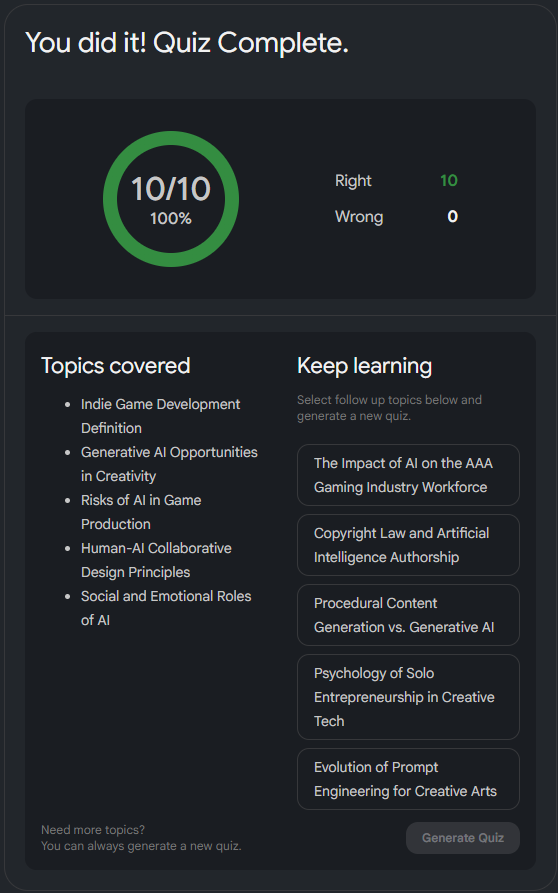

## Research Artifacts

Prompt for a summary of the main points:

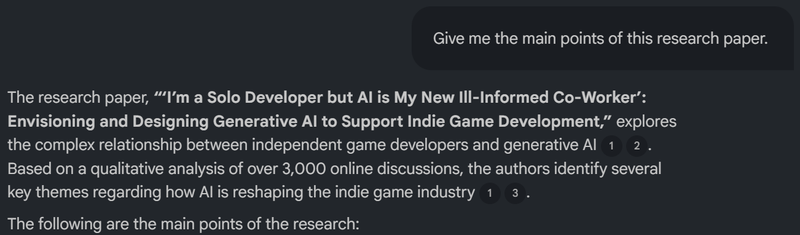

NotebookLM Video and Quiz:

[notebooklm.google.com](https://notebooklm.google.com/notebook/6dc2dc74-f3a3-450a-a645-d9e17b194e21?authuser=1)

## Key Finding

- According the analysis of over 3,000 indie developers, the perception of Generative AI and how it's shaping the indie game industry is mixed.

- Some developers believe that AI tools are a great way to democratize game-development, allowing it to be accessible to a wider audience.

    - AI can help with cost-effectiveness, streamline workflow, and act as a companion that can talk back since being an indie developer can be isolating

- On the other hand, indie developers also dread the use of AI.

    - There is a fear that AI will replace the other human roles, such as concept artists and voice actors.

    - AI fails at maintaining consistency around "art style" and narration

    - Fine-tuning an AI to your specific needs could be more time-consuming than just doing it youself

    - The risk of copyright and legal vulnerabilities

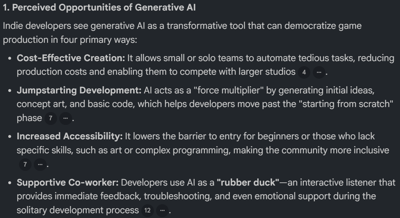

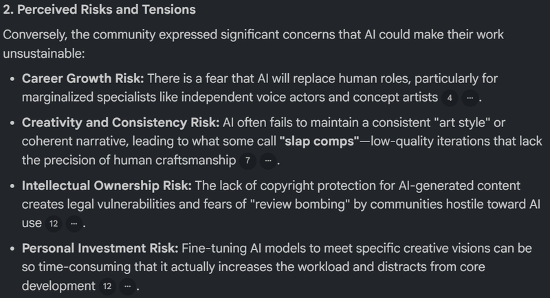

## Verification

- Double checked to see if the analysis of over 3,000 posts were correct.

- The Info seems to correlate with what NotebookLM pulled from the source.

Transcript from source (read the bold):

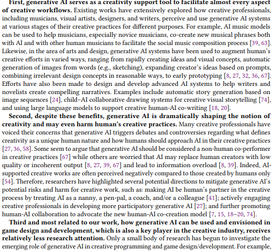

## Visual/Process Notes

[Envisioning Ai as a Supportive Tool.pdf](https://media.milanote.com/p/files/1Wksfj1EO1Ax3Q/y6k/Envisioning%20Ai%20as%20a%20Supportive%20Tool.pdf) (147 KB)

## Reflection / Project Implication

**Reflection:**

This was a great insight into how indie developers felt about AI as a tool. Since my project focuses on how AI can support novice game-developers, these perspectives are the closest in connection to my intended audience. I learned that solo/small group developers have mixed feelings about using AI. Many believe that it's a great tool for democratizing game development, streamlining, cutting costs, and just to have socially. However, there are also many negative views behind AI. Since AI is constantly evolving, developers fear that it could one day replace humans for jobs such as voice acting, concept art, and even music production. There are issues revolving around legal vulnerabilities and copyright and many are also skeptical about AI's abilities with consistency and believe that fine-tuning a model is more tedious than doing the work yourself. In the end, common solutions that these developers agree on is that AI should be used exclusively as a supportive tool that fosters inclusive practices instead of replacing human action, and should be designed as not just a tool, but also a social companion and provides encouragement.

**Project Implication:**

This will affect how I approach and use AI tools. Just like how those indie developers view AI as a tool, I'll also be using AI when developing my game, but it will exclusively be a support tool. Any and all creative vision will be mine alone; so stuff like concept art and world-building. The only thing I'll have AI assist me on is the more technical parts; things like coding and prototyping. I'll also try to have AI teach me how to make games from scratch, and even have me involved in the technical processes.

# GDevelop official documentation / website

Table element string placeholder

## Source/Input

**TItle:**

GDevelop Documentation

**Creator:**

Gdevelop teams

**Source Type:**

Official Documentation

**Why is matters:**

This is the official documentation for Gdevelop, which serves as a comprehensive manual for the program that I'll be using to create my game.

[GDevelop 5 documentation - GDevelop documentation](https://wiki.gdevelop.io/gdevelop5/?utm_source=chatgpt.com)

GDevelop is a full-featured, no-code, open-source game creation tool. Build 2D, 3D, and multiplayer games, as well as interactive presentations and experiences, for mobile (iOS and Android), desktop, and web platforms.

Really cool bonus source!:

[GDevelop AI Game Development: Build Games Faster with AI-Powered Tools | GDevelop](https://gdevelop.io/blog/gdevelop-ai-build-games-faster-ai-powered-tools)

GDevelop AI features include an automated building agent and chat assistant for game development. Learn how these AI tools help create games faster with step-by-step guidance.

## Interaction

**What I did:**

- Verified the source was real and legitimate

- Read the "Getting Started" section and skimmed through the rest

- Used NotebookLM to summarize the source

- Had NotebookLM create a brief video overview about Gdevelop and its features and how it's beginner-friendly

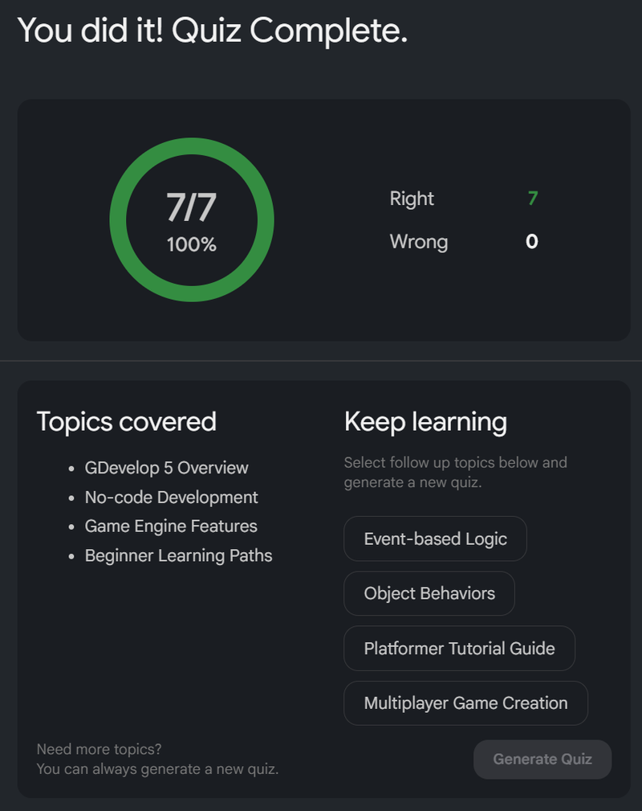

## Research Artifacts

NotebookLM Video:

[notebooklm.google.com](https://notebooklm.google.com/notebook/b6bf6fd5-05f4-4cb9-9fce-9ab11ea4579c/artifact/b1b3751a-5af7-4673-bc62-b1530388614b?utm_source=nlm_web_share&utm_medium=google_oo&utm_campaign=art_share_1&utm_content=&utm_smc=nlm_web_share_google_oo_art_share_1_)

NotebookLM Quiz:

[notebooklm.google.com](https://notebooklm.google.com/notebook/b6bf6fd5-05f4-4cb9-9fce-9ab11ea4579c/artifact/0463ac69-7d63-4290-9706-3e21c3e2121b?utm_source=nlm_web_share&utm_medium=google_oo&utm_campaign=art_share_1&utm_content=&utm_smc=nlm_web_share_google_oo_art_share_1_)

## Key Finding

- Gdevelop is a program whose sole purpose is the make the process of developing games as beginner-friendly as possible, while still allowing for the production of high-quality games.

- The biggest difference that sets Gdevelop apart from the rest is the lack of coding knowledge needed. Gdevelop uses a No-Coding event system instead, which teaches logic through an easy-to-understand if-then based system. This allows users to build complex games without writing any traditional code.

- Gdevelop also provides multiple different tutorials that beginners can utilize, such as documents, Youtube tutorials, presets you can dismantle, and even step-by-step interactive tutorials.

- Gdevelop also includes an AI assistant. This AI comes in two forms, a chat and an agent. The chat Ai acts as a mentor that can overview your entire project and give advice for how to overcome obstacles. Whereas the agent can handle a wide range of tasks, from creating scenes, adding objects, and even making an entire mechanic (for example: adding a functional health bar)

## Verification

- Checked what NotebookLM outputted and where from the source it gathered its info.

    - Everything matches just fine

Transcript from Source:

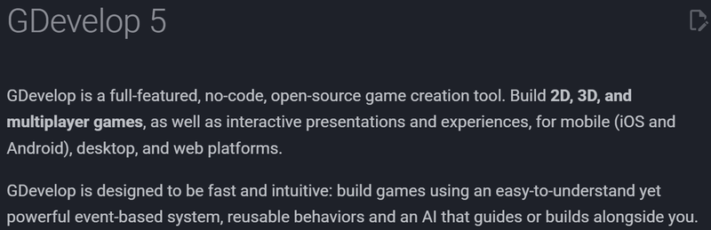

## Visual/Process Notes

[GDevelop Documentation.pdf](https://media.milanote.com/p/files/1WmE7B1Sl2A3as/6Rq/GDevelop%20Documentation.pdf) (1.3 MB)

## Reflection / Project Implication

**Reflection:**

Reading about this Gdevelop and its features was exciting. For someone who has little-to-no coding experience, this program was exactly what I needed. Since Gdevelop features an exclusive AI, this is perfect for my project on developing a game with the assistance of AI. I learned how this tool caters towards those who have less technical knowledge by utilizing an event-based system, rather than traditional coding.

**Project Implication:**

After reading more about this tool and gaining first-hand experience. I can confidently say that this is the tool I'll be using to develop the game that will become my final deliverable for this project.

# GDC — What Game Developers Want From: Generative AI / 2024

Table element string placeholder

## Source/Input

**TItle:**

### **What Game Developers Want From: Generative AI**

**Creator:**

- Beth Elderkin from Game Developer's Conference (GDC)

**Source Type:**

- Digital E-book

**Why is matters:**

- This is one of my strongest sources since it directly discusses where game developers, including those working in larger companies, see AI as useful and It also includes concerns for where it could become risky to use.

[Generative AI eBook | GDC 2025](https://reg.gdconf.com/GenAIeBook)

PDF of Source:

[{b776865b-fcfe-4f27-844c-cd722ed2f61c}_GDC_eBook_Nov24_-_What_Game_Developers_Really_Want_From_Generative_AI.pdf](https://media.milanote.com/p/files/1WmWRY1QoT7pcn/od6/%7Bb776865b-fcfe-4f27-844c-cd722ed2f61c%7D_GDC_eBook_Nov24_-_What_Game_Developers_Really_Want_From_Generative_AI.pdf) (8.4 MB)

## Interaction

**What I did:**

- Verified the authenticity of the source

- Used NotebookLM to read the pdf and summarize the main topics

- Created a video artifact

- Had NotebookLM create a quiz for me to check my understanding

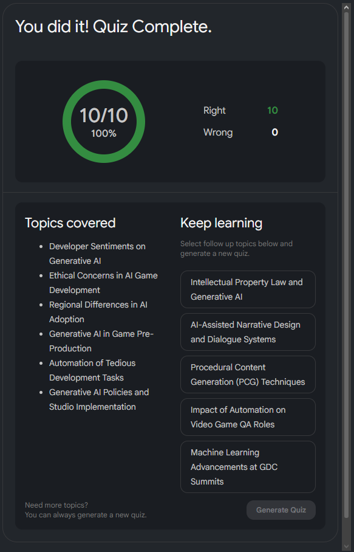

## Research Artifacts

NotebookLM Video:

[notebooklm.google.com](https://notebooklm.google.com/notebook/53233194-9e5a-49da-b3e7-883a4a567b7c/artifact/7b211d93-5625-44ab-9cd9-b8bd74d80cc7?utm_source=nlm_web_share&utm_medium=google_oo&utm_campaign=art_share_1&utm_content=&utm_smc=nlm_web_share_google_oo_art_share_1_)

NotebookLM Quiz:

## Key Finding

- When asked what kind of impact generative AI will have on the game industry, 21% were positive, 18% were negative, and 57% had mixed feelings

- \~84-86% of North American game developers had some concerns about the ethics of generative AI within the industry

    - Many of these concerns regarded IP theft with how AI is trained, job automation and layoffs, loss of creative freedom and the "human POV", as well as industry and consumer backlash.

- Almost half of game developers said GenAI tools were being used at their company or department

    - In East Asia, 70% of game developers have stated that their company has used generative AI

    - While Western studios tend to be a little more iffy about any use of AI, Korean and Chinese developers consider it a selling point.

- While there is worry about the ethical use of GenAI, many see AI as a valuable tool for streamlining production and creativity.

## Verification

- Double-checked that the info NotebookLM was gathering was from the source and not hallucinated

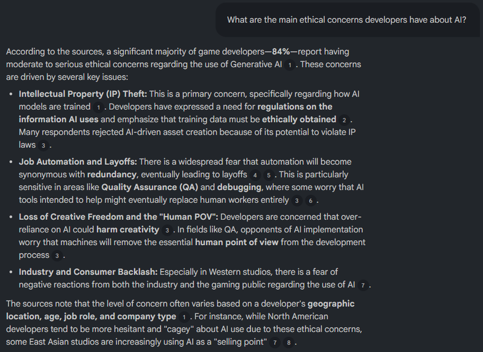

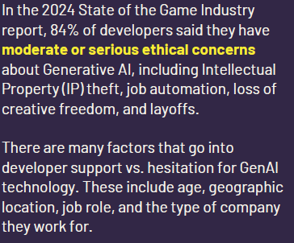

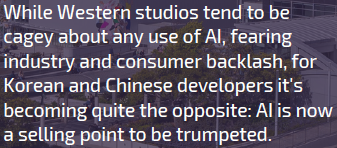

## Visual/Process Notes

[What Game Developers Want From GenAI.pdf](https://media.milanote.com/p/files/1WmYAT1QoT7pcy/llo/What%20Game%20Developers%20Want%20From%20GenAI.pdf) (2.5 MB)

## Reflection / Project Implication

**Reflection:**

This source is one of my strongest for a reason. This provides an incredible amount of insight into the game industry and their perspective on Generative AI as a whole. I learned that there is a reasonable majority of developers who have concerns with the ethics of GenAI, but there are many who can see the benefits that it can bring to the industry, especially for streamlining their workflow.

**Project Implication:**

After reading this e-book, it definitely opens your eyes to what developers really feel about AI. For my project, I can work on it in a new light. I'll try to implement and use what the game developers wanted from GenAI, while avoiding the negatives they mentioned, this mainly applying to the loss of creativity and IP theft.

# “DreamGarden: A Designer Assistant for Growing Games from a Single Prompt” / arXiv, 2024

Table element string placeholder

## Source/Input

**TItle:**

**DreamGarden: A Designer Assistant for Growing Games from a Single Prompt**

**Creator:**

- **Sam Earle** from New York University.

- **Samyak Parajuili** from the University of Texas at Austin.

- **Andrzej Banburski-Fahey** from Microsoft Research

**Source Type:**

Academic Research Paper

**Why is matters:**

DreamGarden, an AI system capable of assisting with the development of diverse game environments in Unreal Engine. This research paper explains how AI can be used in a professional setting.

[DreamGarden: A Designer Assistant for Growing Games from a Single Prompt](https://arxiv.org/html/2410.01791v1?utm_source=chatgpt.com)

Coding assistants are increasingly leveraged in game design, both generating code and making high-level plans. To what degree can these tools align with developer workflows, and what new modes of human-computer interaction can emerge from their use?\
We present DreamGarden, an AI system capable of assisting with the development of diverse game environments in Unreal Engine. At the core of our method is an LLM-driven planner, capable of breaking down a single, high-level prompt—a dream, memory, or imagined scenario provided by a human user—into a hierarchical action plan, which is then distributed across specialized submodules facilitating concrete implementation. This system is presented to the user as a garden of plans and actions, both growing independently and responding to user intervention via seed prompts, pruning, and feedback. Through a user study, we explore design implications of this system, charting courses for future work in semi-autonomous assistants and open-ended simulation design.

## Interaction

**What I did:**

- Verified that the source was real

- Used NotebookLM to read the pdf and summarize

- Created a video artifact to explain what DreamGarden is

- Had NotebookLM create a quiz for me

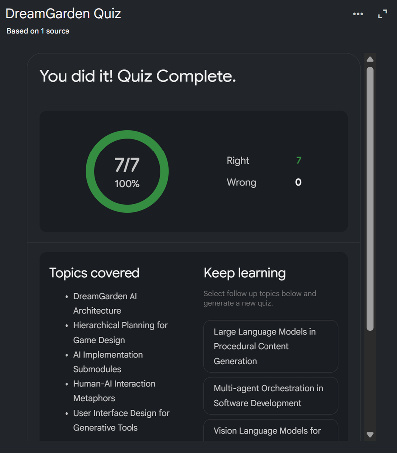

## Research Artifacts

Video:

[notebooklm.google.com](https://notebooklm.google.com/notebook/0d90ee06-6376-4ef6-8767-1bc5a673610d/artifact/e7b754bd-7592-4c40-86ab-111d16340ef6?utm_source=nlm_web_share&utm_medium=google_oo&utm_campaign=art_share_1&utm_content=&utm_smc=nlm_web_share_google_oo_art_share_1_)

Quiz:

[notebooklm.google.com](https://notebooklm.google.com/notebook/0d90ee06-6376-4ef6-8767-1bc5a673610d/artifact/8086b633-178f-462a-8b40-fd4042f6e9d6?utm_source=nlm_web_share&utm_medium=google_oo&utm_campaign=art_share_1&utm_content=&utm_smc=nlm_web_share_google_oo_art_share_1_)

## Key Finding

- DreamGarden is an AI-powered design assistant that was created to turn prompts into 3d game environments in Unreal Engine.

- The process is visualized through a node-based graphical user interface. This allows creators to intervene and adjust the development whenever they want.

- Although DreamGarden is great for quick prototyping and early-stage ideation. It still has its limitations, such as technical constraints, user interface and transparency issues, and, engineering challenges, and creative limitations.

## Verification

- Double-checked that the info NotebookLM was gathering was from the source and not hallucinated

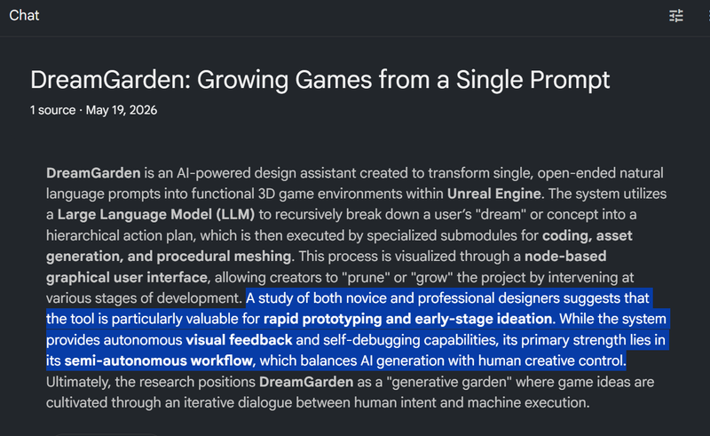

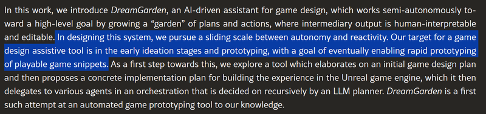

## Visual/Process Notes

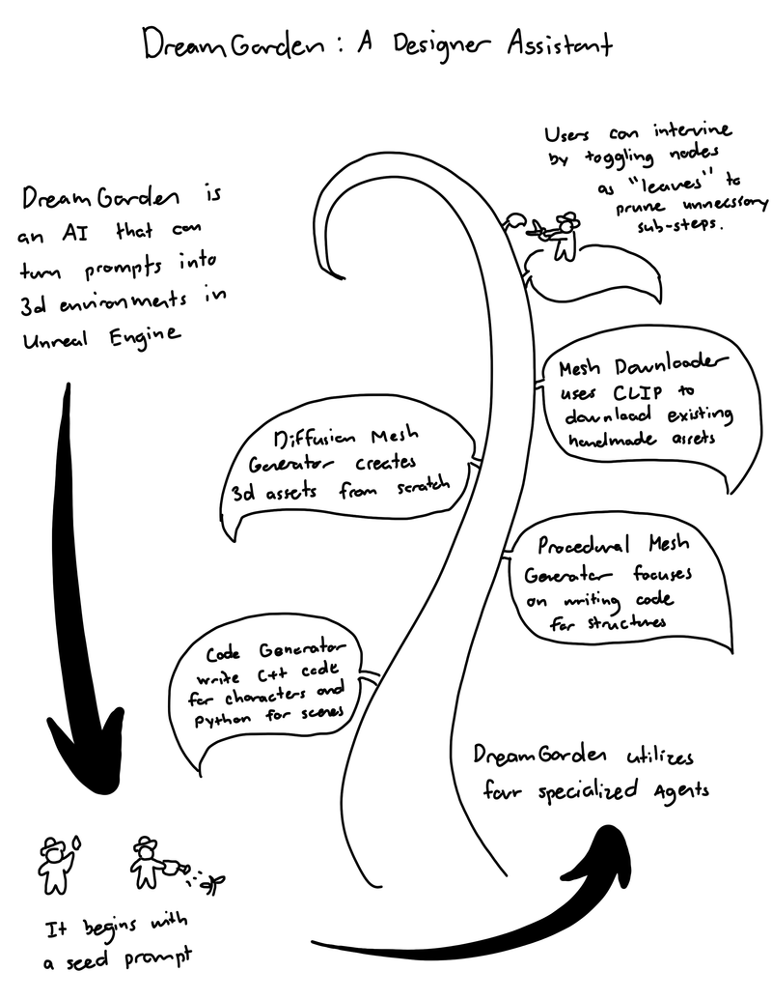

## Reflection / Project Implication

**Reflection:**

Although not the strongest source for what my project is specializing in, it still provides some insight into how AI is being utilized in different game engines along with how it can be used in a more professional setting.

**Project Implication:**

Although it doesn't really affect the project I am currently working on. It just further solidifies the fact that AI can be used multiple ways in other game engines in a more professional setting.

# “Scratch Copilot: Supporting Youth Creative Coding with AI” / arXiv, 2025

Table element string placeholder

## Source/Input

**TItle:**

**Scratch Copilot: Supporting Youth Creative Coding with AI**

**Creator:**

- Stefania Druga from Google DeepMind. Seattle, Washington

- Amy J. Ko from University of Washington. Seattle, Washington

**Source Type:**

Academic Research Paper

**Why is matters:**

It moves the conversation of AI in education beyond just technical efficiency. It also targets a younger demographic who would usually have a harder time working with a more professional coding AI model, like GitHub Copilot and Cursor.

[Scratch Copilot: Supporting Youth Creative Coding with AI](https://arxiv.org/html/2505.03867v1?utm_source=chatgpt.com)

Creative coding platforms, such as Scratch (Maloney et al., 2010), have become instrumental in democratizing computer programming, empowering millions of young learners to express themselves creatively through code. Scratch, with its block-based visual interface, significantly lowers the entry barrier to coding, making it accessible to children as young as 7 years old. However, despite the platform’s accessible visual programming interface, novice middle school learners often encounter difficulties in translating their imaginative ideas into functional code and require scaffolding and guidance (Jimenez et al., 2018; Zhang and Nouri, 2019). These challenges range from grappling with programming logic to debugging errors and effectively utilizing the platform’s features. Consequently, young coders require robust support mechanisms to navigate these hurdles, fully realize their creative potential, and develop crucial computational thinking skills (Papert, 1980; Wing, 2006).

## Interaction

**What I did:**

- Verified the authenticity of the source

- Used NotebookLM to summarize and simplify the article

- Had NotebookLM create a video artifact for me for easier learning and retention

- Also had it make a quiz for me to test my knowledge.

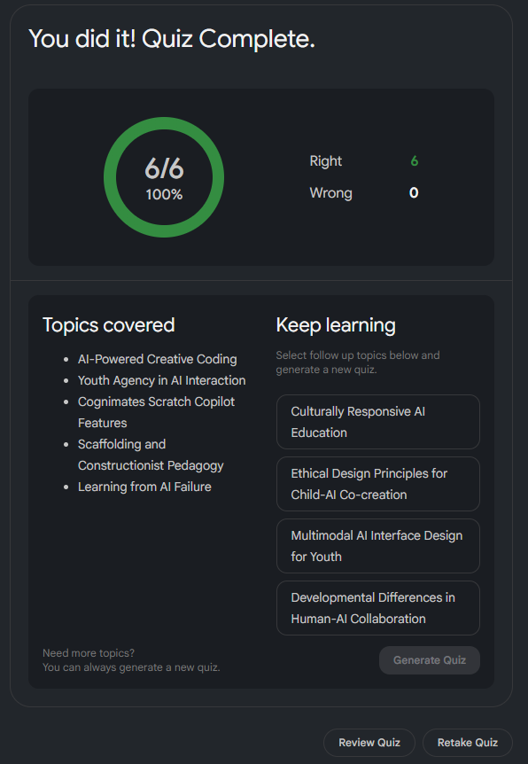

## Research Artifacts

NotebookLM Video:

[notebooklm.google.com](https://notebooklm.google.com/notebook/948c6ac5-670e-48d4-a89e-c3d62ef213fa/artifact/47a4e541-a99b-4563-8742-8162388620d9?utm_source=nlm_web_share&utm_medium=google_oo&utm_campaign=art_share_1&utm_content=&utm_smc=nlm_web_share_google_oo_art_share_1_)

NotebookLM Quiz:

[notebooklm.google.com](https://notebooklm.google.com/notebook/948c6ac5-670e-48d4-a89e-c3d62ef213fa/artifact/5af3c1ee-9e27-4729-a5b0-d440a8cb788b?utm_source=nlm_web_share&utm_medium=google_oo&utm_campaign=art_share_1&utm_content=&utm_smc=nlm_web_share_google_oo_art_share_1_)

## Key Finding

- Cognimates is one of the first AI assistants specifically designed for middle schoolers using visual block-based programming.

- The AI helps students get past "blank page syndrome" by suggesting creative ideas such as game mechanics, character concepts, and project ideas. It also includes real-time visual asset (image) generation using DALL-E

- It prioritizes child agency by preventing over-reliance. The tool uses question-driven teaching method; asking guiding questions to lead them to their own solutions instead of immediately providing direct answers.

## Verification

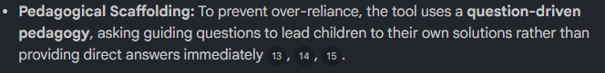

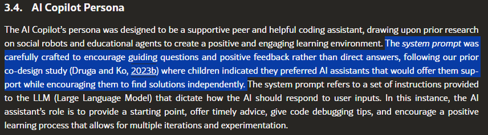

## Visual/Process Notes

[Cognimates.pdf](https://media.milanote.com/p/files/1WrhyM1Y471a5E/wzm/Cognimates.pdf) (3.0 MB)

## Reflection / Project Implication

**Reflection:**

Although it doesn't specifically go into the game development side of my project. This source offers a great insight into how AI can be used as an effective teaching tool for a younger demographic. It goes into great detail over how the AI teaches by giving questions that help lead students to their own solutions instead of immediately handing out fixes without elaborating.

**Project Implication:**

It doesn't really affect the end product of my project. However, this article still gave me a great view of how AI can be used to teach children complicated processes such as coding and programming, while also keeping it ethical and allowing children to steer the wheel.

## Possible Sources / Not Fully Processed

These sources are possible research leads, but they are not fully processed yet. They should not be treated as finished source notes until they include verification, key findings, and project implications.

# “Large Language Models and Games: A Survey and Roadmap” / arXiv, 2024

Table element string placeholder

## Source/Input

**TItle:**

**Creator:**

**Source Type:**

**Why is matters:**

[Large Language Models and Games: A Survey and Roadmap](https://arxiv.org/html/2402.18659v4?utm_source=chatgpt.com)

Recent years have seen an explosive increase in research on large language models (LLMs), and accompanying public engagement on the topic. While starting as a niche area within natural language processing, LLMs have shown remarkable potential across a broad range of applications and domains, including games. This paper surveys the current state of the art across the various applications of LLMs in and for games, and identifies the different roles LLMs can take within a game. Importantly, we discuss underexplored areas and promising directions for future uses of LLMs in games and we reconcile the potential and limitations of LLMs within the games domain. As the first comprehensive survey and roadmap at the intersection of LLMs and games, we are hopeful that this paper will serve as the basis for groundbreaking research and innovation in this exciting new field.

## Interaction

**What I did:**

## Research Artifacts

## Key Finding

## Verification

## Visual/Process Notes

## Reflection / Project Implication

**Reflection:**

**Project Implication:**

# Swacha — “Supporting Serious Game Development with Generative AI” / MDPI, 2025

Table element string placeholder

## Source/Input

**TItle:**

**Creator:**

**Source Type:**

**Why is matters:**

[Supporting Serious Game Development with Generative Artificial Intelligence: Mapping Solutions to Lifecycle Stages](https://www.mdpi.com/2076-3417/15/21/11606?utm_source=chatgpt.com)

The emergence of effective Generative AI has sparked a revolution in video game development, enabling us to generate game assets and source code at a fraction of the cost and time needed compared to if human developers were involved. But the support available from GenAI goes far beyond the generation of game assets and code, especially in the case of serious games, which have to combine playability with non-entertainment purposes such as, but not only, education. In this paper, the potential forms of GenAI-based support for serious game development are explored and placed into the context of the respective phases of the serious game development lifecycle. As existing lifecycle models are either not specialized for the specifics of serious games or are otherwise too simple, a new serious game development lifecycle model has been proposed for this purpose.

## Interaction

**What I did:**

## Research Artifacts

## Key Finding

## Verification

## Visual/Process Notes

## Reflection / Project Implication

**Reflection:**

**Project Implication:**

# “Instruction-Driven Game Engines on Large Language Models” / arXiv, 2024

Table element string placeholder

## Source/Input

**TItle:**

**Creator:**

**Source Type:**

**Why is matters:**

[Instruction-Driven Game Engines on Large Language Models](https://arxiv.org/abs/2404.00276?utm_source=chatgpt.com)

The Instruction-Driven Game Engine (IDGE) project aims to democratize game development by enabling a large language model (LLM) to follow free-form game rules and autonomously generate game-play...

## Interaction

**What I did:**

## Research Artifacts

## Key Finding

## Verification

## Visual/Process Notes

## Reflection / Project Implication

**Reflection:**

**Project Implication:**

